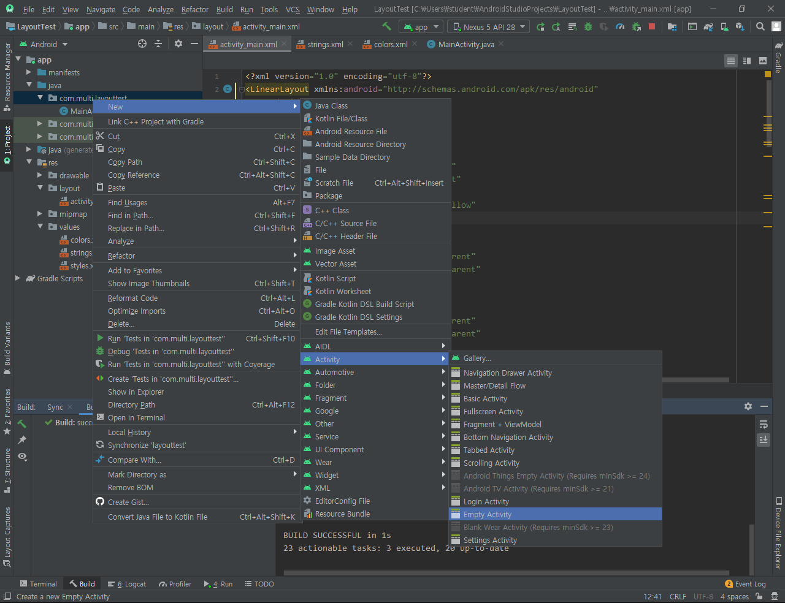
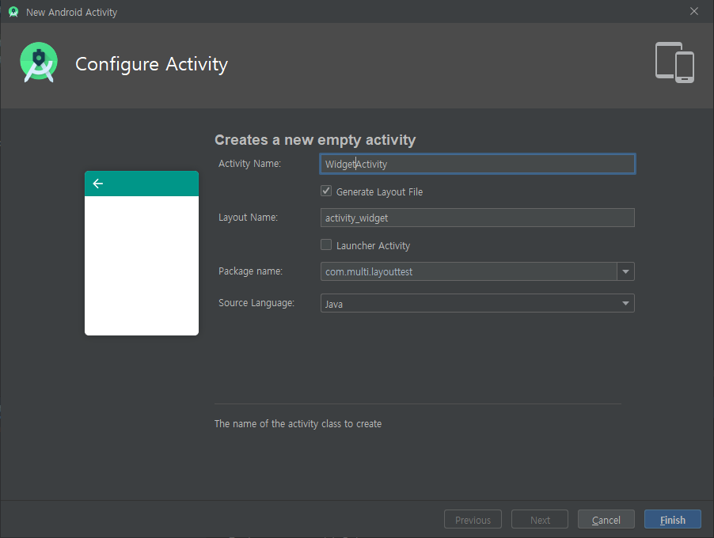
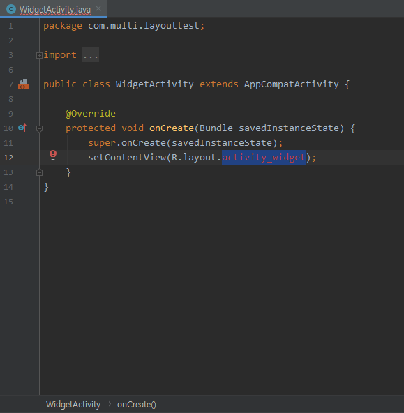
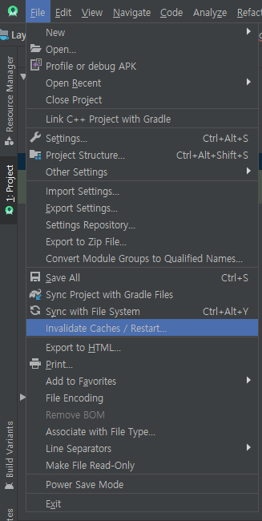
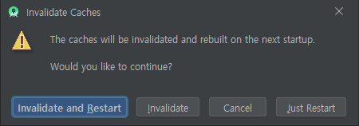
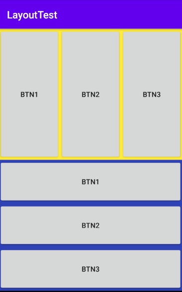
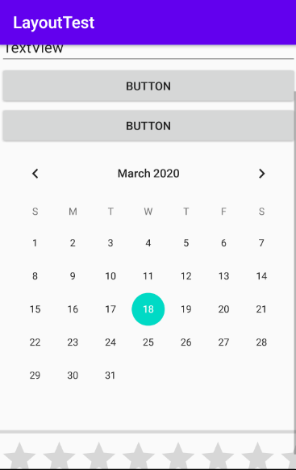

# Activity

> Android Component 중 하나
>
> (Activity, Service, Broadcast Receiver, Content Provider)

- Android Application이 실행되는 기본적인 단위
- Android App의 화면 1개
- UI를 담당하는 Component
- 사용자의 Event 처리를 담당
- Load가 많은 작업처리는 지양한다


- Activity는 App을 구성하고 있는 화면을 지칭화면을 표현하고 관리하기 위한 class

- 화면을 표현할 때는 Activity 하나와 하나 이상의 xml 파일이 필요하다

- Activity 내에서 자바코드로 화면구성을 할 수는 있으나, 권장되지 않음

  (표현과 구현이 분리되지 않기 때문)

- Application은 일반적으로 여러개의 Activity로 구성


## Activity 추가








- Activity 추가 후에는 `AndroidManifest.xml`에 아래와 같이 추가된다.

  ```xml
  <manifest>
      <application
          ....>
          <activity android:name=".WidgetActivity" />
      </application>
  </manifest>
  ```


> `!`  Activity를 추가할 때, Activity와 추가된 Layout이 연결되지 않아 에러가 발생할 수 있다.
>
> 이 경우 프로젝트를 refresh 하고 프로젝트를 재시작 하여 해결할 수 있다.






## Activity 화면 구성

> Avtivity의 화면을 구성하는 방식에는 2가지가 있다.

1. Java Code로 Widget Component를 생성해서 화면에 붙이는 방식
2. XML 파일을 이용해서 화면구성을 처리
   - xml을 이용하는 방식은 표현(화면구성-UI)과 구현(로직)을 분리


## Layout


1. LinearLayout
2. RelativeLayout
3. FrameLayout
4. TableLayout
5. ListView와 GridView


### LinearLayout

- `activity_main.xml`

  ```xml
  <?xml version="1.0" encoding="utf-8"?>
  <LinearLayout xmlns:android="http://schemas.android.com/apk/res/android"
      android:layout_height="match_parent"
      android:layout_width="match_parent"
      android:orientation="vertical">
  
      <LinearLayout
          android:layout_width="match_parent"
          android:layout_height="match_parent"
          android:layout_weight="1"
          android:background="@color/colorYellow"
          android:orientation="horizontal">
          
          <!-- Button들 생략 -->
  
      </LinearLayout>
      <LinearLayout
          android:layout_width="match_parent"
          android:layout_height="match_parent"
          android:layout_weight="1"
          android:background="@color/colorBlue"
          android:orientation="vertical">
          
          <!-- Button들 생략 -->
  
      </LinearLayout>
  
  </LinearLayout>
  ```

  

  

  - Layout 안에 Layout을 넣는 등 다양한 방법으로 사용 가능하다.

  - ```xml
    <LinearLayout>
    	<LinearLayout
            .....
            android:layout_weight="1"
            .....>
        </LinearLayout>
        <LinearLayout
            .....
            android:layout_weight="1"
            .....>
        </LinearLayout>
    </LinearLayout>
    ```

    하위 component들에 `layout_weight` 항목이 있을 때,

    각 component들의 사이즈가 상위 component의 크기에서 비율로 나누어 사용한다.


## ScrollView

> Component들의 갯수가 많아 화면을 이탈하게 될 경우
>
> ScrollView를 이용해 화면의 위아래로 이동 가능하게 할 수 있다.



```xml
<?xml version="1.0" encoding="utf-8"?>
<ScrollView xmlns:android="http://schemas.android.com/apk/res/android"
    android:layout_width="match_parent"
    android:layout_height="match_parent">

    <LinearLayout xmlns:android="http://schemas.android.com/apk/res/android"
        android:layout_height="match_parent"
        android:layout_width="match_parent"
        android:orientation="vertical">

        <EditText
            android:id="@+id/editText2"
            android:layout_width="match_parent"
            android:layout_height="wrap_content"
            android:text="TextView" />
        
        <!-- 생략 -->
        
        <RatingBar
            android:id="@+id/ratingBar"
            android:layout_width="match_parent"
            android:layout_height="wrap_content" />

    </LinearLayout>
</ScrollView>
```


## View와 View Group

### View

> 통상적으로 눈에 보이는 Component
>
> - Button, TextView(lable), ImageView(그림), ...등이 있다.

- TextView

  - `android:layout_width` , `android:layout_height`

    - component의 크기를 지정한다.
    - 고정된 숫자값을 줄 수 있지만, 디바이스마다 다른 해상도를 가지기 때문에 상대적 크기를 주는 것이 좋다.
    - `wrap_parent` : 내부 contents의 크기에 따른다
    - `match_parent` : 상위 Component의 크기에 따른다

  - `android:textAlignment`

    - Layout 내부의 텍스트에 대한 정렬을 지정한다.

    - 단독 사용시 에러가 발생하며, `android:gravity`를 필요로 한다.

    - `center_horizontal` 값을 가질 경우 문제가 발생하지 않으나

      `center_vertical`를 사용할 경우 `RtlCompat`를 필요로 한다.

- Image View

  - `android:src="@drawable/{file_name}"`

    - 경로를 이용하여 Image를 출력한다.

    - `res > drawable` 경로에 Image를 등록할 경우

      `@drawable/{file_name}` 형태의 id로 사용이 가능하다

  - 주의 !

    - res > drawable 경로에서 id는 `file_name`으로만 지정되기 때문에

      같은 이름의 다른 확장자 파일은 문제가 발생한다

    - 예 )  cat1.jpg ,  cat1.png

- (생략)


### View Group

> View의 크기와 위치를 조절해 설정해준다.
>
> - Layout들이 대표적이다.


## Activity Life Cycle

> activity는 사용자에 의해서 이벤트가 발생되면 그 상태가 변한다.
>
> 그에 따라 callback method가 호출되는데 그 callback method에 대해 알아야한다.

1.  Activity는 class 상태로 존재
2.  Activity가 화면에 나타나려면 객체화가 되어야 한다.(instance화)
3.  onCreate() method가 callback된다. >> 화면구성을 주로 한다.
4.  onStart() method가 callback된다.  >> Activity의 초기화 작업을 한다.
5.  Activity가 foreground로 나타나면서 사용자와 interaction이 가능
6.  onResume() method가 callback된다.
7.  Activity가 running 상태가 된다
8.  Activity의 일부분이 보이지 않는 상태(Pause 상태)
9.  Pause 상태가 되면 onPause() method가 callback된다
10.  Activity의 전체가 완전히 가려져서 보이지 않는 상태가 된다(Stop 상태)
11.  Stop 상태가 되면 onStop() method가 callback된다
12.  만약 Stop 상태에서 다시 Running 상태가 되면
13.  onRestart() -> onStart() -> onResume() 순서로 다시 호출
14.  사용하고 있는 activity를 종료하게되면 killed 상태로 진입
15.  진입하기 전에 onDestory() method가 callback된다
     - 사용한 리소스 초기화, 반납


