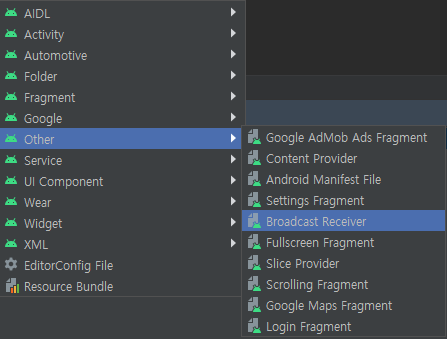
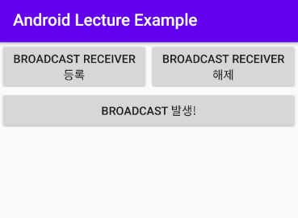

# Broadcast Receiver


## Broadcast란?

> Android 에는 Broadcast라는 signal이 존재한다.
>
> 이 신호(signal)은 Android System 자체에서 발생할 수도 있고,
>
> 사용자 App에서 임의로 발생시킬 수 있다.

> Android System 자체에서 발생하는 Broadcast Signal은
>
> 전화를 수신하거나 네트워크의 전환, 배터리 상태 변화 등이 발생했을 때
>
> Android System이 발생시킨다.


## Broadcast Receiver란?

> Android의 4가지 Component 중 하나

> Android 내부에 전체적으로 발송된 Broadcast Signal 중
>
> 특정 Broadcast 신호를 수신하고 이를 반응하기 위해 사용된다.


## Receiver 등록

> 등록하는 방법에는 2가지가 있다.
>
> 1. Manifest에 등록된 Receiver (정적 등록)
> 2. Context에 등록된 Receiver (동적 등록)
>
> [Android Developer - Broadcast Receiver](https://developer.android.com/guide/components/broadcasts?hl=ko#java)


### 1. 정적 등록

> 외부 `Broadcast Receiver Component` 를 생성하고,
>
> 이를 `AndroidManifest.xml` 파일에 명시하여 등록한다.

> Manifest에 Receiver를 등록한 경우 앱이 아직 실행중이 아니라면 시스템에서 앱을 실행한다.
>
> Android 8.0 (O, Oreo) 부터는 일부 Broadcast를 제외하면 manifest에 Receiver를 등록할 수 없다.  - [Android Developer - Broadcast-exceptions](https://developer.android.com/guide/components/broadcast-exceptions?hl=ko)

1. 외부 `Broadcast Receiver` 생성

   - `File - New - Other - Broadcast Receiver`

     .

     

   - `AndroidManifest.xml`

     위의 방법으로 생성 시 Manifest 파일에 아래와 같이 자동으로 등록된다.

     ```xml
     <receiver
     	android:name=".{___}BroadcastReceiver"
         android:enabled="true"
         android:exported="true"></receiver>
     ```

      

     

2. 자동으로 추가된 `Broadcast Receiver`에 

   Receiver가 수신한 Broadcast를 `intent-filter`를 추가한다.

   ```xml
   <receiver
   	android:name=".{___}BroadcastReceiver"
       android:enabled="true"
       android:exported="true">
       <intent-filter>
           <action android:name="android.provider.Telephony.SMS_RECEIVED" />
       </intent-filter>
   </receiver>
   ```

    


### 2.  동적 등록

> `Context` 에서 `Receiver 객체`를 만들어서 등록한다.

> 등록한 컨텍스트가 유효한 동안 브로드캐스트를 수신하기 때문에
>
> 앱이 `onDestroy()` 메서드에서 등록을 취소하도록 해야한다.

1. `IntentFilter` 객체 생성

   ```java
   IntentFilter intentFilter = new IntentFilter();
   intentFilter.addAction("MY_BROADCAST_SIGNAL");
   ```

    

2. Broadcast Receiver 객체 생성

   ```java
   private BroadcastReceiver bReceiver;
   
   bReceiver = new BroadcastReceiver() {
       @Override
       public void onReceive(Context context, Intent intent) {
           // Receiver 가 신호를 받았을 때 수행되는 Method
           if (intent.getAction().equals("MY_BROADCAST_SIGNAL")) {
               Toast.makeText(Example18_BRTestActivity.this,
                              "신호를 수신했습니다.",
                              Toast.LENGTH_SHORT).show();
           }
       }
   };
   ```

    

3. Broadcast Receiver를 Filter와 함께 등록

   ```java
   registerReceiver(bReceiver, intentFilter);
   ```

 

### 3. 동적 등록 해제

```java
unregisterReceiver(bReceiver);
```


## Broadcast 신호 발생

```java
Intent i = new Intent("MY_BROADCAST_SIGNAL");
sendBroadcast(i);
```


---

## 예제 1

> 동적 등록에 사용한 코드

.

```xml
<LinearLayout xmlns:android="http://schemas.android.com/apk/res/android"
    android:layout_width="match_parent"
    android:layout_height="match_parent"
    android:orientation="vertical">

    <LinearLayout
        android:layout_width="match_parent"
        android:layout_height="wrap_content"
        android:orientation="horizontal">

        <Button
            android:layout_width="wrap_content"
            android:layout_height="wrap_content"
            android:layout_weight="1"
            android:text="Broadcast Receiver 등록"
            android:id="@+id/br_registerBtn"/>

        <Button
            android:layout_width="wrap_content"
            android:layout_height="wrap_content"
            android:layout_weight="1"
            android:text="Broadcast Receiver 해제"
            android:id="@+id/br_unRegisterBtn"/>

    </LinearLayout>

    <Button
        android:layout_width="match_parent"
        android:layout_height="wrap_content"
        android:text="Broadcast 발생!"
        android:id="@+id/sendBroadcastBtn"/>

</LinearLayout>
```


---

## 예제 2 - SMS 메세지 수신

> SMS 수신 시 발신자와 메세지 내용, 수신 날짜를 Activity에 나타낸다


### 1. SMS 보안설정

1. `AndroidManifest.xml`

   ```xml
   <uses-permission android:name="android.permission.RECEIVE_SMS" />
   ```

2. Activity

   [Check Permission](https://github.com/Jzee21/TIL/blob/master/Android/Permission.md) - `사용자 권한 요청`


### 2. SMS Receiver 등록

> 외부 Component 생성 후 정적 등록 (AndroidManifest.xml)

```xml
<receiver
	android:name=".{___}BroadcastReceiver"
    android:enabled="true"
    android:exported="true">
    <intent-filter>
    	<action android:name="android.provider.Telephony.SMS_RECEIVED" />
    </intent-filter>
</receiver>
```


### 3. SMS 메세지 수신

> 외부 Component로 Broadcast Receiver를 생성하면 아래와 같은
>
> `onReceive()` 메서드가 기본적으로 Override 되어있다.

```java
@Override
public void onReceive(Context context, Intent intent) {
    // TODO: This method is called when the BroadcastReceiver is receiving
    // an Intent broadcast.
    throw new UnsupportedOperationException("Not yet implemented");
}
```


1. SMS Message 확인

   ```java
   Bundle bundle = intent.getExtras();
   Object[] obj = (Object[]) bundle.get("pdus");
   ```

   - SMS 정보는 `"pdus"` 라는 Key 값으로 저장되어있다. (반환형 : Object)

   - SMS는 짧은 시간에(동시에 가까운 시간에) 여러개의 SMS가 도착할 수 있다.

     따라서, Object[] 형태의 리스트로 SMS를 꺼낸다

   - Object 객체 1개가 SMS 1건의 정보를 갖는다.

    

2. SmsMessage 객체로 Converting

   ```java
   SmsMessage[] message = new SmsMessage[obj.length];
   
   if (Build.VERSION.SDK_INT >= Build.VERSION_CODES.M) {
       String format = bundle.getString("format");
       message[0] = SmsMessage.createFromPdu((byte[]) obj[0], format);
   } else {
       message[0] = SmsMessage.createFromPdu((byte[]) obj[0]);
   }
   ```

   - Object 객체로 받은 SMS 메세지를 `SmsMessage` 객체로 변환한다.
   - Android 6.0 버전을 기준으로 `format`을 필요로 한다.

    

3. Activity로 데이터 전송

   ```java
   // SMS 데이터 반환
   String sender = message[0].getOriginatingAddress();
   String msg = message[0].getMessageBody();
   String reDate = new Date(message[0].getTimestampMillis()).toString();
   
   // Activity 전송
   Intent i = new Intent(context, ___Activity.class);
   i.addFlags(Intent.FLAG_ACTIVITY_CLEAR_TOP);
   i.addFlags(Intent.FLAG_ACTIVITY_SINGLE_TOP);
   i.addFlags(Intent.FLAG_ACTIVITY_NEW_TASK);
   
   i.putExtra("sender", sender);
   i.putExtra("msg", msg);
   i.putExtra("date", reDate);
   
   context.startActivity(i);
   ```

   - `getOriginatingAddress()` :  SMS의 발신자 번호를 반환한다.
   - `getMessageBody()` :  SMS의 내용을 반환한다.
   - `getTimestampMillis()` :  SMS를 수신한 시간을 반환한다.


```java
@Override
public void onReceive(Context context, Intent intent) {
    
    Bundle bundle = intent.getExtras();
    Object[] obj = (Object[]) bundle.get("pdus");

    SmsMessage[] message = new SmsMessage[obj.length];

    if (Build.VERSION.SDK_INT >= Build.VERSION_CODES.M) {
        String format = bundle.getString("format");
        message[0] = SmsMessage.createFromPdu((byte[]) obj[0], format);
    } else {
        message[0] = SmsMessage.createFromPdu((byte[]) obj[0]);
    }

    String sender = message[0].getOriginatingAddress();
    String msg = message[0].getMessageBody();
    String reDate = new Date(message[0].getTimestampMillis()).toString();

    Intent i = new Intent(context, ___Activity.class);
    i.addFlags(Intent.FLAG_ACTIVITY_CLEAR_TOP);
    i.addFlags(Intent.FLAG_ACTIVITY_SINGLE_TOP);
    i.addFlags(Intent.FLAG_ACTIVITY_NEW_TASK);

    i.putExtra("sender", sender);
    i.putExtra("msg", msg);
    i.putExtra("date", reDate);

    context.startActivity(i);
}
```

