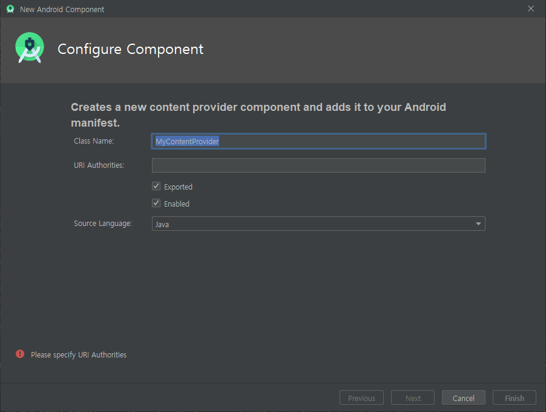
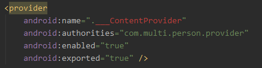
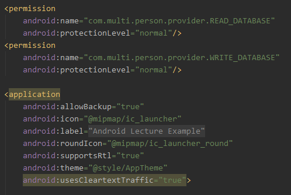

# Content Provider & Resolver

> Android System를 구성하는 4가지 중요 Component 중 하나


## 필요성

> Android에서는 오직 자신의 App 안에서 생성한 데이터만 사용할 수 있다.
>
> `Content Provider & Resolver`는 다른 앱의 데이터에 접근을 허가하거나 요청하는 기능을 한다.

> `Content Provider`는 다른 앱에게 데이터의 접근을 허가하는 컨텐츠 제공자이며,
>
> `Context`에 있는 `Content Resolver` 객체를 이용하여 `Provider`와 통신을 주고받는다.


## Content Provider

> 컨텐츠 제공자는 Application 내부의 데이터를 외부 어플리케이션에 테이블의 형태로 제공한다.
>
> `Content Provider`는 Android System에 의해 관리되며 어플리케이션이 실행될 때, 안드로이드 시스템에 의해 자동으로 생성된다.


### Provider 생성



- Class Name

- URI Authorities  :  Content Provider를 찾기위한 특별한 문자열
  - Provider를 구분하기 위한 고유 문자열 
  - 중첩을 피하기 위해 Uri 형태를 사용한다.
  - 호출 형태  :  `content://{Authority}/{BASE_PATH}`
  - ex)  `content://com.multi.person.provider/person`

- Exported  :  외부에서 접근 가능 여부

- Enabled  :  사용 가능 상태 여부


### Manifest 등록

> 위와 같이 등록하면 아래와 같이 기본적으로 등록된다.




#### 권한 추가

> Provider가 외부 어플리케이션에 데이터를 제공하기 위한 권한 설정을 추가한다.

```xml
<provider
	.....
    android:readPermission="com.multi.person.provider.READ_DATABASE"
	android:writePermission="com.multi.person.provider.WRITE_DATABASE" />
```

- `Provider` 가 사용할 기능 명시


```xml
<permission
    android:name="com.multi.person.provider.READ_DATABASE"
    android:protectionLevel="normal"/>
<permission
    android:name="com.multi.person.provider.WRITE_DATABASE"
    android:protectionLevel="normal"/>
```

- `Provider`가 사용할 기능에 대한 권한 요청

- 등록 위치

  .


### 필수 Method

[ContentProvider 구현의 필수 Method (Android Developer)](https://developer.android.com/guide/topics/providers/content-provider-creating?hl=ko#RequiredAccess)


```java
public class ___ContentProvider extends ContentProvider {
    
    public ___ContentProvider() {
        
    }
    
    @Override
    public int delete(Uri uri, String selection, String[] selectionArgs) {
        // Implement this to handle requests to delete one or more rows.
        throw new UnsupportedOperationException("Not yet implemented");
    }
    
    @Override
    public String getType(Uri uri) {
        // TODO: Implement this to handle requests for the MIME type of the data
        // at the given URI.
        throw new UnsupportedOperationException("Not yet implemented");
    }
    
    @Override
    public Uri insert(Uri uri, ContentValues values) {
        // TODO: Implement this to handle requests to insert a new row.
        throw new UnsupportedOperationException("Not yet implemented");
    }
    
    @Override
    public boolean onCreate() {
        // TODO: Implement this to initialize your content provider on startup.
        return false;
    }
    
    @Override
    public Cursor query(Uri uri, String[] projection, String selection,
                        String[] selectionArgs, String sortOrder) {
        // TODO: Implement this to handle query requests from clients.
        throw new UnsupportedOperationException("Not yet implemented");
    }

    @Override
    public int update(Uri uri, ContentValues values, String selection,
                      String[] selectionArgs) {
        // TODO: Implement this to handle requests to update one or more rows.
        throw new UnsupportedOperationException("Not yet implemented");
    }
    
}
```


### Exam01_Provider

> Content Provider 를 이용하여 어플리케이션의 Database에 insert 하기

- `PersonDatabaseHelper.java`

  ```java
  public class PersonDatabaseHelper extends SQLiteOpenHelper {
  
      PersonDatabaseHelper(@Nullable Context context) {
          super(context, "person.db", null, 1);
      }
  
      @Override
      public void onCreate(SQLiteDatabase db) {
  		String sql = "CREATE TABLE IF NOT EXISTS "
                  + "person(_id INTEGER PRIMARY KEY AUTOINCREMENT, "
                  + "name TEXT, age INTEGER, mobile TEXT)";
          db.execSQL(sql);
          Log.i("DBTest", "onCreate()");
      }
  
      @Override
      public void onUpgrade(SQLiteDatabase db, 
                            int oldVersion, int newVersion) {
  		// ...
      }
  }
  ```

  객체가 생성될 때  `person.db` Database가 생성되며

  생성과 함께 `person` Table을 생성한다.

  

- `___ContentProvider.java`

  ```java
  private SQLiteDatabase database;
  
  @Override
  public Uri insert(Uri uri, ContentValues values) {
      database.insert("person",null, values);
      return uri;
  }
  
  @Override
  public boolean onCreate() {
      PersonDatabaseHelper helper = 
          new PersonDatabaseHelper(getContext());
      database = helper.getWritableDatabase();
  
      return true;
  }
  ```

  `Provider`를 가진 어플리케이션이 실행될 때

  `생성자`  ->  `onCreate()` 가 안드로이드 시스템에 의해 수행된다.

  - `onCreate()`
    - `PersonDatabaseHelper` 객체를 이용하여 Database와 Table을 생성한다.
  - `insert()`
    - person 테이블에 값을 입력한다.
    - `Uri uri`  :  Resolver가 Provider의 Table을 찾을 때 사용하는 고유문자
    - `ContentValues values`  :  Table에 입력할 데이터 셋
      - ContentValues 객체는 Key와 Value 형태의 데이터를 갖는다


## Content Resolver

> 컨텐츠 제공자를 호출하는 메서드를 가지고 있으며
>
> 어플리케이션 저장소의 기본적인 "CRUD"(생성, 검색, 업데이트 및 삭제) 기능을 제공한다.


### Exam01_Resolver

```java
String uriString = "content://com.multi.person.provider/person";
Uri uri = new Uri.Builder().build().parse(uriString);

// HashMap 형태로 DB 에 입력할 데이터를 저장
ContentValues values = new ContentValues();
values.put("name", "홍길동");
values.put("age", 20);
values.put("mobile", "010-1111-5555");

getContentResolver().insert(uri, values);
```

- `Uri uri`  :  데이터를 제공하는 Provider를 찾기위한 고유문자
- `ContentValues values`  :  Provider의 Table에 insert할 데이터를 담는 객체
  - HashMap의 형태로 데이터를 저장한다.