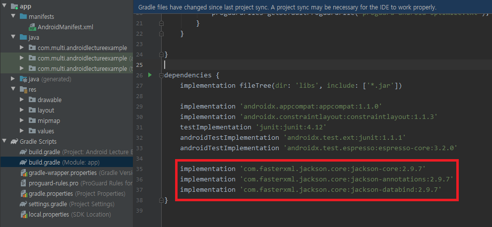
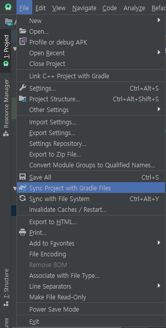

# Gradle

> Spring에서 Framework에 필요한 외부 패키지들은 Maven을 통해 관리했다.
>
> Android에서는 `Gradle`이 외부 패키지들을 관리한다.


## JACKSON Liarary 설치

> JSON 형식의 데이터를 쉽게 Java의 자료구조로 바꿔줄 수 있는 Library이다.

1. `Gradle Scripts` - `build.gradle (Module: app)` 파일

   ```xml
   apply plugin: 'com.android.application'
   
   android {
   	.....
   }
   
   dependencies {
   	.....
   	{__here__}
   }
   ```

   

2. `dependencies` 내부에 필요한 패키지를 입력한다.

   Jackson 라이브러리는 3가지의 패키지를 필요로 한다.

   ```xml
   dependencies {
   	implementation 
   		'com.fasterxml.jackson.core:jackson-core:2.9.7'
       implementation 
   		'com.fasterxml.jackson.core:jackson-annotations:2.9.7'
       implementation 
   		'com.fasterxml.jackson.core:jackson-databind:2.9.7'
   }
   ```

   

   

3. Gradle과 Project 동기화

   `File - Sync Project with Gradle Files`

   

