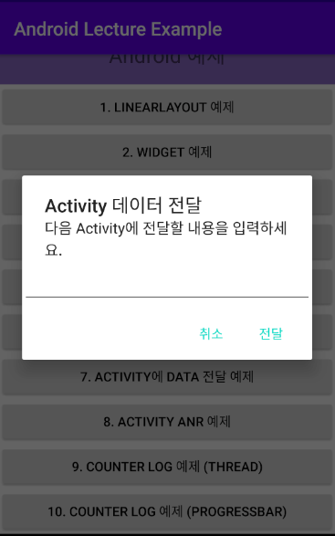

# Intent

## 정의

> 앱 컨포넌트가 무었을 할 것인지를 담는 메세지 객체이다.
>
> 가장 큰 목적은 다른 액티비티, 서비스, 브로드캐스트 리시버, 컨텐트 프로바이더 등을 실행하는 것이다.
>
> 인텐트는 그들 사이에서 데이터를 주고 받기 위한 용도로도 사용된다.


## 화면전환

> 다른 Activity를 호출하는 2가지 방식으로
>
> Explicit 방식과  Implicit 방식이 있다.

### Explicit 방식 (명시적)


#### Target Activity

- Main Activity에서 이동하길 원하는 다른 Activity를 생성한다.
  - `Example01_LayoutActivity`
    - Example01_LayoutActivity.java
    - activity_example01_layout.xml


#### Main Activity

- `activity_main.xml`

  ```xml
  <ScrollView xmlns:android="http://schemas.android.com/apk/res/android"
      android:layout_height="match_parent"
      android:layout_width="match_parent">
  
      <LinearLayout
          android:layout_height="match_parent"
          android:layout_width="match_parent"
          android:orientation="vertical">
  
          <TextView
              android:layout_width="match_parent"
              android:layout_height="wrap_content"
              android:padding="50px"
              android:text="Android 예제"
              android:textSize="10pt"
              android:textAlignment="center"
              android:gravity="center_horizontal"
              android:background="@color/colorPuple"/>
  
          <LinearLayout
              android:layout_width="match_parent"
              android:layout_height="match_parent"
              android:orientation="vertical">
  
              <Button
                  android:id="@+id/_01_linearlayoutBtn"
                  android:layout_width="match_parent"
                  android:layout_height="wrap_content"
                  android:text="1. LinearLayout" />
              
              <!-- 추가 예정 -->
  
          </LinearLayout>
  
      </LinearLayout>
  
  </ScrollView>
  ```
  

  
- `MainActivity.java`

  - id를 등록한 버튼에 Handler를 등록한다.

```java
Button _01_linearlayoutBtn =
		(Button) indViewById(R.id._01_linearlayoutBtn);
_01_linearlayoutBtn.setOnClickListener(new View.OnClickListener() {
	@Override
	public void onClick(View v) {
		
	}
});
```


- Intent 객체 생성
  - Target Activity를 찾아 지정하기 위해서 Intent 객체를 사용한다.

```java
	Intent i = new Intent();
```


- Intent 객체 설정

  - ComponentName 객체를 이용해 이동할 Activity를 지정한다

    - 매개변수는 2개이며

    - 첫번째 매개변수는 이동할 Activity가 포함된 Package 경로

    - 두번째 매개변수는 이동할 Activity의 Class 이름

      (Class 이름은 Package의 경로를 포함한다.)

  - ComponentName 객체를 Intent 객체에 연결한다.

  - Intent 객체를 이용해 새로운 Activity를 호출한다.

```java
ComponentName cname = 
    new ComponentName("com.example.androidlectureexample",
 	"com.example.androidlectureexample.Example01_LayoutActivity");
i.setComponent(cname);
startActivity(i);
```


## Data 전달

> 다음 실행될 Activity에 Data를 실어보내고 화면에 표시하기

> 새로운 Activity로 이동하는 버튼을 만든다
>
> 버튼을 누르면 Widget을 실행하여 사용자로부터 값을 입력받는다
>
> 입력받은 값을 새로운 Activity에서 출력한다.

- 사용자로부터 값을 입력받을 Widget을 생성한다.

  ```java
  final EditText editText = new EditText(MainActivity.this);
  ```

- Widget을 현재 Activity 위에 보여줄 객체를 생성한다.

  ```java
  AlertDialog.Builder builder = 
      new AlertDialog.Builder(MainActivity.this);
  ```

  - `AlertDialog.Builder` 클래스의 매개변수는 `Context Interface`이다
  - 매개변수는 `Builder` 객제가 표현될 상위 객체를 지정한다.

- `Builder` 가 표현할 창에 제목, 설명, 값을 입력받을 Widget을 추가한다.

  ```java
  builder.setTitle("Activity 데이터 전달");
  builder.setMessage("다음 Activity에 전달할 내용을 입력하세요.");
  builder.setView(editText);
  ```

- `Builder`에 버튼을 추가하고, Event Handler를 추가한다

  ```java
  builder.setPositiveButton("전달", new DialogInterface.OnClickListener() {
      @Override
      public void onClick(DialogInterface dialog, int which) {
          Intent i = new Intent();
          ComponentName cname =
              new ComponentName(
              	"com.multi.androidlectureexample",
  				"com.multi.androidlectureexample.{avtivity}");
          i.setComponent(cname);
          // 데이터 전달
          i.putExtra("sendMSG", editText.getText().toString());
          startActivity(i);
      }
  });
  builder.setNegativeButton("취소", new DialogInterface.OnClickListener() {
      @Override
      public void onClick(DialogInterface dialog, int which) {
          // 취소 버튼이기 때문에 특별한 이벤트 처리가 필요 없다
      }
  });
  ```

  - 긍정적인 버튼을 클릭할 경우, 다음 Activity를 실행하는 Handler를 추가했다

  - `Intent` 객체에 다음 Activity에 전달할 Data를 추가한다

    - ```java
      i.putExtra("key", value)
      ```

- 

- 전달받은 Activity에서 값을 꺼내고, TextView에 값을 지정한다

  ```java
  Intent i = getIntent();
  String msg = (String) i.getExtras().get("sendMSG");
  tv.setText(msg);
  ```

  


## Data 받기

> Target Activity 에서 Spinner 의 항목 중 하나를 저장하고
>
> 이를 Main Activity로 전달하면, Main Activity에서 Toast 메세지로 출력한다

- Target Activity에서 데이터를 전달받을 Main Activity에서 응답을 대기한다

  ```java
  btn.setOnClickListener(new View.OnClickListener() {
      @Override
      public void onClick(View v) {
          Intent i = new Intent();
          ComponentName cname =
              new ComponentName(
              	"com.multi.androidlectureexample",
  			  	"com.multi.androidlectureexample.{Activity}");
          i.setComponent(cname);
          startActivityForResult(i, 3000);
          // requestCode	3000
          // Target Activity를 호출한 Activity를 구분하기 위한 코드
          // onActivityResult()를 이용해 반환된 Intent를 받는다.
      }
  });
  ```

  

- Target Activity에서

  Spinner에서 항목이 선택되었을 때, 선택된 항목을 데이터에 저장한다

  - Listener는 `setOnItemSelectedListener` 를 사용한다
  - 해당 Listener는 2가지의 메서드를 Override 해야한다
    - `onItemSelected()` 
    - `onNothingSelected()`

  ```java
  String result;
  Spinner spinner = (Spinner) findViewById(R.id.mySpinner);
  
  spinner.setOnItemSelectedListener(new AdapterView.OnItemSelectedListener() {
      @Override
      public void onItemSelected(AdapterView<?> parent, 
                                 View view, int position, 
                                 long id) {
          // 선택된 항목 저장
          result = list.get(position);
      }
  
      @Override
      public void onNothingSelected(AdapterView<?> parent) {
  
      }
  });
  ```

- Send 버튼을 눌렀을 때, 저장된 Data를 Main Activity로 전달하고

  현재 실행중인 Activity를 종료한다.

  ```java
  Button sendBtn = (Button) findViewById(R.id.sendDataBtn);
  
  sendBtn.setOnClickListener(new View.OnClickListener() {
      @Override
      public void onClick(View v) {
          Intent returnIntent = new Intent();
          returnIntent.putExtra("ResultValue", result);
          setResult(7000, returnIntent);
          Example07_DataFromActivity.this.finish();
      }
  });
  ```

  - Intent 객체를 생성한다
  - `putExtra()` 메서드를 이용해서 Data를 넣어준다
    - 파라매터는 Key값과 Value로 되어있다
  - `Activity.finish()` 메서드를 이용해서 특정 Activity를 종료할 수 있다

- Main Activity에서 이전 Activity에서 전달받은 데이터를 받는다

  - Activity간의 데이터 전달에서 전달받은 데이터는 

    `onActivityResult()` 메서드에서 처리한다.

  ```java
  @Override
  protected void onActivityResult(int requestCode, int resultCode, @Nullable Intent data) {
      super.onActivityResult(requestCode, resultCode, data);
      //
      //_07_DataFromBtn
      if(requestCode==3000 && resultCode==7000) {
          String msg = (String) data.getExtras().get("ResultValue");
          Toast.makeText(this, msg, Toast.LENGTH_SHORT).show();
      }
  }
  ```

  - requestCode와 resultCode를 이용하여 데이터를 요청하고 건내준 Activity 를 구분하여 Event를 처리한다


