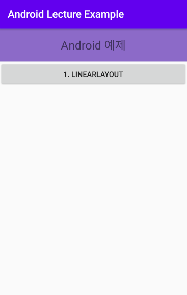

# Intent

## 정의

> 앱 컨포넌트가 무었을 할 것인지를 담는 메세지 객체이다.
>
> 가장 큰 목적은 다른 액티비티, 서비스, 브로드캐스트 리시버, 컨텐트 프로바이더 등을 실행하는 것이다.
>
> 인텐트는 그들 사이에서 데이터를 주고 받기 위한 용도로도 사용된다.


## 화면전환

> 다른 Activity를 호출하는 2가지 방식으로
>
> Explicit 방식과  Implicit 방식이 있다.

### Explicit 방식

> 명시적 방식

> 버튼을 눌렀을 때, 다른 Activity로 이동




#### Target Activity

- Main Activity에서 이동하길 원하는 다른 Activity를 생성한다.
  - `Example01_LayoutActivity`
    - Example01_LayoutActivity.java
    - activity_example01_layout.xml


#### Main Activity

- `activity_main.xml`

  ```xml
  
  <ScrollView xmlns:android="http://schemas.android.com/apk/res/android"
      android:layout_height="match_parent"
      android:layout_width="match_parent">
  
      <LinearLayout
          android:layout_height="match_parent"
          android:layout_width="match_parent"
          android:orientation="vertical">
  
          <TextView
              android:layout_width="match_parent"
              android:layout_height="wrap_content"
              android:padding="50px"
              android:text="Android 예제"
              android:textSize="10pt"
              android:textAlignment="center"
              android:gravity="center_horizontal"
              android:background="@color/colorPuple"/>
  
          <LinearLayout
              android:layout_width="match_parent"
              android:layout_height="match_parent"
              android:orientation="vertical">
  
              <Button
                  android:id="@+id/_01_linearlayoutBtn"
                  android:layout_width="match_parent"
                  android:layout_height="wrap_content"
                  android:text="1. LinearLayout" />
              
              <!-- 추가 예정 -->
  
          </LinearLayout>
  
      </LinearLayout>
  
  </ScrollView>
  ```

  

- `MainActivity.java`

  - id를 등록한 버튼에 Handler를 등록한다.
  - 

```java
Button _01_linearlayoutBtn =
		(Button) indViewById(R.id._01_linearlayoutBtn);
_01_linearlayoutBtn.setOnClickListener(new View.OnClickListener() {
	@Override
	public void onClick(View v) {
		
	}
});
```


		- d
		- 

