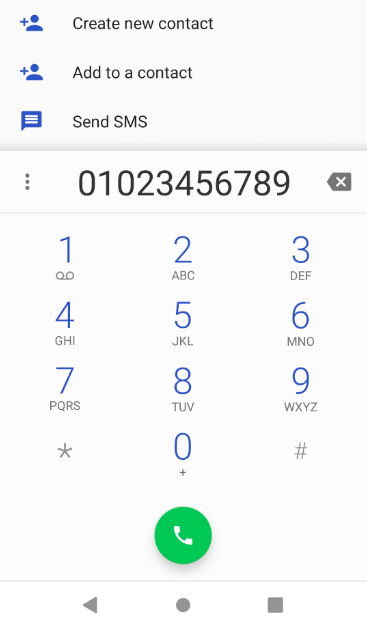
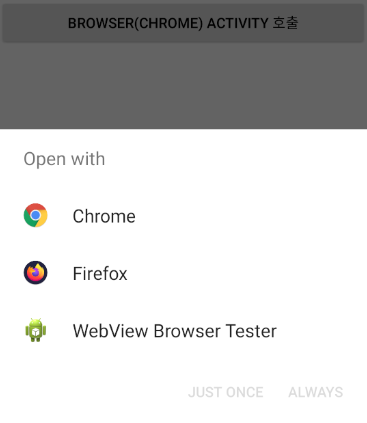
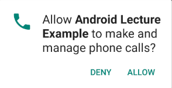
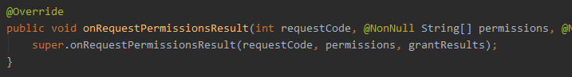

# Intent

## 정의

> 앱 컨포넌트가 무었을 할 것인지를 담는 메세지 객체이다.
>
> 가장 큰 목적은 다른 액티비티, 서비스, 브로드캐스트 리시버, 컨텐트 프로바이더 등을 실행하는 것이다.
>
> 인텐트는 그들 사이에서 데이터를 주고 받기 위한 용도로도 사용된다.


## 화면전환

> 다른 Activity를 호출하는 2가지 방식으로
>
> Explicit 방식과  Implicit 방식이 있다.

1. Explicit 방식 (명시적)

   - 호출할 대상 Activity의 클래스명을 알 때

     클래스를 명시적으로 지정하여 호출하는 방법

    

2. Implicit 방식(묵시적)

   - 호출할 대상 Activity의 클래스명 없이

     Activity가 가진 속성을 검색하여
     조건을 만족하는 Activity를 호출하는 방법

   - 호출하는 Activity 내부의 Activity 뿐만 아니라

     디바이스 내부의 모든 Activity들을 대상으로 검색하고

     조건을 만족하는 Activity들 중에서 하나를 사용자가 선택할 수 있는 선택지를 제공한다


### Explicit 방식 (명시적)

> 호출할 대상 Activity의 클래스명을 알 때
>
> 클래스를 명시적으로 지정하여 호출하는 방법


#### Target Activity

- Main Activity에서 이동하길 원하는 다른 Activity를 생성한다.
  - `Example01_LayoutActivity`
    - Example01_LayoutActivity.java
    - activity_example01_layout.xml


#### Main Activity

- `activity_main.xml`

  ```xml
  <ScrollView xmlns:android="http://schemas.android.com/apk/res/android"
      android:layout_height="match_parent"
      android:layout_width="match_parent">
  
      <LinearLayout
          android:layout_height="match_parent"
          android:layout_width="match_parent"
          android:orientation="vertical">
  
          <TextView
              android:layout_width="match_parent"
              android:layout_height="wrap_content"
              android:padding="50px"
              android:text="Android 예제"
              android:textSize="10pt"
              android:textAlignment="center"
              android:gravity="center_horizontal"
              android:background="@color/colorPuple"/>
  
          <LinearLayout
              android:layout_width="match_parent"
              android:layout_height="match_parent"
              android:orientation="vertical">
  
              <Button
                  android:id="@+id/_01_linearlayoutBtn"
                  android:layout_width="match_parent"
                  android:layout_height="wrap_content"
                  android:text="1. LinearLayout" />
              
              <!-- 추가 예정 -->
  
          </LinearLayout>
  
      </LinearLayout>
  
  </ScrollView>
  ```
  

  
- `MainActivity.java`

  - id를 등록한 버튼에 Handler를 등록한다.

```java
Button _01_linearlayoutBtn =
		(Button) indViewById(R.id._01_linearlayoutBtn);
_01_linearlayoutBtn.setOnClickListener(new View.OnClickListener() {
	@Override
	public void onClick(View v) {
		
	}
});
```


- Intent 객체 생성
  - Target Activity를 찾아 지정하기 위해서 Intent 객체를 사용한다.

```java
	Intent i = new Intent();
```


- Intent 객체 설정

  - ComponentName 객체를 이용해 이동할 Activity를 지정한다

    - 매개변수는 2개이며

    - 첫번째 매개변수는 이동할 Activity가 포함된 Package 경로

    - 두번째 매개변수는 이동할 Activity의 Class 이름

      (Class 이름은 Package의 경로를 포함한다.)

  - ComponentName 객체를 Intent 객체에 연결한다.

  - Intent 객체를 이용해 새로운 Activity를 호출한다.

```java
ComponentName cname = 
    new ComponentName("com.example.androidlectureexample",
 	"com.example.androidlectureexample.Example01_LayoutActivity");
i.setComponent(cname);
startActivity(i);
```


### Implicit 방식 (묵시적)

#### 예제 1

> Implicit 방식 사용 방법

##### Target Activity

1. Activity 생성 
2. Manifest

```xml
<activity android:name=".Example14sub_ImplicitIntentActivity">
  <intent-filter>
    <action android:name="MY_ACTION"/>
    <category android:name="android.intent.category.DEFAULT"/>
    <category android:name="INTENT_TEST"/>
  </intent-filter>
</activity>
```

- <intent-filter>를 설정해 이동할 Activity를 찾도록 추가한다
- <action>은 하나만 올 수 있다
- <category>는 여려개가 올 수 있다


##### 호출 Activity

```java
Intent i = new Intent();
i.setAction("MY_ACTION");
i.addCategory("INTENT_TEST");
i.putExtra("SEND DATA", "안녕?");
startActivity(i);
```


#### 예제 2 - ACTION_DIAL

> 전화 다이얼을 호출한다

##### Activity

```java
Intent i = new Intent();
i.setAction(Intent.ACTION_DIAL);
i.setData(Uri.parse("tel:01023456789"));
startActivity(i);
```



- Action은 안드로이드 기본으로 제공되는 `Intent.ACTION_DIAL` 속성값을 이용한다
- Activity가 실행될 때, Data를 같이 넘겨줄 수 있다
- 데이터는 `Android.net.Uri` 객체의 `Uri.parser` 메서드를 사용한다
- 파라메터는 String형이며, 번호를 나타내는 접미사 `tel:`을 붙여준다


#### 예제 3 - ACTION_VIEW

> 웹 브라우저를 호출한다

##### Activity

```java
Intent i = new Intent();
i.setAction(Intent.ACTION_VIEW);
i.setData(Uri.parse("http://www.naver.com"));
startActivity(i);
```



- Action은 안드로이드 기본으로 제공되는 `Intent.ACTION_VIEW`속성값을 이용한다
- [네이버](http://www.naver.com)를 실행하는 브라우저를 호출한다
- 브라우저의 종류가 여러개일 경우, 사용자가 실행할 App(Activity)를 선택할 수 있다


#### 예제 4 - ACTION_CALL

> 번호를 다이얼에 입력해주는 것 이상으로
>
> 해당 번호로 전화를 걸어주는 기능 구현

> 전화를 거는 것은 권한 설정이 필요하다  - [Permission](https://github.com/Jzee21/TIL/blob/master/Android/Permission.md)

##### Manifest

```xml
<uses-permission android:name="android.permission.CALL_PHONE" />
```


##### Activity

> Android 6.0 (Marshmallow) 부터 권한 설정이 강화되어
>
> 6.0 버전 이전과 이후의 사용 방식(사용 전 허가 획득)에 약간의 차이가 있다.

0. 전화 걸기

   - 권한이 설정되어 있다면 아래 코드로 전화를 걸 수 있다

     ```java
     Intent i = new Intent();
     i.setAction(Intent.ACTION_CALL);
     i.setData(Uri.parse("tel:0102345-6789"));
     startActivity(i);
     ```

     

1. 사용자의 `Android Version`을 확인한다

   ```java
   if (Build.VERSION.SDK_INT >= Build.VERSION_CODES.M)
   ```

   - if  -  Android Version이 6.0 버전 (M)  이상인 경우

     - 권한이 설정되었는지 확인한다

      

   - else  -  Android Version이 5.1 버전 (L) 이하인 경우

     - `[ 0. 전화걸기 ]`를 수행한다

     

2. 사용할 `통화사용 권한` 의 허가 여부를 확인한다

   ```java
   // Manifest.permission.CALL_PHONE* 통화 권한
   int permissionResult =
       ActivityCompat.checkSelfPermission(
       	getApplicationContext(),
   		Manifest.permission.CALL_PHONE);
   
   if (permissionResult == PackageManager.PERMISSION_DENIED)
       // PackageManager.PERMISSION_DENIED : -1
   ```

   - if  -  권한이 허용되지 않은 경우

     - 권한 허용이 이전에 거부되었는지 확인한다

      

   - else  -  권한이 허용된 경우

     - `[ 0. 전화걸기 ]`를 수행한다

      

3. 권한 허용이 이전에 거부되었는지 확인한다

   > 필요한 권한이 처음 요청했는지, 거부당한 권한을 다시 요청하는지 확인한다

   ```java
   if (shouldShowRequestPermissionRationale
       				(Manifest.permission.CALL_PHONE))
       // Boolean shouldShowRequestPermissionRationale(permission)
   ```

   - if  -  이전에 거부당한 권한을 다시 요청하는 경우

     - AlertDialog를 이용해 권한을 다시 허용할 것인지 사용자에게 확인하고

       `[ 4. 권한 요청 ]`을 수행한다.

      

   - else  -  필요한 권한을 처음 요청하는 경우

     - `[ 4. 권한 요청 ]`을 수행한다

      

4. 권한 요청

   > 필요한 권한(통과 권한)을 `사용자에게` 요청한다

   ```java
   requestPermissions(String[] permissions, int requestCode)
   ```

   - 필요한 권한`들`을 사용자에게 요청하는 메서드

     - `String[] permissions` 매개변수를 이용해

       다수의 권한을 연속적으로 요청할 수 있다

     - `requestCode`를 이용해 권한을 요청한 case를 구분한다

   - 위 메서드를 실행하면 아래와 같이 사용자에게 권한을 요청한다.

     `

   - `[ 5. 권한 요청 응답 ]`을 수행한다

   

5. 권한 요청 응답

   > 사용자에게 UI를 이용해 권한을 요청하고 얻은 요청의 결과를
   >
   > `onRequestPermissionsResult()`를 통해 처리한다

   

   ```java
   public void onRequestPermissionsResult(int requestCode, 
                              @NonNull String[] permissions, 
                              @NonNull int[] grantResults) {
       // ..................................................
   }
   ```

   - requestCode : 권한을 요청한 Event를 개발자가 구분하도록 한다
   - permissions : 사용자에게 허가를 요청한 권한들의 목록
   - grantResults : 권한들이 목록과 매칭되는 권한들의 요청 결과

   

   ```java
   if (requestCode == 1000)
   ```

   1. `[ 4. 권한 요청 ]` 에서  설정한 `requestCode`를 이용해

      ``onRequestPermissionsResult()`를 호출한 Event를 구분한다.

       

   ```java
   if (grantResults[0] == PackageManager.PERMISSION_GRANTED)
   ```

   2. UI를 통해 요청한 결과가 승인인지(`PERMISSION_GRANTED`) 확인한다
      - if  -  `[ 0. 전화걸기 ]`를 수행한다
      - else  -  기능의 실행이 취소된다
        - (권한에 의한 기능 실행 불가를 사용자에게 Toast로 알려줘도?)


---

## Data 전달

> 다음 실행될 Activity에 Data를 실어보내고 화면에 표시하기

> 새로운 Activity로 이동하는 버튼을 만든다
>
> 버튼을 누르면 Widget을 실행하여 사용자로부터 값을 입력받는다
>
> 입력받은 값을 새로운 Activity에서 출력한다.

- 사용자로부터 값을 입력받을 Widget을 생성한다.

  ```java
  final EditText editText = new EditText(MainActivity.this);
  ```

- Widget을 현재 Activity 위에 보여줄 객체를 생성한다.

  ```java
  AlertDialog.Builder builder = 
      new AlertDialog.Builder(MainActivity.this);
  ```

  - `AlertDialog.Builder` 클래스의 매개변수는 `Context Interface`이다
  - 매개변수는 `Builder` 객제가 표현될 상위 객체를 지정한다.

- `Builder` 가 표현할 창에 제목, 설명, 값을 입력받을 Widget을 추가한다.

  ```java
  builder.setTitle("Activity 데이터 전달");
  builder.setMessage("다음 Activity에 전달할 내용을 입력하세요.");
  builder.setView(editText);
  ```

- `Builder`에 버튼을 추가하고, Event Handler를 추가한다

  ```java
  builder.setPositiveButton("전달", new DialogInterface.OnClickListener() {
      @Override
      public void onClick(DialogInterface dialog, int which) {
          Intent i = new Intent();
          ComponentName cname =
              new ComponentName(
              	"com.multi.androidlectureexample",
  				"com.multi.androidlectureexample.{avtivity}");
          i.setComponent(cname);
          // 데이터 전달
          i.putExtra("sendMSG", editText.getText().toString());
          startActivity(i);
      }
  });
  builder.setNegativeButton("취소", new DialogInterface.OnClickListener() {
      @Override
      public void onClick(DialogInterface dialog, int which) {
          // 취소 버튼이기 때문에 특별한 이벤트 처리가 필요 없다
      }
  });
  ```

  - 긍정적인 버튼을 클릭할 경우, 다음 Activity를 실행하는 Handler를 추가했다

  - `Intent` 객체에 다음 Activity에 전달할 Data를 추가한다

    - ```java
      i.putExtra("key", value)
      ```

- 

- 전달받은 Activity에서 값을 꺼내고, TextView에 값을 지정한다

  ```java
  Intent i = getIntent();
  String msg = (String) i.getExtras().get("sendMSG");
  tv.setText(msg);
  ```

  


## Data 받기

> Target Activity 에서 Spinner 의 항목 중 하나를 저장하고
>
> 이를 Main Activity로 전달하면, Main Activity에서 Toast 메세지로 출력한다

- Target Activity에서 데이터를 전달받을 Main Activity에서 응답을 대기한다

  ```java
  btn.setOnClickListener(new View.OnClickListener() {
      @Override
      public void onClick(View v) {
          Intent i = new Intent();
          ComponentName cname =
              new ComponentName(
              	"com.multi.androidlectureexample",
  			  	"com.multi.androidlectureexample.{Activity}");
          i.setComponent(cname);
          startActivityForResult(i, 3000);
          // requestCode	3000
          // Target Activity를 호출한 Activity를 구분하기 위한 코드
          // onActivityResult()를 이용해 반환된 Intent를 받는다.
      }
  });
  ```

  

- Target Activity에서

  Spinner에서 항목이 선택되었을 때, 선택된 항목을 데이터에 저장한다

  - Listener는 `setOnItemSelectedListener` 를 사용한다
  - 해당 Listener는 2가지의 메서드를 Override 해야한다
    - `onItemSelected()` 
    - `onNothingSelected()`

  ```java
  String result;
  Spinner spinner = (Spinner) findViewById(R.id.mySpinner);
  
  spinner.setOnItemSelectedListener(new AdapterView.OnItemSelectedListener() {
      @Override
      public void onItemSelected(AdapterView<?> parent, 
                                 View view, int position, 
                                 long id) {
          // 선택된 항목 저장
          result = list.get(position);
      }
  
      @Override
      public void onNothingSelected(AdapterView<?> parent) {
  
      }
  });
  ```

- Send 버튼을 눌렀을 때, 저장된 Data를 Main Activity로 전달하고

  현재 실행중인 Activity를 종료한다.

  ```java
  Button sendBtn = (Button) findViewById(R.id.sendDataBtn);
  
  sendBtn.setOnClickListener(new View.OnClickListener() {
      @Override
      public void onClick(View v) {
          Intent returnIntent = new Intent();
          returnIntent.putExtra("ResultValue", result);
          setResult(7000, returnIntent);
          Example07_DataFromActivity.this.finish();
      }
  });
  ```

  - Intent 객체를 생성한다
  - `putExtra()` 메서드를 이용해서 Data를 넣어준다
    - 파라매터는 Key값과 Value로 되어있다
  - `Activity.finish()` 메서드를 이용해서 특정 Activity를 종료할 수 있다

- Main Activity에서 이전 Activity에서 전달받은 데이터를 받는다

  - Activity간의 데이터 전달에서 전달받은 데이터는 

    `onActivityResult()` 메서드에서 처리한다.

  ```java
  @Override
  protected void onActivityResult(int requestCode, int resultCode, @Nullable Intent data) {
      super.onActivityResult(requestCode, resultCode, data);
      //
      //_07_DataFromBtn
      if(requestCode==3000 && resultCode==7000) {
          String msg = (String) data.getExtras().get("ResultValue");
          Toast.makeText(this, msg, Toast.LENGTH_SHORT).show();
      }
  }
  ```

  - requestCode와 resultCode를 이용하여 데이터를 요청하고 건내준 Activity 를 구분하여 Event를 처리한다


