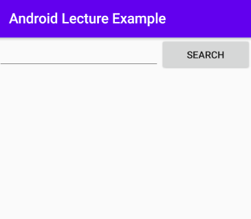

# Network


## Book Search App

> Web Application에 접속하여
>
> keyword를 이용해 데이터를 받아오자 (ver. Simple)


### 화면구성




```xml
<LinearLayout
	...
	android:orientation="vertical">
    
    <LinearLayout
		...
		android:orientation="horizontal">
    
        <EditText .../>
        <Button .../>
        
    </LinearLayout>
    
    <ListView .../>

</LinearLayout>
```

 

### Activity

1. Component Instance 획득

   ```java
   public class Activity extends AppCompatActivity {
       private Button searchBtn;
       private EditText searchTitle;
       private ListView searchList;
       
       @Override
       protected void onCreate(Bundle savedInstanceState) {
           searchBtn = (Button) findViewById(R.id.searchBtn);
           searchTitle = 
               (EditText) findViewById(R.id.searchTitle);
           searchList = 
               (ListView) findViewById(R.id.searchList);
       }
   }
   ```


### Thread

1. Handler 생성

   ```java
   @SuppressLint("HandlerLeak")
   final Handler handler = new Handler() {
       @Override
       public void handleMessage(@NonNull Message msg) {
           super.handleMessage(msg);
       }
   };
   ```

   - 추후 Thread가 데이터를 전달하고자 `sendMessage()`를 호출할 때,

     Activity에서 데이터를 받고 처리하기 위한 `handleMessage()`를 

     Override 하면서 Handler를 생성한다.

    

2. Runnable class 작성

   ```java
   class BookSearchRunnable implements Runnable {
   
       private Handler handler;
       private String keywork;
   
       BookSearchRunnable() {}
       BookSearchRunnable(Handler handler, String keyword) {
           this.handler = handler;
           this.keywork = keyword;
       }
   
       @Override
       public void run() {
           
       }
   }
   ```

   - Activity class 밖이나 별도의 파일로 작성한다

   - Thread는 Activity에 데이터를 전달하기 위한 Handler와

     검색어 keyword가 필요하기 때문에 생성자를 작성한다


### Event

1. Activity의 Button에 이벤트를 등록한다

   ```java
   searchBtn.setOnClickListener(new View.OnClickListener() {
       @Override
       public void onClick(View v) {
           String keyword = searchTitle.getText().toString();
           Log.i("keyword", keyword);
           if (keyword.trim().getBytes().length <= 0) {
               Toast.makeText(Activity.this,
   				"검색어를 입력해주세요.",
                   Toast.LENGTH_SHORT).show();
           } else if (keyword != null) {
               BookSearchRunnable runnable =
                   new BookSearchRunnable(handler, keyword);
               Thread t = new Thread(runnable);
               t.start();
           }
       }
   });
   ```

   - 버튼을 클릭하면 `EditText`에 내용을 가져와 keyword에 저장한다
   - keyword가 비어있는 경우, Toast 메세지가 발생한다
   - keyword가 입력된 경우, Thread를 생성, 실행한다

 

### Web App 접속

> Thread에서 Web Application에 접속하여 데이터를 받아온다.

1. `run()` 메서드 작성

   ```java
   String url = "{IP_address}/bookSearch/searchTitle?keyword=";
   ```

    

2. 예외처리

   ```java
   try {
       
   } catch (Exception e) {
       Log.i("BookSearch", e.toString());
   }
   ```

   > Java Network 기능은 네트워크나 서버 상황에 따라 다양한 변수와 결과가 존재한다
   >
   > 따라서 Network 기능 구현은 Exception 처리를 기본으로 한다

    

3. Web Application 접속

   ```java
   // 접속 시도
   URL url = new URL(url);
   HttpURLConnection con = 
       (HttpURLConnection) url.openConnection();
   con.setRequestMethod("GET");
   // 연결 상태 확인
   int responceCode = con.getResponseCode();
   ```

   ```java
   [Error] 
   java.io.IOException: Cleartext HTTP traffic to 
       {IP_Address} not permitted
   ```

   > 위와 같은 문제 발생 시
   >
   > Android Application 에서 Network에 접속하는데 있어 권한이 없음을 나타낸다.
   >
   > 이는 Application의 보안 설정으로 특정 기능에 대한 권한 등록이 필요하다
   >
   > [Android 권한 설정]


### Data from Server

> 접속한 Web Application의 Server에서 데이터를 가져온다.

1. 연결 통로 만들기

   ```java
   BufferedReader br = new BufferedReader(
       new InputStreamReader(con.getInputStream()));
   ```

   - Java에서는 서버와의 데이터 통로(Java Stream)을 이용해 데이터를 읽을 수 있다.
   - `InputStream`을 이용한 `BufferedReader` 객체를 이용해 데이터 통로를 만든다.

    

2. 통로를 통해 데이터 읽어오기

   ```java
   String readLine = "";
   StringBuffer responseText = new StringBuffer();
   while ((readLine = br.readLine()) != null) {
       responseText.append(readLine);
   }
   br.close();
   ```

   - `BufferedReader`를 통해 읽은 데이터를 `StringBuffer` 객체에 저장한다.
   - `BufferedReader` 객체 통로는 사용 후 반드시 닫는다.

    

3. 받은 데이터 확인하기

   ```java
   Log.i("BookSearch", "Message : " + responseText.toString());
   ```

   


```java
// 가져온 데이터(JSON)를 자료구조화 시켜서 Activity로 반환
/*  일반적으로 서버쪽 웹 프로그램은 XML이나 JSON으로 결과 데이터를 제공한다
	서버로부터 받은 데이터를 Java의 자료구조로 변환한다				*/
/*  JSON Parsing Library를 이용해서 쉽고 편하게 JSON을 handling
	가장 대표적인 JSON 처리 Library 중 하나인 JACKSON Library 사용 */

// JACKSON Library 설치
```


### JSON to String Array

> 일반적으로 서버쪽 Web Program은 XML이나 JSON 방식으로 결과 데이터를 제공한다.
>
> 가져온 데이터(JSON)는 Acvitity에서 사용할 수 있도록 자료구조화 시켜서 Activity로 반환해야한다.
>
> JSON Parsing Library 중 가장 유명한 `JACKSON` 라이브러리를 이용해서 JSON 파일을 쉽고 편하게 handling 한다.
>
> [Android에 JACKSON 라이브러리 설치하기]

```java
ObjectMapper mapper = new ObjectMapper();
String[] resultArr = 
    mapper.readValue(responseText.toString(), String[].class);
```

- Jackson Parser를 사용하기 위해 `ObjectMapper`객체를 생성한다
- `ObjectMapper.readValue()` 메서드를 이용해 JSON 파일을 String 배열로 변환한다.
- `ObjectMapper.readValue()`는 Json Data, 변환할 자료형을 파라메터로 갖는다.


### Handler로 전달

```java
Bundle bundle = new Bundle();

bundle.putStringArray("BOOKLIST", resultArr);

Message msg = new Message();
msg.setData(bundle);

handler.sendMessage(msg);
```

- Thread에서의 결과물을 Activity로 전달한다.


### ListView에 데이터 지정

> Thread에서 Handler를 통해 보낸 데이터를 Activity에서 받는다.
>
> 보낼 때는 `sendMessage()` 메서드를 이용하며,
>
> 받을 때는 `handleMessage()` 메서드를 사용한다.
>
> `handleMessage()` 메서드는 상단의 `Thread - 01. Handler 생성`에 있다.

```java
@Override
public void handleMessage(@NonNull Message msg) {
    super.handleMessage(msg);

    // Thread에서 데이터 수신
    Bundle bundle = msg.getData();
    String[] bookList = (String[]) bundle.get("BOOKLIST");

    // ListView에 데이터 지정
    ArrayAdapter adapter =
        new ArrayAdapter(getApplicationContext(),
                         android.R.layout.simple_list_item_1,
                         bookList);
    searchList.setAdapter(adapter);

}
```

- `ListView`는 Adapter 객체를 이용해 View에 지정할 수 있다.


> `Error`
>
> 위에서 Thread 에서 전달된 데이터를 Activity에서 받을 때,
>
> ```java
> Bundle bundle = msg.getData();
> String[] bookList = (String[]) bundle.get("BOOKLIST");
> ```
>
> 에 사용된 코드를 줄이기 위해 아래와 같이
>
> ```java
> String[] bookList = (String[]) msg.getDate().get("BOOKLIST");
> ```
>
> 로 줄여서 사용 시, 데이터의 수신이 정상적으로 이루어지지 않는다.

