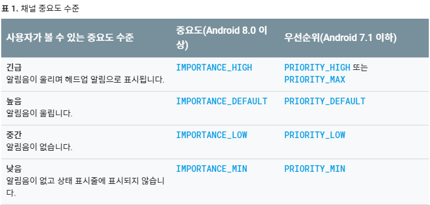

# Notification

[Android Developer - Build Notification](https://developer.android.com/training/notify-user/build-notification?hl=ko)


## Basic Notification

### 1. 알림 생성

```java
NotificationCompat.Builder nBuilder =
    new NotificationCompat.Builder(getApplicationContext(),CHANNEL_ID)
    	.setSmallIcon(R.drawable.notification_icon)
    	.setContentTitle(textTitle)
    	.setContentText(textContent)
    	.setPriority(NotificationCompat.PRIORITY_DEFAULT);
```

알림을 사용하기 위해서는 `NotificationCompat.Builder` 개체를 이용해 설정을 해야한다.

- 작은 아이콘  :  `setSmallIcon()`  -  사용자가 볼 수 있는 유일한 필수 콘텐츠

- 제목  :  `setContentTitle() ` 

- 알림 내용 : `setContentText()`

- 알림 우선순위  :  `setPriority()`  -  Android 7.1 이하에서 알림의 강제성을 결정

  ​																		(Android 8.0 이상은 채널 중요도를 대신 설정)


### 2. 채널 또는 우선순위 설정

> Android 8.0 (O, Oreo) 버전 부터는 알림을 제공하기 위해서는
>
> 앱의 알림 채널을 시스템에 등록하여야 한다.(필수)
>
> 앱이 시작하자마자 수행해야한다.

> Android 7.1 (N, Nougat) 버전 이하의 기기를 지원하기 위해서는
>
> 채널 대신 알림의 우선순위를 설정해야한다.


#### * 채널 설정

1. 고유한 채널 ID, 사용자가 볼 수 있는 이름, 중요도 수준을 사용하여 `NotificationChannel` 개체를 구성합니다.
2. 선택적으로 `setDescription()`을 사용하여 시스템 설정에서 사용자에게 표시되는 설명을 지정합니다.
3. 알림 채널을 `createNotificationChannel()`에 전달하여 등록합니다.

```java
if (Build.VERSION.SDK_INT >= Build.VERSION_CODES.O) {
    // Channel 구성 요소
    CharSequence name = getString(R.string.channel_name);
    String description = getString(R.string.channel_description);
    int importance = NotificationManager.IMPORTANCE_HIGH;
    
    // 채널 설정
    NotificationChannel nChannel =
        new NotificationChannel(CHANNAL_ID, channelName, importance);
    channel.setDescription(description);
    
    // Option
    
    // 채널 등록
    NotificationManager nManager = (NotificationManager)
    		context.getSystemService(NOTIFICATION_SERVICE);
    nManager.createNotificationChannel(nChannel);
}
```

- 중요도 수준에 따라 알림의 작동이 달라진다.

  

  [from Android Developer](https://developer.android.com/training/notify-user/channels?hl=ko)

   

- 기본적인 알림에 추가 설정을 줄 수 있다.

  ```java
  /***	Option	***/
  // 진동
  nChannel.enableVibration(true);
  nChannel.setVibrationPattern(new long[]);
  // LED
  nChannel.enableLights(true);
  nChannel.setLightColor(int argb);
  // 잠금화면 알림
  nChannel.setLockscreenVisibility(Notification.VISIBILITY_PRIVATE);
  ```


#### *  우선순위 설정

- `NotificationCompat.Builder` 객체를 이용하여 Notification객체를 생성할 때,

  ```java
  .setPriority(NotificationCompat.PRIORITY_DEFAULT);
  ```

  를 이용하여 우선순위를 설정할 수 있다.


### 3. 알림의 탭 작업 설정

> 기본적으로 알림은 탭(터치)에 반응해야한다.
>
> 이를 위해 `PendingIntent` 객체를 지정해야한다.

```java
Intent nIntent = 
    new Intent(getApplicationContext(), ___Activity.class);
nIntent.addFlags(Intent.FLAG_ACTIVITY_SINGLE_TOP);
nIntent.addFlags(Intent.FLAG_ACTIVITY_CLEAR_TOP);

int requestID = (int) System.currentTimeMillis();

PendingIntent pIntent =
    PendingIntent.getActivity(getApplicationContext(), requestID,
                              nIntent, PendingIntent.FLAG_UPDATE_CURRENT);

NotificationCompat.Builder nBuilder =
    new NotificationCompat.Builder(getApplicationContext(),CHANNEL_ID)
    	.setSmallIcon(android.R.drawable.btn_star);	
    	.setContentTitle("Noti제목")
		.setContentText("Noti내용")
        .setPriority(NotificationCompat.PRIORITY_DEFAULT)
		// Option
		.setContentIntent(pIntent)
        .setAutoCancel(true);		// 터치 반응

```

- 현재 실행되고있는 Activity  위에 알림을 띄우기 위해서

  Intent 객체에 Intent Flag를 추가하였다.

- Intent를 이용해 `PendingIntent` 객체를 생성하고, 이를 Builder에 지정한다.

- 알림에 추가적인 옵션을 선택할 수 있다.

  ```java
  // 알림의 기본 사운드, 기본 진동 설정
  .setDefaults(Notification.DEFAULT_ALL)
  
  // 알림의 기본음 설정
  .setSound(RingtoneManager.getDefaultUri(
              RingtoneManager.TYPE_NOTIFICATION))
  ```

  


### 4. 알림 표시

```java
NotificationManager nManager = (NotificationManager)
    		context.getSystemService(NOTIFICATION_SERVICE);

nManager.notify(notificationId, builder.build());
```


---

```java
/*
String CHANNAL_ID = "MY_CHANNEL";
String channel_name = "MY_CHANNEL_NAME";
String channel_description = "MY_CHANNEL_TEST"
*/

NotificationManager nManager =
    (NotificationManager) context.getSystemService(NOTIFICATION_SERVICE);

if (Build.VERSION.SDK_INT >= Build.VERSION_CODES.O) {
    // Channel 구성 요소
    CharSequence name = getString(R.string.channel_name);
    String description = getString(R.string.channel_description);
    int importance = NotificationManager.IMPORTANCE_HIGH;
    
    // 채널 설정
    NotificationChannel nChannel =
        new NotificationChannel(CHANNAL_ID, channelName, importance);
    nChannel.setDescription(description);
    
    // 진동
	nChannel.enableVibration(true);
	nChannel.setVibrationPattern(new long[]);
	// LED
	nChannel.enableLights(true);
	nChannel.setLightColor(int argb);
	// 잠금화면 알림
	nChannel.setLockscreenVisibility(Notification.VISIBILITY_PRIVATE);
    
    // 채널 등록
    nManager.createNotificationChannel(nChannel);
}

// 알림 탭 작업
Intent intent = 
    new Intent(getApplicationContext(), ___Activity.class);
intent.addFlags(Intent.FLAG_ACTIVITY_SINGLE_TOP);
intent.addFlags(Intent.FLAG_ACTIVITY_CLEAR_TOP);

int requestID = (int) System.currentTimeMillis();

/* PendingIntent pendingIntent = 
	PendingIntent.getActivity(this, 0, intent, 0);			*/
PendingIntent pIntent =
    PendingIntent.getActivity(getApplicationContext(), requestID,
                              intent, PendingIntent.FLAG_UPDATE_CURRENT);

NotificationCompat.Builder nBuilder =
    new NotificationCompat.Builder(getApplicationContext(),CHANNAL_ID);
			setSmallIcon(android.R.drawable.btn_star)
			.setContentTitle("My Notification")
			.setContentText("Hello~")
			.setDefaults(Notification.DEFAULT_ALL)
			.setSound(RingtoneManager.getDefaultUri(
                		RingtoneManager.TYPE_NOTIFICATION))
			.setContentIntent(pIntent)
			.setAutoCancel(true);

// 알림 표시
nManager.notify(0, nBuilder.build());
			 // 0 : notificationId
```

