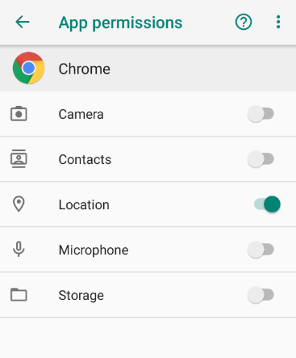

# Permission

> Android Application의 보안 정책에 따라
>
> 사용자의 민감한 데이터나 특정 시스템 기능을 사용하기 위해서는
>
> 이에 엑세스 하기 위한 권한을 요청해야 한다.
>

> `AndroidManifest.xml` 파일에는
>
> Android 빌드 도구, Android 운영체제 및 Google Play에 앱에 관한 필수 정보를 가진다.


## 앱 권한 요청

> 앱마다 사용자에게 권한을 요청하고 요청이 허용되어야 해당 기능을 이용할 수 있다

> Android 6.0 (Marshmallow) 이상에서는 manifest 파일에 기술하는 것 이외에 추가적인 권한을 요구한다

- 일반 권한(Normal Permission)
- 위험 권한(Dangerous Permission)
  - 위치, 전화, 카메라, 마이크, 문자, 일정, 주소록, 센서 등
  - 사용자의 개인정보와 관련된 모든것


## 권한 확인

> 각각의 Application 마다 권한을 확인하고, 수정할 수 있다.

설정  -  애플리케이션  -  `확인할 앱` - 권한




### Network 연결 권한

Application에서 Network 작업을 수행하기 위해서는 `mainfest`에 다음과 같은 권한을 포함해야 한다.

```xml
<uses-permission android:name="android.permission.INTERNET" />
```

또는 (하나 또는 두개의 권한)

```xml
<uses-permission 
	android:name="android.permission.INTERNET" />
<uses-permission 
	android:name="android.permission.ACCESS_NETWORK_STATE" />
```


### HTTP 접속 권한

HTTP 프로토콜로 네트워크에 접속하기 위해서는 `mainfest`에 다음과 같은 내용이 포함되어야 한다.

```xml
<application
	android:usesCleartextTraffic="true"
	.....>
</application>
```

> Android 9.0 (Pie) 버전 부터는 기본 Web Protocol이 HTTP에서 `HTTPS`로 변경되었다.
>
> 이에 따라 HTTP 프로토콜을 사용하기 위해서는 위와 같은 특수한 설정이 추가로 필요하다.


### 통화 권한

```xml
<uses-permission android:name="android.permission.CALL_PHONE" />
```

`Intent.md - 예제 4`

[전화걸기 권한 설정](https://github.com/Jzee21/TIL/blob/master/Android/Intent.md)


### SMS 수신 권한

```xml
<uses-permission android:name="android.permission.RECEIVE_SMS" />
```


## 사용자 권한 요청

> Android 6.0 (M, Marshmallow)  버전 이상부터는 추가적인 권한을 필요로 하며,
>
> 이는 사용자에게 직접 권한 사용의 허가를 요청한다

```java
// 1. Android Version 확인
if (Build.VERSION.SDK_INT >= Build.VERSION_CODES.M) {
    // M 버전 이상
    // 2. 사용자 권한 중 SMS 받기 권한의 설정 확인
    int permissionResult = ActivityCompat.checkSelfPermission(
        	getApplicationContext(), Manifest.permission.RECEIVE_SMS);
    if (permissionResult == PackageManager.PERMISSION_DENIED) {
        // 권한이 없다면
        // 3. 사용자에게 권한을 처음 요청하는지 확인
        if (shouldShowRequestPermissionRationale(
            	Manifest.permission.RECEIVE_SMS)) {
            // True  >>  거부한 이력이 있다
            // 4. 권한을 다시 요청
            AlertDialog.Builder dialog =
                new AlertDialog.Builder(___Activity.this);
            dialog.setTitle("권한이 필요합니다.");
            dialog.setMessage("SMS 수신 권한이 필요합니다. 수락하시겠습니까?");
            dialog.setPositiveButton("Yes", 
			new DialogInterface.OnClickListener() {
                @Override
                public void onClick(DialogInterface dialog, int which) {
                    requestPermissions(
                        new String[]{Manifest.permission.RECEIVE_SMS},
                        100);
                    // callback onRequestPermissionsResult()
                }
            });
            dialog.setNegativeButton("No", 
			new DialogInterface.OnClickListener() {
                @Override
                public void onClick(DialogInterface dialog, int which) {
                    // 권한 설정 거부
                    // do nothing
                }
            });
            dialog.create().show();
        // 3. 권한 요청 기록 확인
        } else {
            // False  >>  처음 권한을 요청한 경우
            requestPermissions(
                new String[]{Manifest.permission.RECEIVE_SMS},
                100);
            // callback onRequestPermissionsResult()
        }
    // 2. 권한 확인
    } else {
        // 권한이 있다면
        // Log.i("SMSTest", "보안설정 통과");
    }
// 1. 버전 확인
} else {
    // M 버전 미만
    // Log.i("SMSTest", "보안설정 통과");
}
```

```java
@Override
public void onRequestPermissionsResult(int requestCode, 
		@NonNull String[] permissions, @NonNull int[] grantResults) {
    super.onRequestPermissionsResult(requestCode, 
                                     permissions, grantResults);
    if (requestCode == 100) {
        if (grantResults.length > 0 && 
            grantResults[0] == PackageManager.PERMISSION_GRANTED) {
            Log.i("SMSTest", "보안설정 통과");
        }
    }
} // onRequestPermissionsResult()
```

