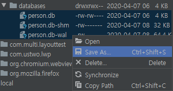

# SQLite

> Android System 내부에는 기본적으로 SQLite라는 DB가 포함되어있다.


## SQLite 사용

> 기존에는 `SQLiteOpenHelper`를 이용하여 데이터를 저장하였지만,
>
> 2017년 Google I/O에서 `Android Architecture Components(AAC)`를 발표하면서 
>
> Android Developer 에서는 SQLite를 직접 사용하는 것은 `Low Level API`이기 때문에
>
>  AAC의 `Room`의 사용을 강력하게 권장한다.

> Android에서 Database은 각 어플리케이션마다 구분된 공간에 저장된다.


## SQLite 기초

> Exam01

### DB 생성

```java
private SQLiteDatabase database;

String dbName = getString(R.string.database_name);
database = openOrCreateDatabase(dbName, MODE_PRIVATE, null);
```

- name  :  읽어들일 DB의 이름

- mode  :  DB를 읽는 방식

  - MODE_PRIVATE  :  0x0000

    읽기 쓰기가 가능한 일반적인 DB를 생성하거나 오픈

- factory  :  null 사용

> 이렇게 생성된 Database는 Device 내부의
>
> `/data/data/{app_package}/databases/{dbName}` 형태로 저장된다.
>
> (dbName에는 확장자가 포함된다.)


### Table 생성

```java
String tableName = getString(R.string.table_name);
String sql = "CREATE TABLE IF NOT EXISTS " + tableName
    + " ( _id INTEGER PRIMARY KEY AUTOINCREMENT, "
    + "name TEXT, age INTEGER, mobile TEXT)";
database.execSQL(sql);
```

- `execSQL()`   :  select 계열이 아닌 SQL 문장을 실행할 때 사용
- `rawQuery()`  :  select 계열의 SQL 문장을 실행할 때 사용


### Data 입력

```java
String empName = empNameEt.getText().toString();
int empAge = Integer.parseInt(empAgeEt.getText().toString());
String empMobile = empMobileEt.getText().toString();

String sql = "INSERT INTO emp(name, age, mobile) VALUES "
    + "('" + empName + "', " + empAge + ", '" + empMobile + "')";
database.execSQL(sql);
```


## Cursor

> Database를 불러오면 Table 형태로 받는다
>
> Cursor는 Table을 `row` 단위로 처리하도록 돕는다.

> Exam01의 데이터 출력

```java
// database load
String sql = "SELECT _id, name, age, mobile FROM emp";
Cursor cursor = database.rawQuery(sql, null);

// 다음 줄 확인
cursor.moveToNext();

cursor.getInt(0);
cursor.getString(1);
```


## SQLiteOpenHelper

> 2017년 이후 Android Developer에서는
>
> 해당 방식을 `Low Level API`로서 구현시 요류발생의 가능성이 높아
>
> AAC의 Doom 을 사용할 것을 강력 추천하고있다.


### 필수 구성

> SQLiteOpenHelper 를 이용하기 위해서는 별도의 Class를 Define 해주어야 한다.

```java
class MyDatabaseHelper extends SQLiteOpenHelper {
    
}
```


#### Method Override

> `SQLiteOpenHelper`를 상속받은 Helper 객체를 생성하면
>
> 반드시 Override 해야할 메서드들이 있다.
>
> 1. 생성자
> 2. onCreate()
> 3. onUpgrade()
>
> 여기에 필수는 아니지만 Override 하면 좋은 메서드로
>
> - onOpen()
>
> 메서드가 있다.


#### 생성자

> `SQLiteOpenHelper` 객체는 기본 생성자가 존재하지 않는다.
>
> 따라서 아래와 유사한 생성자를 기본으로 필요로 한다.

```java
public static final int DATABASE_VERSION = 1;
public static final String DATABASE_NAME = "MyDatabase";

public MyDatabaseHelper(@Nullable Context context) {
    super(context, DATABASE_NAME, null, DATABASE_VERSION);
}
```

`super(context, DATABASE_NAME, null, DATABASE_VERSION)`

- context 
- name  :  생성하거나 불러올 DB의 이름
- factory  :  기본적으로 `null`을 사용한다.
- version  :  DB의 버전 정보


#### onCreate()

> 생성자가 실행되면 자동적으로 `onOpen()` 메서드가 callback 된다
>
> 하지만, 만약 해당 DB가 존재하지 않다면, `onCreate()` 메서드가 먼저 호출된다.

```java
@Override
public void onCreate(SQLiteDatabase db) {

}
```


#### onOpen()

> 생성자의 `DATABASE_NAME` 이름으로 생성된 DB가 있을 때
>
> 생성자가 수행된 후 이 메서드가 자동적으로 callback 된다.

```java
@Override
public void onOpen(SQLiteDatabase db) {
    super.onOpen(db);
}
```


#### onUpgrade()

> 생성자의 `DATABASE_NAME` 이름으로 생성된 DB가 있을 때
>
> 기존의 `DATABASE_VERSION`과 `새로운 Version`이 다르다면
>
> `onUpgrade()` 메서드가 호출된 후, `onOpen()` 메서드가 실행된다.

> 앱이 업데이트되어 배포될 때, DB 스키마를 다시 생성할 때 주로 사용된다.
>
> 기존의 DB를 drop 하고 새로운 DB를 구성한다.

```java
@Override
public void onUpgrade(SQLiteDatabase db, int oldVersion, int newVersion) {

}
```


### 호출 순서

```java
if ( DATABASE_NAME DB가 존재하는가? ) {
    if ( 기존 Version == 새로운 Version ) {
        onOpen();
    } else {
        onUpgrade();
    }
} else {
    onCreate();
}
```


### Exam02

> `SQLiteOpenHelper`를 이용한 Database 생성

```java
class MyDBHelper extends SQLiteOpenHelper {
    public MyDBHelper(Context context, String DB_NAME, int DB_VERSION) {
    	super(context, DB_NAME, null, DB_VERSION);
	}
    
    @Override
    public void onCreate(SQLiteDatabase db) {
		String sql = "CREATE TABLE IF NOT EXISTS person"
                + " ( _id INTEGER PRIMARY KEY AUTOINCREMENT, "
                + "name TEXT, age INTEGER, mobile TEXT)";
        db.execSQL(sql);
    }
    
    @Override
    public void onOpen(SQLiteDatabase db) {
        super.onOpen(db);
    }
    
    
    @Override
    public void onUpgrade(SQLiteDatabase db, 
                          int oldVersion, int newVersion) {

    }
    
}
```

```java
private SQLiteDatabase database;
// ...
MyDBHelper helper = new MyDBHelper(___Activity.this, dbName, 1);
database = helper.getWritableDatabase();
```


## Room

> .....


## SQLite 데이터 확인

> Android 시스템에서 제공하는 SQLite 데이터베이스는
>
> DB를 생성한 어플리케이션의 고유 영역에 저장된다.

> 내부 저장소에 저장된 DB를 PC로 복사해오고,
>
> [Sqlitebrowser](https://sqlitebrowser.org/)를 이용해 조회할 수 있다.


### DB 저장 경로

`/data/data/{app_package}/databases/{DATABASE_NAME}`


### DB 가져오기

> DB를 가지고 있는 가상 디바이스나, 실제 디바이스의 USB 디버깅 연결이 선행된다.

.

`View - Tool Windows - Device File Explorer`


DB 저장 경로로 이동한다.

.

.


.

위 3개의 파일을 PC로 저장한다. (Save As...)

- `Device File Explorer` 실행 이후 DB의 상태가 변경된 이력이 있다면

  `Synchronize`를 사용한 후 저장한다


