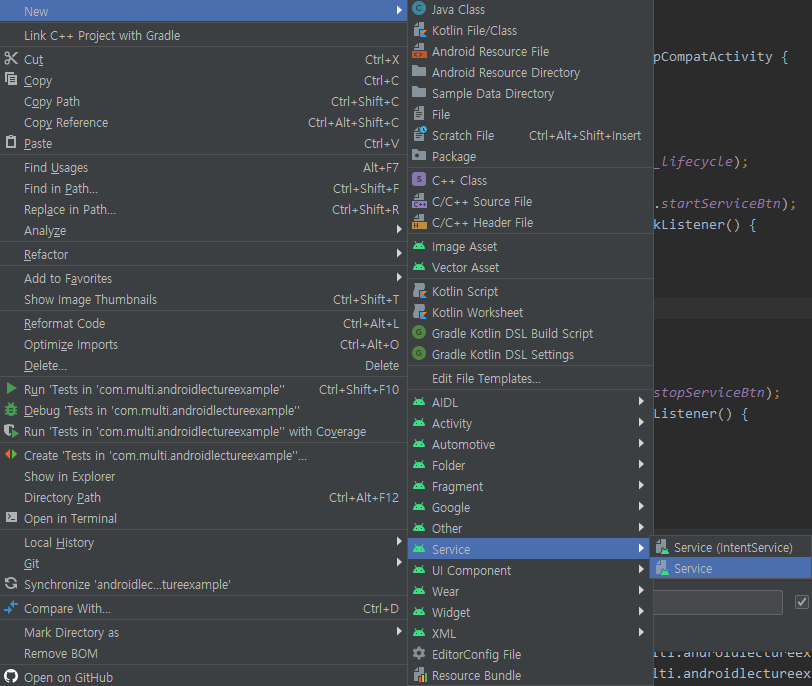
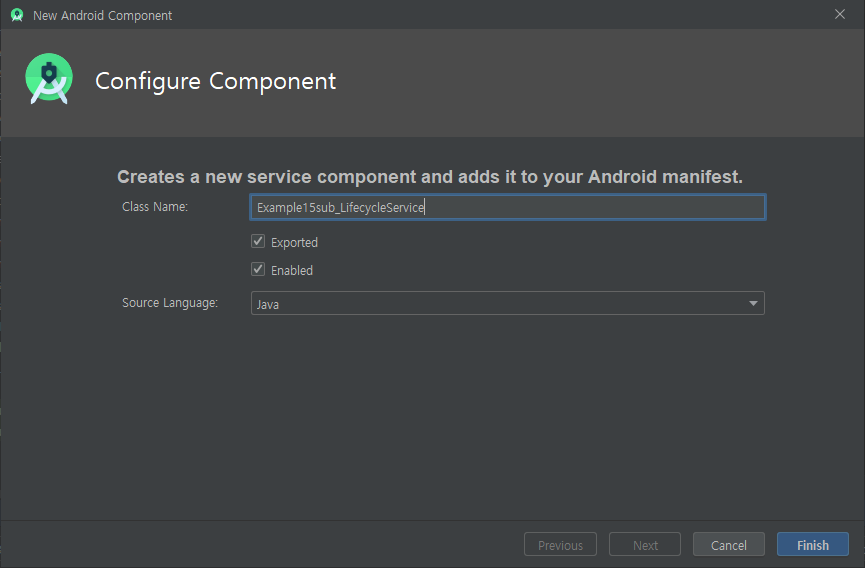
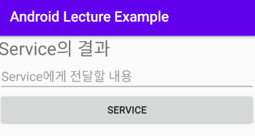
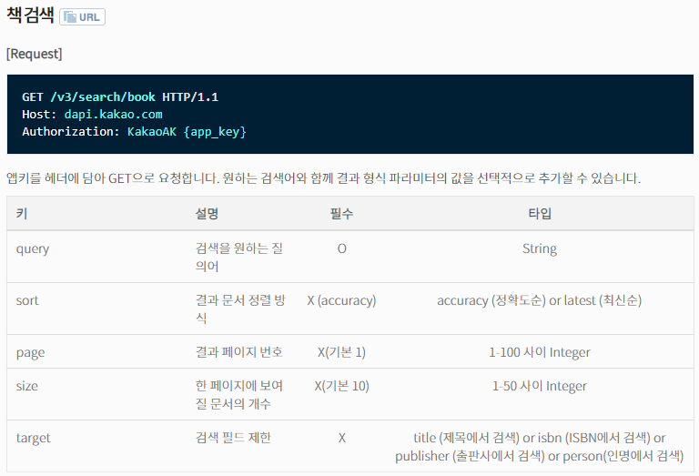

# Service

> 메신저 앱이나 스트리밍 앱처럼
>
> 화면에 켜지 않아도 메세지를 수신하거나 음악을 스트리밍 하는 등
>
> 눈에 보이지 않지만 Background에서 실행되는 것들을 구현하는데 주로 사용된다.


---

## Lifecycle

### Activity

- onCreate() > onStart() > onResume() > onPause > onStop()

### Service

- onCreate() > onStartCommand() > onDestroy()


## Create Service

`New - Service - Service*`

> Service로 생성한다.
>
> Service (IntentService)  :  1회용 Service라고 생각하면 된다.






- Exported
  - 생성된 Component를 다른 App에서 사용할 수 있도록 허용
- Enabled
  - 서비스가 사용 가능한 상태로 생성할 것


```java
public class ___Service extends Service {
    public ___Service() {
    }
    
    @Override
    public IBinder onBind(Intent intent) {
        // TODO: Return the communication channel to the service.
        throw new UnsupportedOperationException(
            "Not yet implemented");
    }
}
```


### Method Override

> 주로 사용하게 될 Method
>
> onCreate(). onStartCommand(), onDestroy()

```java
@Override
public void onCreate() {
    super.onCreate();
}

@Override
public int onStartCommand(Intent intent, int flags, int startId) {
    return super.onStartCommand(intent, flags, startId);
}

@Override
public void onDestroy() {
    super.onDestroy();
}
```

- onCreate()
  
  - `Service`가 생성될 때 호출된다
- onStartCommand()
  - 실제 Service 동작을 수행하는 부분
  
  - Service가 동작중이지 않다면 먼저 `onCreate()`를 호출한 후 실행한다
  
  - Activity에서 Service를 실행하기 위해 전달된 Intent 객체는
  
    Service의 `onStartCommand()` 에서 받을 수 있다.( `onCreate() 아님` )
- onDestroy()
  
  - `stopService()`가 실행되면 호출된다


## Start Service

### Activity

```java
Intent i = new Intent(getApplicationContext(),
                      ___Service.class);
startService(i);
```

- Intent에 Service의 클래스를 지정한다

- startService(intent) 메서드를 이용해

  Service 의 `onCreate()`를 호출한다.


### Service

`onStartCommand()`

> Activity의 `startService()`가 실행되면 
>
> Service 객체의 생성을 확인하여  `onCreate()` 실행 후 실행되거나
>
> 바로 실행된다.

```java
try {
    // private Thread myThread;
    myThread = new Thread(new Runnable() {
        @Override
        public void run() {
            for (int i=0 ; i<10 ; i++) {
                try {
                    Thread.sleep(1000);     // 1 sec
                    // interrupt point
                    Log.i("ServiceExam", "count : " + i);
                } catch (Exception e) {
                    Log.i("ServiceExam", 
                          "["+i+"] e : " + e.toString());
                }
            }// for()
        }// run()
    }).start();
} catch (Exception e) {
    Log.i("ServiceExam", "Thread.start() : " + e);
}
```

- onStartCommend() 내부에서 Thread를 이용해 작업을 처리한다.

 

## Stop Service

### Activity

```java
Intent i = new Intent(getApplicationContext(),
                      ___Service.class);
stopService(i);
```

- Intent에 Service의 클래스를 지정한다

- stopService(intent) 메서드를 이용해

  Service 의 `onDestroy()`를 호출한다.

 

### Service

`onDestroy()`

> 서비스가 사용한 자원에 대해 정리 하도록 유도하는 메서드

```java
if (myThread != null && myThread.isAlive()) {
    myThread.interrupt();
}
```

- ( 기존에는 Thread.stop() 메서드를 이용해 쓰레드를 강제종료 했다

  강제 종료에는 많은 Exception을 발생시켜 현재는 사용하지 않는다 )

- 서비스에서 사용한 myThread 쓰레드가 존재하고, 아직 작동중이라면

  해당 쓰레드에 `interrupt` 를 발생시킨다.

- `interrupt`는 Thread가 `Sleep` 상태에 들어가고자 할 때,

  강제적으로 Exception을 발생시켜 Thread가 작업중이 아닌 유휴상태일 때, Thread의 작업 종료를 유도한다

- 따라서, Thread에서는 `interrupt`에 대응한 예외처리가 필요하다

 

 

## Activity와 Service의 차이점

1. Lifecycle이 다르다

   - 위의 Lifecycle에서 비교한 바와 같다

2. 자동적으로 다시 시작할 수 있다

   - Activity는 종료 시 사라지지만(자동으로 살릴 수 없다)

     Service는 도중에 의도치 않게 중료되어도 자동으로 중단된 지점에서 **`다시 시작할 수 있다`**

 

## Service에서 Data 받기

.

```java
private TextView dataFromServiceTv;
private EditText dataToServiceEt;
private Button dataToServiceBtn;
```

 

### Activity

```java
dataToServiceBtn.setOnClickListener(new View.OnClickListener() {
    @Override
    public void onClick(View v) {
        //
        Intent i = new Intent(getApplicationContext(),
                              Example16sub_DataTransferService.class);
        i.putExtra("DATA", dataToServiceEt.getText().toString());
        startService(i);
    }
});
```

- Service에 넘겨줄 데이터는 Intent 객체에 `putExtra()` 메서드를 이용해 담을 수 있다

 

### Service

```java
@Override
public int onStartCommand(Intent intent, int flags, int startId) {

    String data = intent.getExtras().getString("DATA");

    return super.onStartCommand(intent, flags, startId);
}
```

- Activity에서 Service를 실행하기 위해 전달된 Intent 객체는

  Service의 `onStartCommand()` 에서 받을 수 있다.( `onCreate() 아님` )

 

## Activity로 Data 전달

### Service

```java
@Override
public int onStartCommand(Intent intent, int flags, int startId) {
    // ...

    String resultData = data + "를 받았어요";
    Intent resultIntent = new Intent(getApplicationContext(),
						Example16_ServiceDataTransferActivity.class);
    resultIntent.putExtra("RESULT", resultData);
    
    // 차이점
    resultIntent.addFlags(Intent.FLAG_ACTIVITY_NEW_TASK);
    resultIntent.addFlags(Intent.FLAG_ACTIVITY_CLEAR_TOP);
    resultIntent.addFlags(Intent.FLAG_ACTIVITY_SINGLE_TOP);

    startActivity(resultIntent);

    return super.onStartCommand(intent, flags, startId);
}
```

- Service에서 Intent를 이용해 Activity를 호출하고

  Intent 에 전달할 데이터를 담아 보낸다

- Service에서 Activity를 호출할때는 2가지가 필요하다

  1. Task

     - 화면이 없는 Service가 화면을 가진 Activity를 호출하기 위해서는
       Task가 필요하다

     - ```java
       resultIntent.addFlags(Intent.FLAG_ACTIVITY_NEW_TASK);
       ```

  2. Flag

     - 새로운 Activity를 실행하는 것이 아닌,
       메모리에 존재하는 Activity를 찾아서 실행할 때 Flag를 설정해야한다

     - ```java
       resultIntent.addFlags(Intent.FLAG_ACTIVITY_CLEAR_TOP);
       resultIntent.addFlags(Intent.FLAG_ACTIVITY_SINGLE_TOP);
       ```

 

### Activity

```java
@Override
protected void onNewIntent(Intent intent) {
    super.onNewIntent(intent);

    String result = intent.getExtras().getString("RESULT");
    dataFromServiceTv.setText(result);

}
```

- Service로부터 Intent가 도착하면

  Activity에서 `onNewIntent()` method가 호출된다

- Intent에서 데이터를 꺼내어 사용한다

 

---

## 응용예제

### Kakao Open Api

[Kakao Developer](https://developers.kakao.com/)  에서는 Kakao와 관련된 서비스에서 제공하는 Open API들을 모아놓았다.

 

#### Daum Book Search Api

> 2020/03/27일 기준



```java
String url = 
    "https://dapi.kakao.com/v3/search/book?target=title&query="
    + keyword;
```

```java
URL obj = new URL(url);
HttpURLConnection con = (HttpURLConnection) obj.openConnection();
con.setRequestMethod("GET");
con.setRequestProperty(						// *header에 인증키 추가
    "Authorization", "KakaoAK {Kakao app_key}");
```

- 인증키 전송

  Kakao Open API에서는 개인마다 고유의 API 인증키를 발급한다.

  API는 `앱키를 헤더에 담아 GET으로 요청`하기를 요구한다.

- Request Header 설정

  `HttpURLConnection` 객체가 제공하는 `setRequestProperty()` 메서드를 이용해
  key와 value 값으로 Header에 설정을 담을 수 있다.

 

#### JSON 데이터 처리

> Kakao Open API의 요청 결과는 JSON 방식으로 보내진다

- 서버에서 데이터 받아오기

  ```java
  BufferedReader br = new BufferedReader(
      new InputStreamReader(con.getInputStream()));
  StringBuffer sb = new StringBuffer();
  
  String line;
  while ( (line = br.readLine()) != null ) {
      sb.append(line);
  }
  
  br.close();
  
  String jsonData = sb.toString();	// JSON 양식의 String 결과값
  ```

  받아온 데이터의 형태는 아래와 같다.

  ```json
  {
      "documents": [
          {
              "authors": [
                  ""
              ],
              "contents": "",
              "datetime": "",
              "isbn": "",
              "price": 20000,
              "publisher": "",
              "sale_price": 18000,
              "status": "",
              "thumbnail": "",
              "title": "",
              "translators": [],
              "url": ""
          },
          { "..." },....,{ "..." }
      ]
  }       
  ```

    

- 내부 데이터를 참조한 객체를 생성한다.

  ```java
  class KakaoBookVO {
      private ArrayList<String> authors;
      private String contents, datetime, isbn;
      private String price, publisher, sale_price;
      private String status, thumbnail, title;
      private ArrayList<String> translators;
      private String url;
  
      public KakaoBookVO() {
      }
      
      public KakaoBookVO(......) {
          
      }
      
      // ...
  }
  ```

  JSON 데이터에 들어있는 key들을 변수로 갖는 `KakaoBookVO` 객체를 만들었다

   

- Jackson Library로 데이터 변환

  위 데이터의 `"documents"` 항목 안의 리스트를 가져와야한다.

  ```java
  ObjectMapper mapper = new ObjectMapper();
  Map<String, Object> map =
      mapper.readValue(
      	jsonData, new TypeReference<Map<String, Object>>(){});
  Object jsonObject = map.get("documents");
  
  jsonData = mapper.writeValueAsString(jsonObject);
  ```

   

  `"documemts"` 내부의 데이터를

  String 타입에서   `ArrayList<KakaoBookVO>` 타입으로 변환한다.

  ```java
  ArrayList<KakaoBookVO> booklist =
      mapper.readValue(jsonData, new TypeReference<ArrayList<KakaoBookVO>>() {});
  
  ArrayList<String> resultData = new ArrayList<String>();
  for (KakaoBookVO vo : booklist) {
      resultData.add(vo.getTitle());
  }
  ```

   

- 결과 데이터를 View에 적용하기 위해, Activity로 전송한다

  - Runnable 객체를 별도로 만들었다면,

    Thread의 결과를 Service로 보내기 위해 Handler를 이용한다.

  - Runnable 객체를 Service 안에 Inner Class 로 만들었다면

    Runnable 내부에서 전송도 가능하다.  `<- 이 방법 사용`

  ```java
  Intent i = new Intent(getApplicationContext(),
                        KakaoBookSearchResultActivity.class);
  i.putExtra("BOOKLIST", resultData);
  
  i.addFlags(Intent.FLAG_ACTIVITY_NEW_TASK);
  i.addFlags(Intent.FLAG_ACTIVITY_CLEAR_TOP);
  i.addFlags(Intent.FLAG_ACTIVITY_SINGLE_TOP);
  
  startActivity(i);
  ```


