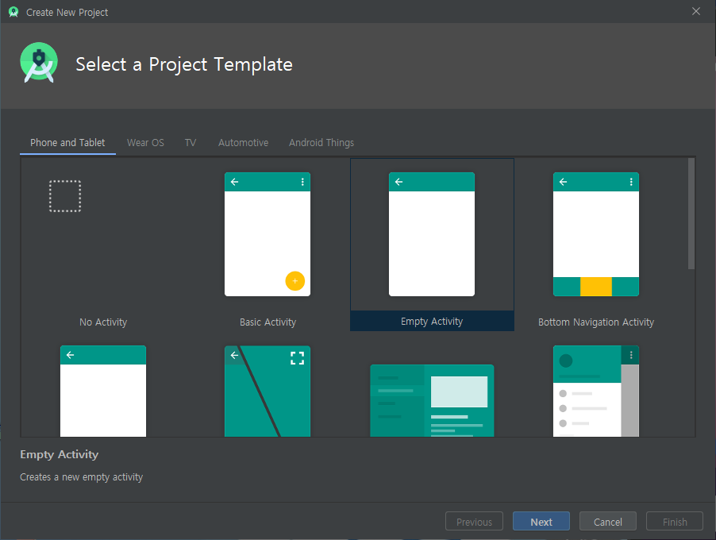

# Android

> 목표
>
> - Component들의 동장방식에 대한 이해
>
> - Android Framework의 동작원리

> Android 주요 컴포넌트
>
> 1. Activity
> 2. Service
> 3. Broadcast Receiver
> 4. Content Provider


## Android란?

> Google이 만든 휴대기기용(스마트폰, 태블릿) 플랫폼


### 구성

> 다양한 모듈이 레이어를 갖고 계층별 소프트웨어 스택으로 구성되어있다.
>
> 
>
> - OS(Linux Kernel)
> - Middleware
>   - Library, Android Runtime
> - Application Framework
> - Application

### 특징

> 오픈소스
>
> 개발언어 - Java, Kotlin
>
> 앱간의 연동이 자유롭다.  
>
> JDK  :  Dalvik  >>  ART (Android Runtime)


#### 버전

> (생략)
>
> 8(오레오)	[보안정책이 확 바뀌는 기점]
>
> 9(파이)
>
> 10(Q)


#### 대중성

> Android가 빠르게 시장점유율을 높일 수 있었던 이유
>
> - 오픈소스
> - Eco System이 잘 되어있다.


#### Framework

> Android는 Framwork이다.
>
> `!`  `Library vs Framework`
>
> - Library는 특정 기능을 쉽고 편하게 구현할 수 있다.
>   - 시스템 구성은 개발자가 설계
>   - 유지보수가 힘들다
> - Framework는 동작 방식이 정해져있다.
>   - Framework을 이해해야 개발이 가능하다.
>   - 유지보수가 쉽다


### Android Component

#### 1. Activity

- Android Application이 실행되는 기본적인 단위
- Android App의 화면 1개
- UI를 담당하는 Component
- 사용자의 Event 처리를 담당
- Load가 많은 작업처리는 지양한다


#### 2. Service

- 내부 로직처리를 담당
- 데이터베이스 연결, 네트워크 연결
- 사용자와의 interaction은 담당하지 않는다
- 일반적으로 Background에서 로직처리를 담당


#### 3. Broadcast Receiver

- Android System에서 발생되는 여러가지 신호(Broadcast)를 받아서 적절한 처리를 하는 Component


#### 4. Content Provider & Resolver

- 모든 Android App은 Sandbox Model을 이용
- App 간의 데이터 공유


## 개발환경 설정

> 1. JDK  1.8.0
> 2. Android Studio  3.6.1
> 3. AVD(Android Virtual Device) & real device


### Android Studio 설치

[Android Developers](https://developer.android.com/) 에서 설치

`android-studio-ide-192.6241897-windows.exe` 실행

Virtual Device 선택 (default) (가상 디바이스 사용 여부)

- 


> `!`  Android Studio를 삭제할 때,
>
> 제어판에서 삭제를 한 후에 설치폴더, 환경설정이 남아있는 경우가 있다.


### Android Studio 설정

- 최초 실행 시 기존의 설정을 적용할지 묻는다.

  (백업본이 있다면 적용)


- 

  > Next

- 

  > UI등 설정을 진행할지 여부
  >
  > Standard  -  Next

- 

  > UI  -  Dark  / Light
  >
  > 난 무조건 Dark

- 

  > 추가로 설치될 목록과 필요 용량에 대한 설명
  >
  > 기본적으로 Android 최신버전(10, Q)가 설치된다.

- 

  > ing.....

- 


#### SDK 설정

- 

- 

  > `Android 9.0 (Pie)`, `Android 8.0 (Oreo)` 선택

- 

  > 상단 `SDK Tools` - `Google Play service` 선택
  >
  > `Apply`

- 

  > Licence  `Accept` - `Next`
  
- 


#### AVD Manager

- 

- 

- 

  > Nexus 5 선택

- 

  > `Pie Download`

- 

- 

- 

- 


## Project

### 생성

- 

- 

- 

  > Name  :  App 의 이름
  >
  > Package Name  :  다른 앱과 구분되는 기준
  >
  > ​		- unique한 값을 사용해야 하며, 주로 도메인의 역순으로 많이 사용한다.
  >
  > Language  :  Java   (default  :  Kotlin)
  >
  > Minimum SDK  :  구동 가능 Android 최소 버전

- 


### 구성


> `!`  Gradle
>
> Spring의 Maven과 같은 역할


`File View Type`


> Project View는 `Android`를 기본으로 하며, 설정 파일은 `Project`를 통해 확인한다.


> App과 프로젝트 전반에 대한 정보
>
> ```xml
> <activity android:name=".MainActivity">
>                  	<!--    class name    -->
> 	<intent-filter>
> 		<action android:name="android.intent.action.MAIN" />
> 
> 		<category android:name=
>                   "android.intent.category.LAUNCHER" />
>                                   <!--  앱의 첫 Activity  -->
> 	</intent-filter>
> </activity>
> ```


`MainActivity.java`

```java
package com.example.myfirstapp;

import androidx.appcompat.app.AppCompatActivity;

import android.os.Bundle;

public class MainActivity extends AppCompatActivity {

    /* onCreate()	(callback method)
        특정 시점이 되면 Android System에 의해서 자동으로 호출
        (해당 클래스의 instance가 생성될 때) */
    @Override
    protected void onCreate(Bundle savedInstanceState) {
        super.onCreate(savedInstanceState);
        /* activity_main.xml 파일을 이용해서
           activity의 View를 설정하는 method  */
        setContentView(R.layout.activity_main);
    }
}
```


`Activity의 화면을 구성하는 방식`

1. Java Code로 Widget Component를 생성해서 화면에 붙이는 방식
2. XML 파일을 이용해서 화면구성을 처리
   - xml을 이용하는 방식은 표현(화면구성-UI)과 구현(로직)을 분리


`res 폴더`

1. drawable  : application 에서 사용하는 그림 파일 저장
2. layout    : Activity에서 사용할 화면구성을 위한 xml 파일 저장
   - xml 파일의 이름은 무조건 소문자로 해야한다.
3. mipmap    : launcher icon과 같은 이미지 자원을 저장
4. values    : 문자열이나 컬러와 같은 다양한 자원에 대한 정보를 저장


### Debuging

`Logcat`


###  XML


### View와 View Group

View  :  통상적으로 눈에 보이는 Component

	- Button, TextView(lable), ImageView(그림), ...

View Group  :  View의 크기와 위치를 조절해서 설정한다.

- 대표적인 녀석이 Layout


## Activity Life Cycle

> activity는 사용자에 의해서 이벤트가 발생되면 그 상태가 변한다.
>
> 그에 따라 callback method가 호출되는데 그 callback method에 대해 알아야한다.

1.  Activity는 class 상태로 존재
2.  Activity가 화면에 나타나려면 객체화가 되어야 한다.(instance화)
3.  onCreate() method가 callback된다. >> 화면구성을 주로 한다.
4.  onStart() method가 callback된다.  >> Activity의 초기화 작업을 한다.
5.  Activity가 foreground로 나타나면서 사용자와 interaction이 가능
6.  onResume() method가 callback된다.
7.  Activity가 running 상태가 된다
8.  Activity의 일부분이 보이지 않는 상태(Pause 상태)
9.  Pause 상태가 되면 onPause() method가 callback된다
10.  Activity의 전체가 완전히 가려져서 보이지 않는 상태가 된다(Stop 상태)
11.  Stop 상태가 되면 onStop() method가 callback된다
12.  만약 Stop 상태에서 다시 Running 상태가 되면
13.  onRestart() -> onStart() -> onResume() 순서로 다시 호출
14.  사용하고 있는 activity를 종료하게되면 killed 상태로 진입
15.  진입하기 전에 onDestory() method가 callback된다
    - 사용한 리소스 초기화, 반납


