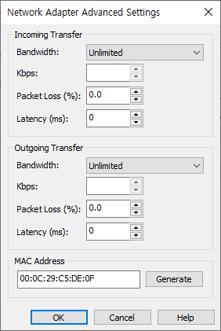
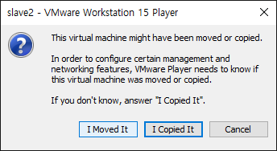

# Hadoop

---

## 빅데이터란?

빅데이터의 속성

- 규모   - 데이터의 크기
- B...
- 속도   - 데이터를 ...
- 정확성  - 빅데이터에 부여할 수 있는 신뢰 수준
- 가치   - 빅테이터를 저장하고 IT 인프라 구조 시스템을 구현하는 비용


3V

1. Volume   - 데이터의 생성 주기가 빠르다
2. Velocity   - 저장, 처리 속도가 빠르다
3. Variaty    - SNS 등  ( 형태가 다양  -  비정형 데이터 )


HDFS (Hadoop Distributed File System)


하둡 클러스터링(multi node 구성)

= 빅데이터 저장(분산) 처리 시스템

1. 1개 컴퓨터(VM)  :  Single node 운영
2. 4개 컴퓨터  :  Multi Clustering node 운영


1>  VM  -  install Linux ( CentOS 7 )

- yum update 기능 끄기
- selinux 기능 끄기
- openjdk 1.7 삭제

2> JDK 1.8 Install  (root)

3> 방화벽 해제 (root)

4> Hadoop (user - hadoop)


>  Hadoop 설치 전에 JDK가 반드시 설치되어있어야 한다.


---

yum update 정지

> `_Til\Linux\Linux.md`  참조


```
[root@master ~]# gedit /etc/sysconfig/network-scripts/
ifcfg-eno16777736

BOOTPROTO="none"		* 수정
IPADDR=192.168.111.110	**추가
NETMASK=255.255.255.0	**추가
GATEWAY=192.168.111.2	**추가
DNS1=192.168.111.2		**추가
```


방화벽 전체 종료

> node 들 사이의 통신에 있어 port 번호가 랜덤하게 생성되기 때문에
>
> 모든 포트에 대해 방화벽 예외처리를 할 수 없어
>
> 방화벽 기능 자체를 종료한다.

```
[root@localhost yum.repos.d]# systemctl status firewalld
firewalld.service - firewalld - dynamic firewall daemon
   Loaded: loaded (/usr/lib/systemd/system/firewalld.service; enabled)
   Active: active (running) since Mon 2020-02-24 09:57:53 KST; 54min ago
 Main PID: 766 (firewalld)
   CGroup: /system.slice/firewalld.service
           └─766 /usr/bin/python -Es /usr/sbin/firewalld --nofork --nopid

Feb 24 09:57:53 localhost.localdomain systemd[1]: Started firewalld - dynamic firewall daemon.
[root@localhost yum.repos.d]# systemctl stop firewalld
[root@localhost yum.repos.d]# systemctl disable firewalld
rm '/etc/systemd/system/dbus-org.fedoraproject.FirewallD1.service'
rm '/etc/systemd/system/basic.target.wants/firewalld.service'
[root@localhost yum.repos.d]# 
[root@localhost yum.repos.d]# systemctl status firewalld
firewalld.service - firewalld - dynamic firewall daemon
   Loaded: loaded (/usr/lib/systemd/system/firewalld.service; disabled)
   Active: inactive (dead)

Feb 24 18:57:52 localhost.localdomain systemd[1]: Starting firewalld - dynamic firewall daemon...
Feb 24 09:57:53 localhost.localdomain systemd[1]: Started firewalld - dynamic firewall daemon.
Feb 24 10:53:27 localhost.localdomain systemd[1]: Stopping firewalld - dynamic firewall daemon...
Feb 24 10:53:28 localhost.localdomain systemd[1]: Stopped firewalld - dynamic firewall daemon.
[root@localhost yum.repos.d]# 
```


JDK 삭제, 설치

```
[root@localhost ~]# 
[root@localhost ~]# rpm -qa | grep jdk
java-1.7.0-openjdk-headless-1.7.0.51-2.4.5.5.el7.x86_64
java-1.7.0-openjdk-1.7.0.51-2.4.5.5.el7.x86_64
[root@localhost ~]# yum remove java

.....

Removed:
  java-1.7.0-openjdk.x86_64 1:1.7.0.51-2.4.5.5.el7                      libreoffice-langpack-en.x86_64 1:4.1.4.2-3.el7                     

Dependency Removed:
  icedtea-web.x86_64 0:1.4.2-1.el7                                 java-1.7.0-openjdk-headless.x86_64 1:1.7.0.51-2.4.5.5.el7                
  jline.noarch 0:1.0-8.el7                                         libreoffice-calc.x86_64 1:4.1.4.2-3.el7                                  
  libreoffice-core.x86_64 1:4.1.4.2-3.el7                          libreoffice-draw.x86_64 1:4.1.4.2-3.el7                                  
  libreoffice-graphicfilter.x86_64 1:4.1.4.2-3.el7                 libreoffice-impress.x86_64 1:4.1.4.2-3.el7                               
  libreoffice-pdfimport.x86_64 1:4.1.4.2-3.el7                     libreoffice-pyuno.x86_64 1:4.1.4.2-3.el7                                 
  libreoffice-ure.x86_64 1:4.1.4.2-3.el7                           libreoffice-writer.x86_64 1:4.1.4.2-3.el7                                
  rhino.noarch 0:1.7R4-4.el7                                       unoconv.noarch 0:0.6-7.el7                                               

Complete!
[root@localhost ~]# 
```


---

user - hadoop


다운로드 폴더에 설치파일 위치


user - root


hostname  :  localhost -> master

```
[root@master ~]# hostnamectl set-hostname master
```


and, shutdown

vm copy for slave


vm open


vm name change


vm network - mac address - generate - new mac addr copy



run vm



click `I Moved It`


```
[root@master ~]# gedit /etc/sysconfig/network-scripts/ifcfg-eno16777736
```

mac addr paste, ipaddr change


```
[root@master ~]# hostnamectl set-hostname slave1
[root@master ~]# hostname
slave1
```


```
[root@master ~]# systemctl restart network
```


> slave1
> 00:50:56:35:4B:F0
>
> slave2
> 00:50:56:36:08:B3
>
> slave3
> 00:50:56:27:FA:0C


---

```
[root@master ~]# gedit /etc/hosts

192.168.111.110 master
192.168.111.130 slave1
192.168.111.140 slave2
192.168.111.150 slave3
```


all vm edit &

```
systemctl restart network
```


test conn

```
ping slave1
ping slave2
ping slave3
```

```
[root@slave1 ~]# 
[root@slave1 ~]# ssh slave2
The authenticity of host 'slave2 (192.168.111.140)' can't be established.
ECDSA key fingerprint is a0:0f:85:1f:ab:a2:3f:5a:c8:20:61:e4:d4:57:d4:83.
Are you sure you want to continue connecting (yes/no)? yes
Warning: Permanently added 'slave2,192.168.111.140' (ECDSA) to the list of known hosts.
root@slave2's password: 
Last login: Mon Feb 24 13:43:57 2020
[root@slave2 ~]# 
[root@slave2 ~]# who
root     :0           2020-02-24 13:43 (:0)
root     pts/0        2020-02-24 13:44 (:0)
root     pts/1        2020-02-24 14:01 (slave1)
[root@slave2 ~]# exit
logout
Connection to slave2 closed.
[root@slave1 ~]# 
[root@slave1 ~]# 
```


master hadoop

> set key ( type rsa ) for login with password

```
[hadoop@master ~]$ ssh-keygen -t rsa
Generating public/private rsa key pair.
Enter file in which to save the key (/home/hadoop/.ssh/id_rsa): 
Created directory '/home/hadoop/.ssh'.
Enter passphrase (empty for no passphrase): 
Enter same passphrase again: 
Your identification has been saved in /home/hadoop/.ssh/id_rsa.
Your public key has been saved in /home/hadoop/.ssh/id_rsa.pub.
The key fingerprint is:
79:8c:aa:09:4c:c7:5d:ea:24:96:3e:5c:49:f7:77:9f hadoop@master
The key's randomart image is:
+--[ RSA 2048]----+
|                 |
|                 |
|      . o        |
|   . + = =       |
|  . * * S + . .  |
| o = = . . . . ..|
|  o + o        E.|
|   . +           |
|    o            |
+-----------------+

```

```
[hadoop@master ~]$ ssh-copy-id -i /home/hadoop/.ssh/id_rsa hadoop@slave1
The authenticity of host 'slave1 (192.168.111.130)' can't be established.
ECDSA key fingerprint is a0:0f:85:1f:ab:a2:3f:5a:c8:20:61:e4:d4:57:d4:83.
Are you sure you want to continue connecting (yes/no)? yes
/usr/bin/ssh-copy-id: INFO: attempting to log in with the new key(s), to filter out any that are already installed
/usr/bin/ssh-copy-id: INFO: 1 key(s) remain to be installed -- if you are prompted now it is to install the new keys
hadoop@slave1's password: 

Number of key(s) added: 1

Now try logging into the machine, with:   "ssh 'hadoop@slave1'"
and check to make sure that only the key(s) you wanted were added.

[hadoop@master ~]$ ssh hadoop@slave1
Last failed login: Mon Feb 24 14:36:24 KST 2020 from master on ssh:notty
There was 1 failed login attempt since the last successful login.
Last login: Mon Feb 24 14:28:31 2020
[hadoop@slave1 ~]$ 
```

> slave1~slave3 반복


## install Hadoop

```
[hadoop@master ~]$ tar xvfz hadoop-1.2.1.tar.gz

[hadoop@master conf]$ mkdir /home/hadoop/hadoop-data
```

```
cd /home/hadoop/hadoop-1.2.1/conf

masters
slaves
core-sitelxml
hdfs-site.xml
mapred-site.xml
hadoop-env.sh
```

```
[hadoop@master conf]$ gedit hadoop-env.sh 

line 9
export JAVA_HOME=/usr/local/jdk1.8
```

```
[hadoop@master conf]$ gedit masters 

line 1
slave1
```

```
[hadoop@master conf]$ gedit slaves

line 1~3
slave1
slave2
slave3
```

```
[hadoop@master conf]$ gedit core-site.xml 
[hadoop@master conf]$ 

line 6~15
<configuration>
    <property>
        <name>fs.default.name</name>
        <value>hdfs://master:9000</value>
    </property>
    <property>
        <name>hadoop.tmp.dir</name>
        <value>/home/hadoop/hadoop-data/</value>
    </property>
</configuration>
```

```
[hadoop@master conf]$ gedit hdfs-site.xml 
[hadoop@master conf]$ 

line 6~19
<configuration>
    <property>
        <name>dfs.replication</name>
        <value>3</value>
    </property>
    <property>
        <name>dfs.http.address</name>
        <value>master:50070</value>
    </property>
    <property>
        <name>dfs.secondary.http.address</name>
        <value>slave1:50090</value>
    </property>
</configuration>
```

```
[hadoop@master conf]$ gedit mapred-site.xml 
[hadoop@master conf]$ 

line 6~11
<configuration>
    <property>
        <name>mapred.job.tracker</name>
        <value>master:9001</value>
    </property>
</configuration>
```


copy files to slaves

```
[hadoop@master conf]$ scp hadoop-env.sh hadoop@slave1:/home/hadoop/hadoop-1.2.1/conf
hadoop-env.sh                                                                                             100% 2429     2.4KB/s   00:00

[hadoop@master conf]$ scp *-site.xml hadoop@slave1:/home/hadoop/hadoop-1.2.1/conf
core-site.xml                                                                                             100%  403     0.4KB/s   00:00    
hdfs-site.xml                                                                                             100%  490     0.5KB/s   00:00    
mapred-site.xml                                                                                           100%  283     0.3KB/s   00:00
```


```
[hadoop@master conf]$ gedit /home/hadoop/.bash_profile

line 14~16
export HADOOP_HOME=/home/hadoop/hadoop-1.2.1
export HADOOP_HOME_WARN_SURPRESS="TRUE"
PATH=$HADOOP_HOME/bin:$PATH
```

```
[hadoop@master conf]$ source /home/hadoop/.bash_profile
```

```
[hadoop@master conf]$ echo $PATH
/home/hadoop/hadoop-1.2.1/bin:/usr/local/bin:/usr/local/sbin:/usr/bin:/usr/sbin:/bin:/sbin:/usr/local/jdk1.8/bin:/home/hadoop/.local/bin:/home/hadoop/bin:/home/hadoop/.local/bin:/home/hadoop/bin
```


```
[hadoop@master conf]$ hadoop namenode -format
Warning: $HADOOP_HOME is deprecated.

20/02/24 15:36:03 INFO namenode.NameNode: STARTUP_MSG: 
/************************************************************
STARTUP_MSG: Starting NameNode
STARTUP_MSG:   host = master/192.168.111.110
STARTUP_MSG:   args = [-format]
STARTUP_MSG:   version = 1.2.1
STARTUP_MSG:   build = https://svn.apache.org/repos/asf/hadoop/common/branches/branch-1.2 -r 1503152; compiled by 'mattf' on Mon Jul 22 15:23:09 PDT 2013
STARTUP_MSG:   java = 1.8.0_241
************************************************************/
20/02/24 15:36:04 INFO util.GSet: Computing capacity for map BlocksMap
20/02/24 15:36:04 INFO util.GSet: VM type       = 64-bit
20/02/24 15:36:04 INFO util.GSet: 2.0% max memory = 932184064
20/02/24 15:36:04 INFO util.GSet: capacity      = 2^21 = 2097152 entries
20/02/24 15:36:04 INFO util.GSet: recommended=2097152, actual=2097152
20/02/24 15:36:04 INFO namenode.FSNamesystem: fsOwner=hadoop
20/02/24 15:36:04 INFO namenode.FSNamesystem: supergroup=supergroup
20/02/24 15:36:04 INFO namenode.FSNamesystem: isPermissionEnabled=true
20/02/24 15:36:04 INFO namenode.FSNamesystem: dfs.block.invalidate.limit=100
20/02/24 15:36:04 INFO namenode.FSNamesystem: isAccessTokenEnabled=false accessKeyUpdateInterval=0 min(s), accessTokenLifetime=0 min(s)
20/02/24 15:36:04 INFO namenode.FSEditLog: dfs.namenode.edits.toleration.length = 0
20/02/24 15:36:04 INFO namenode.NameNode: Caching file names occuring more than 10 times 
20/02/24 15:36:05 INFO common.Storage: Image file /home/hadoop/hadoop-data/dfs/name/current/fsimage of size 112 bytes saved in 0 seconds.
20/02/24 15:36:05 INFO namenode.FSEditLog: closing edit log: position=4, editlog=/home/hadoop/hadoop-data/dfs/name/current/edits
20/02/24 15:36:05 INFO namenode.FSEditLog: close success: truncate to 4, editlog=/home/hadoop/hadoop-data/dfs/name/current/edits
20/02/24 15:36:05 INFO common.Storage: Storage directory /home/hadoop/hadoop-data/dfs/name has been successfully formatted.
20/02/24 15:36:05 INFO namenode.NameNode: SHUTDOWN_MSG: 
/************************************************************
SHUTDOWN_MSG: Shutting down NameNode at master/192.168.111.110
************************************************************/
[hadoop@master conf]$ 
[hadoop@master conf]$ 
[hadoop@master conf]$ start-all.sh
```

```
[hadoop@master conf]$ jps
9592 JobTracker
11660 Jps
9423 NameNode


[hadoop@slave1 ~]$ jps
9906 DataNode
10100 TaskTracker
10231 Jps
9754 SecondaryNameNode


[hadoop@slave2 ~]$ jps
9235 TaskTracker
9380 Jps
9110 DataNode


[hadoop@slave3 ~]$ jps
9106 TaskTracker
8979 DataNode
9237 Jps

```

```
[hadoop@master conf]$ stop-all.sh
Warning: $HADOOP_HOME is deprecated.

stopping jobtracker
slave1: stopping tasktracker
slave2: stopping tasktracker
slave3: stopping tasktracker
stopping namenode
slave1: stopping datanode
slave3: stopping datanode
slave2: stopping datanode
slave1: stopping secondarynamenode
```


