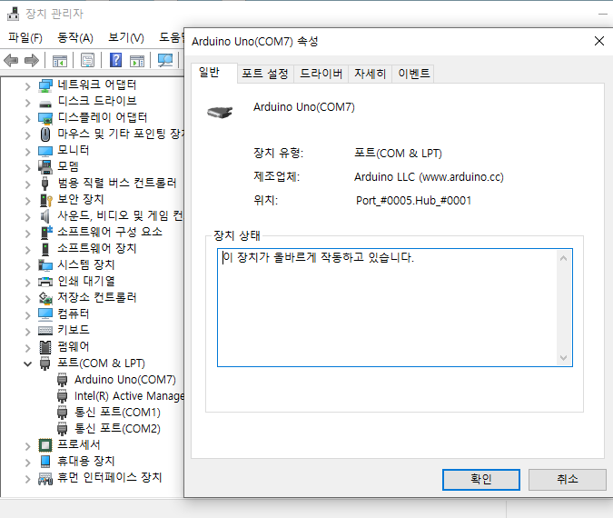
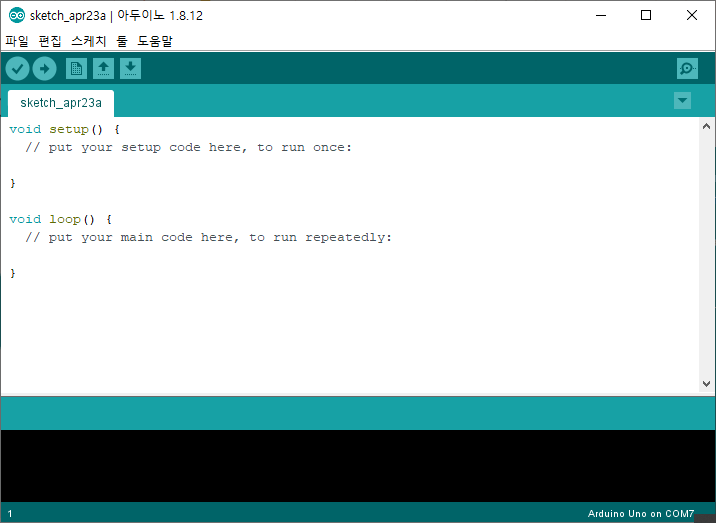
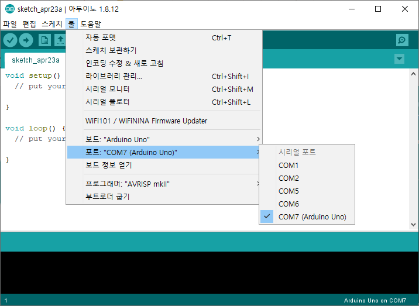
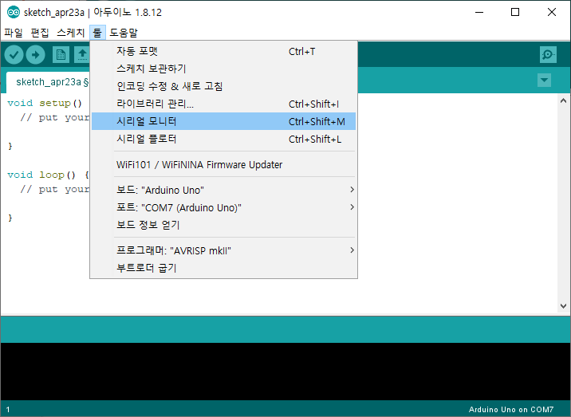
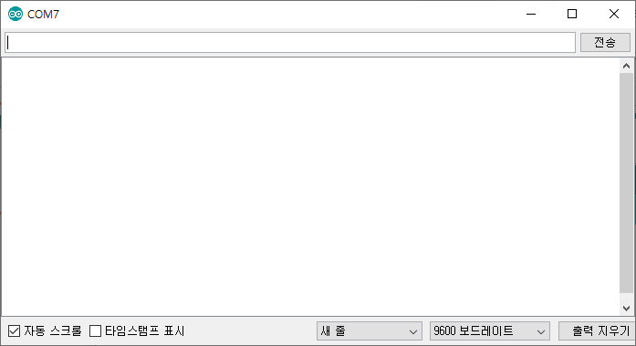
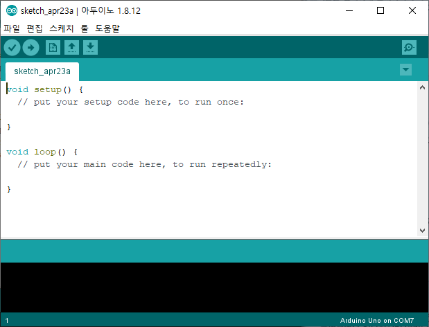

# Arduino

---

## Arduino란

> 이탈리아에서 만든 오픈소스 하드웨어
>
> (이탈리아어로 강한친구, 강력한 친구, 절친한 친구라는 의미)


## Arduino의 특징

1. Micro-Controller 이다
2. IoT 프로젝트에 사용하기 좋다


## IoT (사물인터넷)

> IoT(사물인터넷, Internet of Things)은
>
> 각종 사물에 센서와 통신기능을 결합하여 인터넷에 연결하는 기술이다.
>
> IoT 장비에서 생성된 데이터는 5G 통신기술 등을 이용하여 클라우드에 집적되고
>
> 집적된 데이터는 빅데이터로 분류되어 사용될 수 있다


### IoT Controller

> 사물인터넷을 구현하는데 사용될 Controller가 가져야할 조건

1. 가격이 저렴해야한다
2. 프로그램의 작성과 이식이 쉬워야한다.
3. 센서와 엑추에이터를 쉽게 사용할 수 있어야 한다.


### Controller 종류

1. Micro-Controller

   - 단순히 이식된 코드에 따라 작업을 수행하는 기계장치
   - OS나 응용프로그램의 설치가 불가능하다
   - Arduino 등

   

2. Single-Board

   - 소형 컴퓨터
   - OS나 응용프로그램의 설치가 가능하다
   - Raspberry Pi,  Lattepanda (라떼판다) 등


## Arduino 사용하기

> Arduino IDE 를 설치하면
>
> Arduino에서 수행할 코드를 작성하기 위한 IDE 뿐만 아니라
>
> Arduino를 인식하기 위한 드라이버도 함께 설치된다


### Arduino IDE 설치

1. [Arduino Software Download](https://www.arduino.cc/en/Main/Software) 사이트에서 설치파일을 받는다

   (2020/04/23 일 기준 - 1. 8. 12 버전)

2. Install

   - 전부 Next

   - 설치가 끝나갈 때 Arduino를 위한 드라이버의 설치를 묻는다

     전부 설치한다

3. 설치 확인

   - 작업관리자  -  포트(COM & LPT)

     

     > 작업관리자에서 포트 항목이 보이지 않는다면
     >
     > `보기 - 숨겨진 장치 표시` 를 선택한다.

     > **`장치의 COM 번호를 반드시 기억한다.`**


### Arduino IDE 사용

- 기본 실행창

  


- 포트 설정

  

  - **`툴 - 포트`** 에서 장치관리자에서 확인한 COM 포트를 선택한다


- 기본 UI

  

  - 확인       -  코드를 컴파일하여 코드의 에러를 하단에 출력한다
  - 업로드       - 코드를 연결된 Arduino에 업로드한다
  - 새파일, 열기, 다른 이름으로 저장


- 시리얼 모니터

  

  

  - **`툴 - 시리얼 모니터`** 를 이용해서 Arduino에 메세지를 주고받을 수 있다
  - 신호(메세지)를 주고받을 속도(보드레이트)를 설정해야한다

  


# Arduino 개발

## 코드 기본 구성

.

> 기본적인 코드는 setup(), loop() 메서드로 구성되어있다

- `setup()`
  - Arduino에 전원이 공급되기 시작할 때, `단 한번 실행되는 코드`이다
  - Arduino가 제어하게될 센서 등의 정보를 설정한다
- `loop()`
  - `setup()` 메서드가 수행된 후 자동석으로 시작된다
  - Arduino의 전원이 종료될 때까지 반복해서 수행될 코드를 작성한다


## Serial

- Arduino가 COM 포트를 이용해 연결된 장치와 신호를 주고받을 때 사용된다
- 포트간의 속도(보드레이트)가 높거나 다를 경우 데이터 수신에 문제가 발생한다
- `시리얼 모니터` 에서 메세지를 확인할 수 있다
- **`시리얼 통신을 하는 동안에는 0, 1번 핀을 디지털 입출력으로 사용할 수 없다`**


### Serial 출력

- 연결된 장치에 신호(메세지)를 출력

- ```c++
  void setup() {
    // put your setup code here, to run once:
    Serial.begin(9600);
  }
  
  void loop() {
    // put your main code here, to run repeatedly:
    Serial.println("Hello World!!");
    delay(1000);
  }
  ```

  - `Serial.begin(speed)`

    - COM 포트를 이용해 통신할 전송속도를 결정한다.

    - 설정 가능 속도

      - 300, 600, 1200, 2400, 4800, 9600, 

        14400, 19200, 28800, 38400, 57600, 115200

  - `Serial.print(message)`

    - 특정 메세지를 전송한다
    - 숫자  :  `print(10)`
    - 숫자를 제외한 문자  : `print("Hello")`
      - 숫자 외에는 따옴표("")를 사용해야한다

  - `Serial.println(message)`

    - `print()` 메서드의 메세지 위에 줄바꿈이 추가된다

  - `delay(ms)`

    - 매개변수로 주어진 밀리초(*millisecond*) 만큼 수행이 정지된다


### Serial 입력

- 연결된 장치에서 신호(메세지) 수신

- ```c++
  int led = 13;
  
  void setup() {
    // put your setup code here, to run once:
    Serial.begin(9600);
    pinMode(led, OUTPUT);
  }
  
  void loop() {
    // put your main code here, to run repeatedly:
    if(Serial.available()) {
      char c = Serial.read();
      if(c == 'a') {
        digitalWrite(led, HIGH);
      } else if(c == 's') {
        digitalWrite(led, LOW);
      }
    }
  }
  ```

  - `Serial.begin(speed)`
    - (위와 동일)
  - `Serial.available()`
    - 수신된 신호(메세지)가 없으면 `0`을 반환한다
    - 수신된 신호(메세지)가 있을 때 `데이터의 갯수`를 반환한다
  - `Serial.read()`
    - 시리얼 통신 수신 버퍼의 첫번째 문자열을 읽어 반환한다
    - 수신 버퍼가 비어있으면 `-1`를 반환한다
    - 문자열을 읽어들이면 `10진 ASCII 코드 값`으로 반환한다
  - `Serial.readString()`
    - 수신된 데이터를 문자열로 읽는다
    - 단점으로 속도가 조금 느리다
  - `Serial.end()`
    - 시리얼 통신을 종료할 때 사용한다


## Sensor

> Arduino Uno 제품은 총 20개의 I/O 핀을 지원한다.
>
> - 디지털 I/O 핀
>
>   - 총 14개의 디지털 I/O 핀
>
>   - 0, 1번 핀은 시리얼 통신이 가능하며,
>
>     시리얼 통신중에는 0, 1번 핀의 디지털 신호 사용이 불가능하다
>
>   - 6개는 PWM(pulse-width modulated)신호를 지원한다
>
>     - 3, 5, 6, 9, 10, 11
>
> - 아날로그 I/O 핀
>
>   - 총 6개의 아날로그 I/O 핀
>   - 모두 디지털 핀으로 공용 사용이 가능하다

### LED

- 연결된 LED 센서 제어

- [01. Basics > Blink](https://www.arduino.cc/en/Tutorial/Blink)

- ```c++
  int led = 13;
  
  void setup() {
    // put your setup code here, to run once:
    pinMode(led, OUTPUT);
  }
  
  void loop() {
    // put your main code here, to run repeatedly:
    digitalWrite(led, HIGH);
    delay(1000);
    digitalWrite(led, LOW);
    delay(1000);
  }
  ```

  - `int led = 13`
    - `setup()` 메서드가 수행되기 전에 특정 변수의 선언이 가능하다
    - `setup()` 와 `loop()` 메서드 모두에서 사용하기 위해 메서드 밖에 선언한다
  - `pinMode(pin, mode)`
    - 특정 핀에 대한 입력 또는 출력을 설정한다
    - `mode`
      - OUTPUT, INPUT, INPUT_PULLUP (3개)
  - `digitalWrite(pin, value)`
    - 특정 핀에 대하여 값을 지정한다
    - `value`
      - HIGH(on), LOW(off) (2개)


### LED(PWM)

- 연결된 LED의 밝기를 PWM으로 제어

- [03. Analog > Fading](https://www.arduino.cc/en/Tutorial/Fading)

- ```c++
  int led = 10;
  
  void setup() {
    // put your setup code here, to run once:
    pinMode(led, OUTPUT);
  }
  
  void loop() {
    // put your main code here, to run repeatedly:
    analogWrite(led, 255);
    delay(1000);
    analogWrite(led, 0);
    delay(1000);
  }
  ```

  - `analogWrite(pin, value)`
    - 특정 핀에 대한 값을 지정한다
    - 핀에서 PWM을 지원해야 사용 가능하다
    - PWM 지원은 보드의 핀 숫자 앞에 `~` 표시가 있다
    - `value`
      - 0(always off) ~ 255(always on) 사이의 값을 지정한다


### Button

- 버튼의 상태 정보를 수신한다

- [02. Digital > Button](https://www.arduino.cc/en/Tutorial/Button)

- ```c++
  // constants won't change. They're used here to set pin numbers:
  const int buttonPin = 2;     // the number of the pushbutton pin
  const int ledPin =  10;      // the number of the LED pin
  
  // variables will change:
  int buttonState = 0;         // variable for reading the pushbutton status
  
  void setup() {
    // initialize the LED pin as an output:
    pinMode(ledPin, OUTPUT);
    // initialize the pushbutton pin as an input:
    pinMode(buttonPin, INPUT);
  }
  
  void loop() {
    // read the state of the pushbutton value:
    buttonState = digitalRead(buttonPin);
  
    // check if the pushbutton is pressed. If it is, the buttonState is HIGH:
    if (buttonState == HIGH) {
      // turn LED on:
      analogWrite(ledPin, 100);
    } else {
      // turn LED off:
      analogWrite(ledPin, 0);
    }
  }
  ```

  - `pinMode(pin, value)`
    - `value`  :  버튼의 입력을 받기 위해 `INPUT`을 사용한다
  - `degitalRead(pin)`
    - 핀에 연결된 센서의 상태를 반환한다
    - `return HIGH or LOW`

