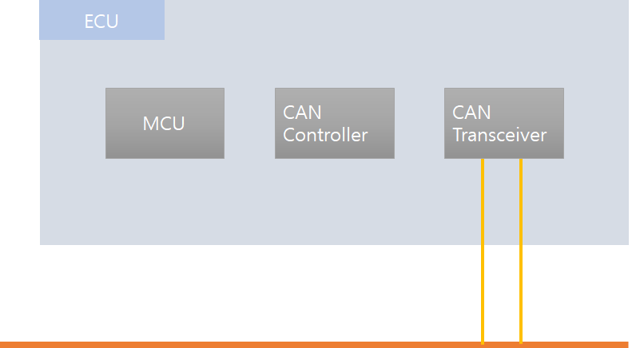
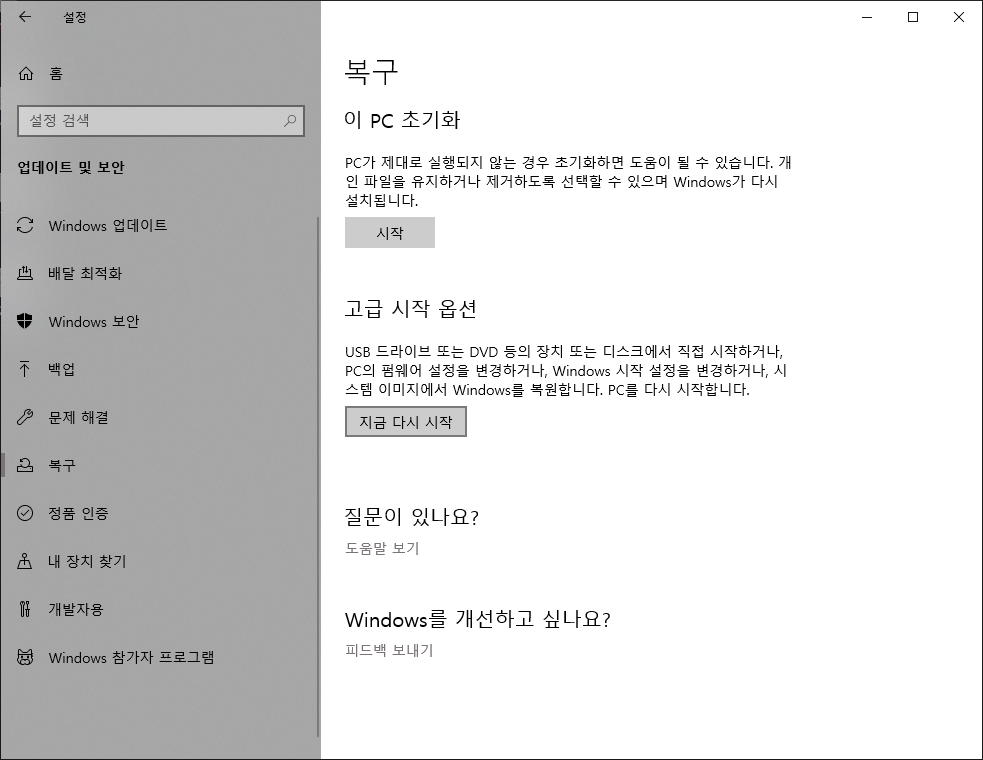
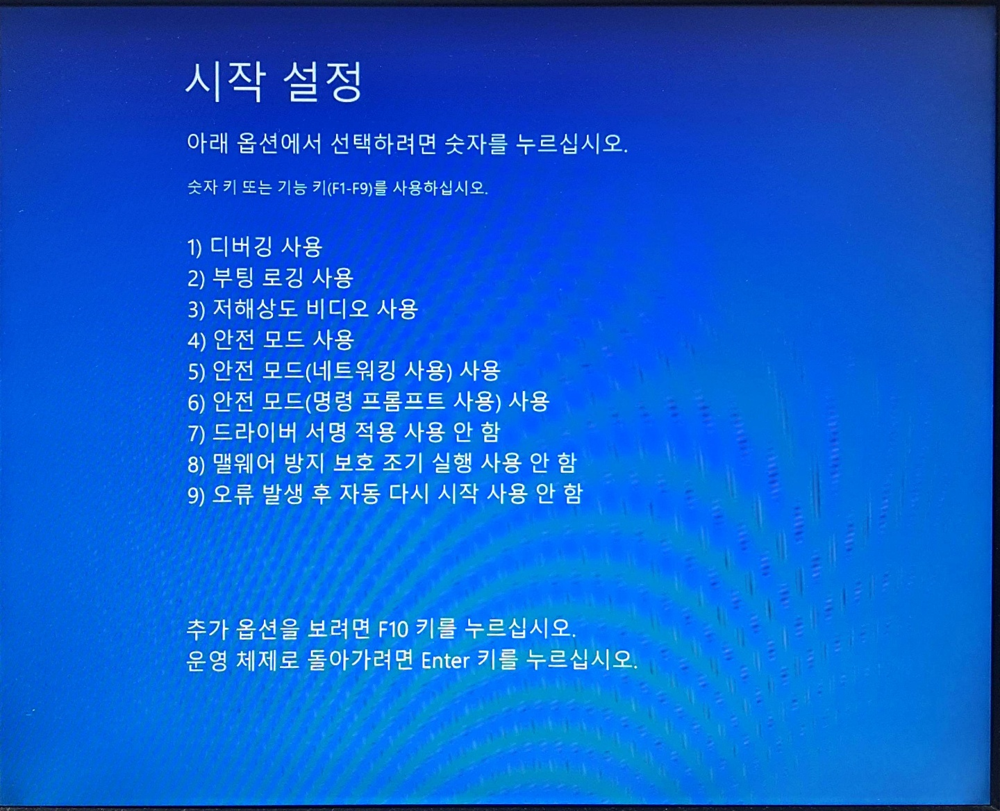
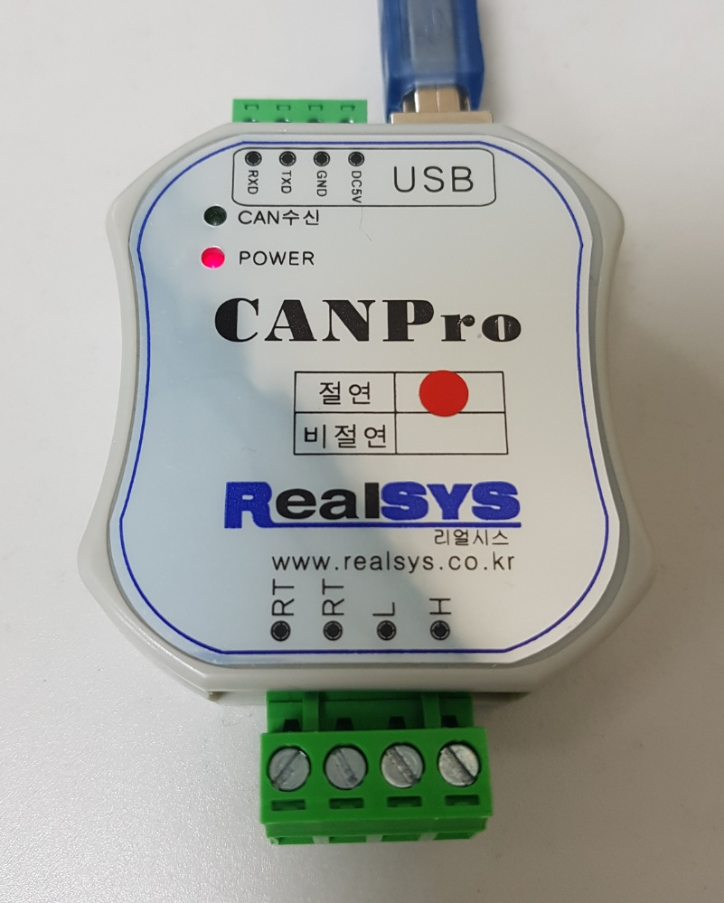

# CAN Protocol

> CAN (Controller Area Network)

## 개발 배경

맨 처음 자동차를 대상으로 등장!

1983년 벤츠사의 RFP에서 시작하여 Bosch 사에서 개발 시작, 1986년 처음 발표 (CAN 1.0)

당시 벤츠는 3개의 ECU(Electronic Control Unit)간의 데이터 통신 시스템을 요청

## 특징

- 장점
  - **굉장히 견고한 네트워크 구조***

- 단점
  - 속도가 매우 느림
  - 많은 양의 데이터를 보낼 수 없다

단점을 극복하기 위해 상향된 것들로

LIN, CAN FD, FLEX, ... 등이 있다

## ECU

> ECU에는 여러가지 종류가 있다

- ACU (Airbag Control Unit)
  - 에어백과 관련된 제어

- BCM (Body Control Module)
  - 자동차의 각종 경보들을 제어
- ECU (Engine Control Unit)
  - 엔진을 제어하는 유닛
- TCU (Transmission Control Unit)
  - 변속을 제어하는 유닛
- ABS (Anti-lock Breaking System)
  - 브레이크 관련 제어

## CAN의 구성 (차량)

## CAN의 장점과 특징

- CAN은 Multi Master 형식으로 통신한다
  - Server와 Client의 개념이 아니다
- 노이즈에 상당히 강한 Network
- 표준 프로토콜
- 

CRC를 이용한 데이터의 무결성 확인

## CAN 장비 사용

### Windows 드라이버 서명 설정 변경

> Windows 보안 특성 상 드라이버 서명이 적용되지 않은 장비는 USB로 연결이 불가능하다.
>
> 이를 위해 Windows의 부팅 설정을 일부 변경해주어야 한다.
>
> 해당 설정은 Windows Update 시 설정을 다시 해주어야 한다.

- Windows 설정 - 업데이트 및 보안 - 복구 - 고급 시작 옵션

- 파란색 배경의 설정 창에서

  - 문제해결 - 고급옵션 - 시작설정 - 재부팅

  - 을 하면 위의 화면이 실행되며,

     `7) 드라이버 서명 적용 사용 안 함`을 클릭한다

- CAN 장비사에서 제공하는 드라이버 설치

- CAN 장비사에서 제공파는 프로그램 설치

- 사용한 CAN 장비

  .

