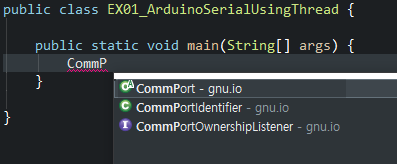

# Serial 통신

> Java에서 Arduino와 Serial 통신을 목표로 한다


## Port

포트에는 2가지 종류가 있다

- Serial Port (직렬 포트)
- Parallel Port (병렬 포트)


## RXTX 설치

> Java에서 포트 통신을 위한 라이브러리를 설치한다

1. 다운로드
   - 아래 사이트에서 파일을 다운받는다
   - [RXTX Download](http://rxtx.qbang.org/wiki/index.php/Download) - [ rxtx-2.1-7-bins-r2.zip](http://rxtx.qbang.org/pub/rxtx/rxtx-2.1-7-bins-r2.zip)
   - 파일들을 확인한다
     - `RXTXcomm.jar`
     - `Windows\i368-mingw32\rxtxParallel.dll`
     - `Windows\i368-mingw32\rxtxSerial.dll`
     - ...
     
      
   
2. `JAVA_HOME\bin` 경로에 `dll 파일` 추가

   - Java를 기본적으로 설치하면 경로는 아래와 같다
     - `C:\Program Files\Java\jdk1.8.0_231\bin`

   - `rxtxParallel.dll`  -  병렬 포트
   - `rxtxSerial.dll`  -  직렬 포트

    

3. 프로젝트에 라이브러리 추가

   - `RXTXcomm.jar` 파일을 프로젝트에 추가한다
   - 프로젝트에 파일을 넣고 `Add JARs` 를 하거나
   - 다운받은 파일을 `Add External JARs`를 수행한다

    

4. 라이브러리 작동 확인

   - Java에서 import 해본다

     .


## Serial 신호 수신

### Arduino

```c++
void setup() {
  // put your setup code here, to run once:
  Serial.begin(9600);
}

void loop() {
  // put your main code here, to run repeatedly:
  Serial.println("Hello World!!");
  delay(1000);
}
```

- 1초마다 "Hello World!!" 메세지를 전송한다
- 전송속도는 9600


### Java

```java
import java.io.InputStream;
import java.io.OutputStream;

import gnu.io.CommPort;
import gnu.io.CommPortIdentifier;
import gnu.io.SerialPort;

// ....

CommPortIdentifier portIdentifier = null;
try {
    // 1. Serial 통신을 위한 COM 포트 설정
    portIdentifier = CommPortIdentifier.getPortIdentifier("COM7");

    // 2. 포트의 점유 상태 확인
    if(portIdentifier.isCurrentlyOwned()) {
        System.out.println("포트가 사용중입니다.");
    } else {
        // 3. 포트 객체를 받아온다
        CommPort commPort = portIdentifier.open("PORT_OPEN", 2000);

        // 4. 포트 종류 확인
        if(commPort instanceof SerialPort) {
            // 5. 포트 설정(통신속도)
            SerialPort port = (SerialPort)commPort;
            port.setSerialPortParams(
                9600, 
                SerialPort.DATABITS_8, 
                SerialPort.STOPBITS_1, 
                SerialPort.PARITY_NONE);

            // 6. Stream 객체 생성
            InputStream in = port.getInputStream();
            OutputStream out = port.getOutputStream();

            // 7. 신호를 수신하는 Thread
            Thread t = new Thread(() -> {
                byte[] buffer = new byte[1024];
                int len = -1;
                try {
                    while((len = in.read(buffer)) != -1) {
                        System.out.println("data : " 
                                           + new String(buffer, 0, len));
                    }
                } catch (Exception e) {
                    e.printStackTrace();
                }
            });
            t.start();
        } else {
            System.out.println("Serial Port가 아닙니다.");
        }// if(commPort instanceof SerialPort)

    } // if(isCurrentlyOwned())

} catch (Exception e) {
    e.printStackTrace();
} // try
```

