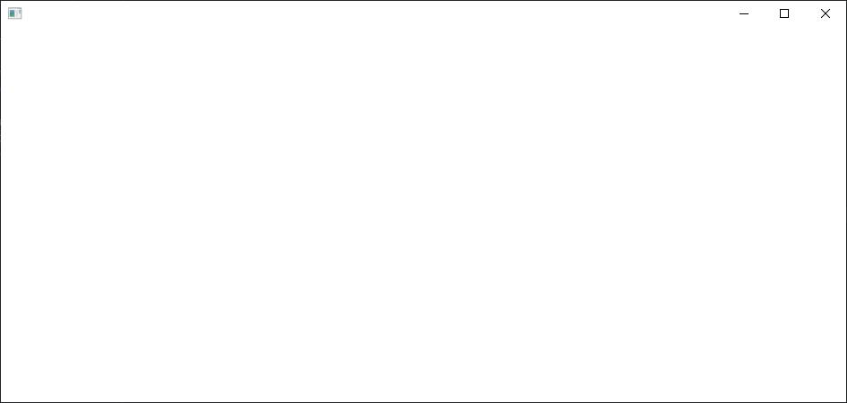
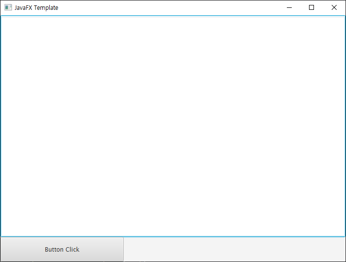

# JavaFX

> Java의 표준 GUI 라이브러리인 Swing을 대체하기 위해 개발된 라이브러리
>
> Swing보다 가볍고(상속과 Overriding이 적다) 효과를 구현하기 간편하다.


## Library

...


## 간단 사용법

### 클래스 구성

```java
package javaThread;

import javafx.application.Application;
import javafx.stage.Stage;

public class JavaFX_UITemplate extends Application {

    @Override
	public void start(Stage arg0) throws Exception {
		// TODO Auto-generated method stub
		
	}
    
	public static void main(String[] args) {
		// TODO Auto-generated method stub

	}

}
```

`Application` 클래스(javafx.application)를 상속한 클래스로 정의하고

추상메서드 `start()`를 overriding 한다.


### 실행

```java
public static void main(String[] args) {
    launch();
}
```

- `Application` 클래스에 포함되어있는 `launch()` 메서드 실행
- `JavaFX 응용프로그램`을 시작하는 메서드로 내부에서 `start()` 메서드를 사용한다.


```java
@Override
public void start(Stage stage) throws Exception {
    stage.show();
}
```

- `start()` 메서드의 인자로 전달된 `Stage` 객체의 `show()` 메서드 호출
- `Stage()` 객체에 구성된 Window를 화면에 표시한다.





### Scene

> `Stage` 객체가 Window라면
>
> `Scene` 객체는 Window의 구성을 담당한다.

```java
@Override
public void start(Stage stage) throws Exception {
    
    BorderPane root = new BorderPane();
    Scene scene = new Scene(root);
    
    stage.setScene(scene);
    stage.show();
}
```

- `Stage`는 `Scene`을 추가할 수 있다
- `Scene`는 단 하나의 `Pane`을 포함한다
- `Pane`는 구성 요소들을 포함할 수 있다


### Pane

> Java의 `레이아웃 매니저` 가 포함된 것이라고 볼 수 있다

```java
BorderPane root = new BorderPane();
root.setPrefSize(700, 500);

Button btn = new Button("Button Click");
btn.setPrefSize(250, 50);

root.setCenter(btn);

Scene scene = new Scene(root);
stage.setScene(scene);
stage.show();
```

- `Scene` 객체는 하나의 `Pane`를 가지고

  `Pane` 객체는 다수의 구성요소 또는 또다른 `Pane`을 가질 수 있다

- 이는 `Scene` 객체가 가지는 단 하나의 `Pane`을 `Root Node`로 하는 `Tree 구조`로 구성된다.


### Event

```java
Button btn = new Button();
btn.setOnAction(new EventHandler() {
    @Override
    public void handle(Event arg0) {
        System.out.println("Button Clicked!");
    }
});
```

- 구성요소에는 `handle()` 메서드를 갖는 `EventHandler` 객체를 이용하여

  다양한 Event를 처리할 수 있다.


```java
Button btn = new Button();
btn.setOnAction((arg0) -> {
    System.out.println("Button Clicked!");
});
```

- 위의 Button 객체의 이벤트 처리를 `Lambda식`으로 표현 가능하다.


> 주의!
>
> 구성요소의 이벤트 처리는 Thread를 이용해야 `ANR : Application Not Responding`를 피할 수 있다


### Platform

```java
TextArea ta = new TextArea();
Button btn = new Button();
btn.setOnAction((arg0) -> {
    addMsg(String msg)
});
```

```java
private void addMsg(String msg) {
    Platform.runLater(new Runnable() {
        @Override
        public void run() {
            ta.appendText(msg + "\n");
        }
    });
//    Platform.runLater(() -> {
//        ta.appendText(msg + "\n");
//    });
}
```

- `Platform.runLater()` 메서드에 `Runnable` 객체를 넘겨주면

  내부적으로 Thread를 자동으로 생성하여 수행한다.


### 예제

```java
private TextArea ta;
private Button btn;

@SuppressWarnings("unchecked")
@Override
public void start(Stage arg0) throws Exception {
    BorderPane root = new BorderPane();
    root.setPrefSize(700, 500);
    
    ta = new TextArea();
    root.setCenter(ta);
    
    btn = new Button("Button Click");
    btn.setPrefSize(250, 50);
    
    btn.setOnAction(e -> {
		System.out.println("Button Clicked!");
	});
    
    FlowPane flowpane = new FlowPane();
	flowpane.setPrefSize(700, 50);
	flowpane.getChildren().add(btn);
    
    root.setBottom(flowpane);
    
    Scene scene = new Scene(root);
	primaryStage.setScene(scene);
	primaryStage.setTitle("JavaFX Template");
	primaryStage.setOnCloseRequest(() -> {
        System.exit(0);
	});
	primaryStage.show();

}
```




## FileChooser

```java
FileChooser fileChooser = new FileChooser();
fileChooser.setTitle("Open File");

File file = fileChooser.showOpenDialog(primaryStage);
```


## Reference Link

[[JavaFX] JavaFX 응용 프로그램 기본 코드](https://araikuma.tistory.com/377)

[JavaFX : Stage - Scene - Node 구조 예제](https://bitsoul.tistory.com/66)