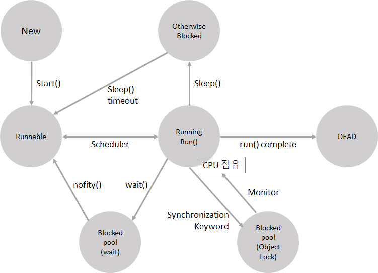

# Thread

기본 개념

- Multiprocessing
  - Task를 실행하는 core(processor)가 2개 이상인 경우
- Multitasking
  - 하나의 core가 시분할(time-slicing)기법을 이용해서 여러개의 Task를 마치 동시에 수행되는 것처럼 보이게 하는 기법
- **Multithreading**
  - 하나의 Task를 여러개의 Sub-Task(Thread)로 분할해서 동시간대에, 혹은 동시간에 실행되는 것처럼 만드는 기법
  - Thread는독립적인 실행 흐름


## Main()

- Program의 시작지점

- main() 이 종료되면 프로그램이 종료된다 (Entry Point)

  > 이런 관점에서 보면 프로그램은 실행흐름이 단 1개만 존재한다.
  >
  > - 실행흐름을 Thread라고 한다.
  > - 단일 Thread 프로그램

- main() 은 하나의 Thread로서

  main Thread에서 별도의 실행흐름(thread)을 파생할 수 있다.


## Thread 언제 쓰나?

1. 대용량의 데이터를 분산해서 처리해야 되는 경우
2. 다수의 클라이언트를 처리하는 서버 프로그램
3. 기타...


## Thread의 사용 방법

> Java에서 Thread를 생성하는 방법은 2가지가 있다.

1. 상속
2. interface 구현


### 1. 상속

```java
public class ThreadTest {

	public static void main(String[] args) {
		System.out.println("ThreadTest start");
		
		// 1. 상속 Thread
		// 생성
		MyThread t = new MyThread();
		// 호출
		t.start();
		
		System.out.println("ThreadTest finish");
	}

}

// 1. 상속을 이용한 Thread 생성
class MyThread extends Thread {
	@Override
	public void run() {
		super.run();
		System.out.println("MyThread - run!");
	}
}
```

- `Class Thread`를 상속한 `MyThread` 클래스를 만들고

  `main()`에서 MyThread를 실행시킨다.

- `run()` method를 Override하고 Thread에서 실행할 코드를 추가한다 

- main()에서 Thread로 실행할 class를 객체로 생성하고 실행을 요청한다.

- main()에서는 run()을 직접 호출하지 않고

  start()를 호출하면 내부적으로 run()을 호출하여 수행된다.


### 2. interface

```java
public class ThreadTest {

	public static void main(String[] args) {
		System.out.println("ThreadTest start");
		
		// 2. interface Thread
		// 생성
		MyRunnable runnable = new MyRunnable();
		// Thread화
		Thread t2 = new Thread(runnable);
		t2.start();
		
		System.out.println("ThreadTest finish");
	}

}

// 2. interface 구현을 이용한 Thread 생성
class MyRunnable implements Runnable {
	@Override
	public void run() {
		System.out.println("MyRunnable - run!");
	}
}
```

- `interface Runnable` 를 상속한 `MyRunnable` 클래스를 만들었다.

- interface의 `run()` method를 Override하고 Thread에서 실행할 코드를 추가한다 

- interface로 구현된 클래스를 인스턴스로 생성하고

  Thread 클래스를 이용해 Thread 인스턴스로 생성한다.

- start() 메서드를 이용해 Thread를 실행을 요청한다.


## Thread 수행 타이밍

- Thread는 `Non Blocking Method`로 실행된다.

- Thread는 JVM이 내부 알고리즘을 이용해 수행될 시간을 결정한다

  따라서, Thread가 언제 실행될지 사용자는 알 수 없다

  (Thread Scheduler가 결정)

- 다만, Thread의 수행 시점을 지정할 수 있는 방법 또한 존재한다.


## Thread Lifecycle





---

# Synchronization

[Java Synchronization](https://github.com/Jzee21/TIL/blob/master/Java/Synchronization.md)

목차

- Mult-Thread의 문제
- Monitor 객체
- synchronized 키워드
  1. Method 동기화
  2. 동기 화 블록


---

# Interrupt

Thread의 종료에 있어 `Thread.stop()` 메서드가 시스템 자원의 안정성등에 문제가 있어 사용을 지양하고 `Interrupt`의 사용이 권장된다.

수행중인 Thread를 즉시 종료하는 것이 아니라 Thread가 일시정지 상태가 되었을 때 스레드가 사용하던 자원을 반납하고 안정적으로 종료되도록 유도한다.


```java
Thread t = new Thread(()-> {
    for (int i = 1; i <= 100; i++) {
        try {
            Thread.sleep(1000);
            System.out.println(i + "\n");
        } catch (InterruptedException e) {
            break;
        }
    }
});
t.start();
```

```java
t.interrupt();
```

- `interrupt()` 메서드가 수행되면 `InterruptedException`이 발생 대기한다.

- Thread가 동작중에 `sleep()` 메서드에 의해 일시정지 상태가 되면

  `InterruptedException` 예외가 발생하면 `catch 문`에서 Thread가 사용하는 자원을 반납하는 코드를 수행하도록 한다.


---

# Daemon

기본적으로 Thread는 자신을 호출한 Thread와 무관한 동작기간을 갖는다.

예를 들어 `main thread`가 모든 일을 끝내고 종료되어도 그가 실행시킨 thread들은 여전히 그들의 동작을 수행한다.


`Daemon Thread`는 주 스레드의 작업을 돕는 보조 스레드의 역할을 하는 스레드로서

`주 스레드가 종료되면 Daemon 스레드도 종료`된다.


```java
Thread t = new Thread(()-> {
    for (int i = 1; i <= 100; i++) {
        try {
            Thread.sleep(1000);
            System.out.println(i + "\n");
        } catch (InterruptedException e) {
            break;
        }
    }
});
t.setDaemon(true);
t.start();
```

- `setDaemon(Boolean)`  메서드를 이용해 데몬스레드를 설정할 수 있다
  - Boolean 매개변수 True  :  데몬스레드
  - Boolean 매개변수 False  :  일반 스레드
- **`반드시 Thread.start() 전에 호출되어야 한다.`**


---

# Reference Link

- [Java] interrupt() 메소드를 이용하여 스레드 정지시키기

  출처 : [https://cornswrold.tistory.com/190](https://cornswrold.tistory.com/190) 평범한 개발자 노트

- [Java] Thread의 interrupt() 메소드 (feat. Thread.stop())

  출처 : [https://ict-nroo.tistory.com/22](https://ict-nroo.tistory.com/22) 개발자의 기록습관

- [Java] 데몬스레드 (daemon thread)

  출처 : [https://cornswrold.tistory.com/195](https://cornswrold.tistory.com/195) 평범한 개발자 노트