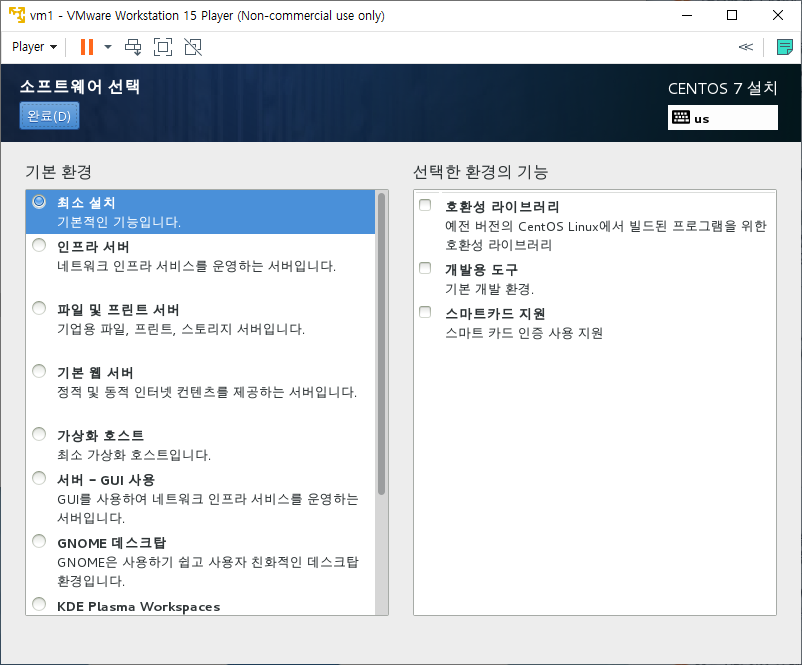
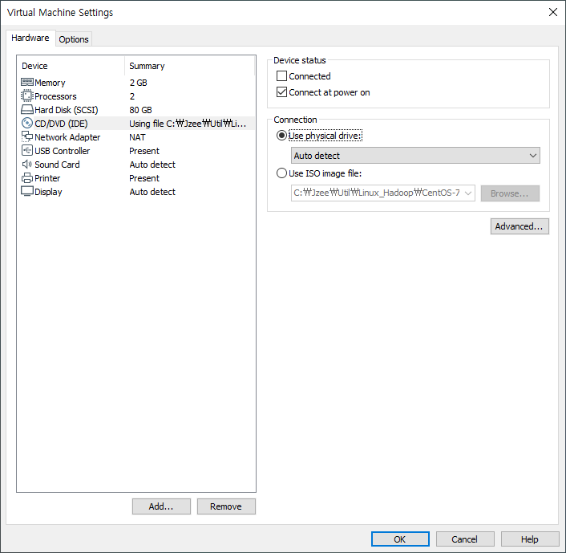

# Linux

---

> Windows 10 Enterprise 1903(18362.239) (Host)
>
> VMWare Workstation player 15.5.1
>
> ​	CentOS 7.0  1406	(Guest)
>
> ​		Java 1.8
>
> ​		Apache Tomcat 9.0.30
>
> ​		Oracle 11g Express
>
> ​		Hadoop 1.2.1


## 1. 설치

---

### 1. VMWare 설치

> Virtual Machine(VM / 가상머신)
>
> Virtual box, VMware, Hyper-V 중 VMware를 사용한다.


[[VMware Workstation 15 Player Download]](https://www.vmware.com/kr/products/workstation-player/workstation-player-evaluation.html)


## 2. CentOS 설치

---

### 1. VM 생성

> OS 설치는 설정 이후에 진행


VM 생성 완료 화면


---

### 2. VM 설정

`Edit virtual machine settings`

Memory - 2GM


Processors - 2개로 증가 (나만)


Hard Disk - Remove, Add


Network (설정 확인)


(Advanved - 추후 Hadoop 설정에 필요)


VMnet8

- Host OS와 Guest OS들간의 통신을 위한 프로토콜
- 192.168.111.xxx 로 설정하여 실습한다.


VMware가 설치된 위치에  `vmnetcfg.exe` 파일 복사, 실행


VMnet8의 `Subnet IP`를 `192.168.111.0` 으로 변경


변경 후 결과(cmd - ipconfig)


---

### 3. VM에 CentOS 설치

- VM 설정에서 `CD/DVD - Use ISO image file:`에

   `CentOS-7.0-1406-x86_64-DVD.iso` 를 추가한다.


---

- VM을 실행하면 다음 화면이 나타난다.


- Install CentOS 7` 선택

---


- 한국어 선택

---


- `키보드`
  - `영어` 추가
  - 우선순위 변경


---



- `소프트웨어 선택`
  - 최하단 `개발 및 창조를 위한 워크스테이션` 선택


---


- `네트워크 및 호스트 이름` 
  - 끔 >> 켬


---


- `설치 대상`


- 클릭 2번으로 파란배경에 체크까지


- 파티션을 설정합니다 클릭 - 완료


- `LVM(기본)`을 `표준 파티션`  으로 변경


- swap 영역 지정(2GB)


추가 후 화면


`변경 사항을 적용` 선택


`설치 시작` 선택


`ROOT 암호`

`사용자 생성`


---


재부팅

엔터

동의


Kdump 사용 해제


**설치완료 화면**


`목록에 없습니까` - `root` 로그인


한국어 설정

한국어 1개 삭제

..... 하면


설치 완료


+




설치에 사용된 ISO 파일의 연결을 해제해준다.


---

### 4. CentOS 설정


소프트웨어 실행 후

최신 패키지만, 전용 패키지만 설정 끔


소프트웨어 공급원 - 업데이트 확인 - 하지않기


terminal

```terminal
cd /etc/yum.repos.d

ls

gedit Centos-Base.repo
```


> 해당 부분은 주기적으로 update를 실행하는 구간
>
> 해당 부분은 앞에 **`#`**으로 주석 처리한다.


```terminal
gedit Centos-Sources.repo
```


> 위와 동일한 부분을 주석처리 한다.


```terminal
su -

cd /etc/yum.repos.d

mv CentOS-Base.repo CentOS-Base.repo.bak

wget http://download.hanbit.co.kr/centos/7/CentOS-Base.repo
```


```terminal
chmod 644 *

rm -f *.repo~

ls

yum clean all
```


#### 네트워크 설정

```terminal
ipconfig
```


> inet : `192.168.111.xxx`
>
> 맨 뒤의 3자리 숫자를 고정해야 서버로 사용 가능하다.


```terminal
cd /etc/sysconfig/network-scripts

gedit ifcfg-eno16777736
```


수정

```
BOOTPROTO="dhcp"
	to
BOOTPROTO=none

and add

IPADDR=192.168.111.100
NETMASK=255.255.255.0
GATEWAY=192.168.111.2
DNS1=192.168.111.2
```


```terminal
systemctl restart network		-- 변경내용 적용
```


#### 보안 설정

> SELinux 기능 끄기

```terminal
gedit /etc/sysconfig/selinux
```

```terminal
SELINUX=enforcing
	to	
SELINUX=disabled
```


---

```terminal
cat /etc/redhat-release		-- OS version info
```


## + 필수 명령어

```terminal
* <fimename>	-> <f>
* <directory>	-> <d>

cd				-- 디렉토리 이동
ls				-- 디렉토리 내부 파일 정보 확인
dir				-- 디렉토리 내부 확인(간단)

pwd				-- 현재 경로 확인

cat <f>			-- 파일 내용 출력 (입력x)
gedit <f>		-- 파일 내용 출력 (입력o)

touch <f>		-- 파일 생성 또는 실행(최종 수정 시간 변경)

cp <f1> <f2>	-- file1을 file2란 이름으로 복사
cp -r <d> <d>	-- 디렉토리 복사

mv <f> <d>		-- file을 해당 디렉토리로 이동
				   <d> 뒤에 <f>를 주면 변경된 파일명으로 이동

rm <f>			-- file 삭제
rm -i <f>		-- 삭제 여부 확인
rm -f <f>		-- 확인 없이 삭제
rm -r <d>		-- 디렉토리 삭제
rm -rf <d>		-- 하위 디렉토리까지 삭제(확인 없이!)**

----------------------------------------------------------
ls -a		-- 숨김파일 포함
   -l		-- 파일 권한 포함
   /<directory>		-- 해당 경로 내부 파일 정보

cat <f1> <f2>			-- file 1, 2 합쳐서 조회
cat <f1> <f2> > <f3>	-- file 1, 2 합쳐서 file3에 덮어쓰기
cat <f1> <f2> >> <f3>	-- file 1, 2 합쳐서 file3에 이어쓰기

history -c	-- history 기록 삭제
----------------------------------------------------------
shutdown -P now			-- P : poweroff		-- now : time
						-- r : reboot
						-- c : (shutdown cancel)
		 -r	+10			-- 10분 후 재부팅
halt -P
init 0					-- 0 : 0~6	run level
						-- 1 : rescue
						-- 3 : multi user mode (text)
						-- 5 : multi user mode (graphic)
						-- 6 : reboot

```


## + 주요 경로

```terminal
/						filesystem root
/root					root 계정 디렉토리
/home/user_account/		해당 계정 디렉토리
/etc/...				설정파일 디렉토리
/usr/...				모든 계정 사용 가능 디렉토리
```


## 파일 속성

```terminal
[root@localhost ~]# ls -l
합계 8
-rw-------. 1 root root 1420  2월 18  2020 anaconda-ks.cfg
-rw-r--r--. 1 root root 1471  2월 18 11:08 initial-setup-ks.cfg
drwxr-xr-x. 2 root root    6  2월 18 11:10 공개
drwxr-xr-x. 2 root root    6  2월 18 11:10 다운로드
drwxr-xr-x. 2 root root    6  2월 18 11:10 문서
drwxr-xr-x. 2 root root    6  2월 18 11:10 바탕화면
drwxr-xr-x. 2 root root    6  2월 18 11:10 비디오
drwxr-xr-x. 2 root root    6  2월 18 11:10 사진
drwxr-xr-x. 2 root root    6  2월 18 11:10 서식
drwxr-xr-x. 2 root root    6  2월 18 11:10 음악

----------------------------------------------
d / rwx / r-x / r-x		|	- - -
1	2	  3		4		|	4 2 1  + => 7(max)
----------------------------------------------

1. d	- or d	: file or directory

2. rwx	- root 계정
		- r:read, w:write, x:execute

3. r-x	- root 그룹 계정


4. r-x	- 다른 사용자 그룹


```


