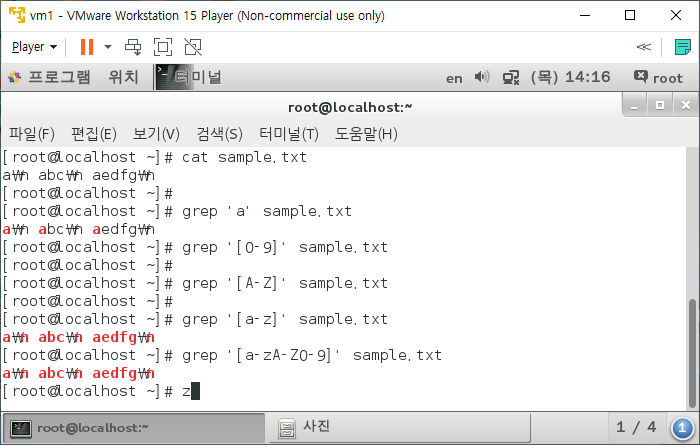

# Linux Command

---

## + 필수 명령어

```terminal
* <fimename>	-> <f>
* <directory>	-> <d>

cd				-- 디렉토리 이동
ls				-- 디렉토리 내부 파일 정보 확인
dir				-- 디렉토리 내부 확인(간단)

pwd				-- 현재 경로 확인

whoami			-- 로그인한 user 확인

ps				-- 현재 프로세스의 정보 출력
jps				-- JVM에 의해 생성된 프로세스 정보 출력

cat <f>			-- 파일 내용 출력 (입력x)
gedit <f>		-- 파일 내용 출력 (입력o)
head, tail

touch <f>		-- 파일 생성 또는 실행(최종 수정 시간 변경)

cp <f1> <f2>	-- file1을 file2란 이름으로 복사
cp -r <d> <d>	-- 디렉토리 복사

mv <f> <d>		-- file을 해당 디렉토리로 이동
				   <d> 뒤에 <f>를 주면 변경된 파일명으로 이동

rm <f>			-- file 삭제
rm -i <f>		-- 삭제 여부 확인
rm -f <f>		-- 확인 없이 삭제
rm -r <d>		-- 디렉토리 삭제
rm -rf <d>		-- 하위 디렉토리까지 삭제(확인 없이!)**

----------------------------------------------------------
ls -a		-- 숨김파일 포함
   -l		-- 파일 권한 포함
   /<directory>		-- 해당 경로 내부 파일 정보

cat <f1> <f2>			-- file 1, 2 합쳐서 조회
cat <f1> <f2> > <f3>	-- file 1, 2 합쳐서 file3에 덮어쓰기
cat <f1> <f2> >> <f3>	-- file 1, 2 합쳐서 file3에 이어쓰기

history -c	-- history 기록 삭제
----------------------------------------------------------
shutdown -P now			-- P : poweroff		-- now : time
						-- r : reboot
						-- c : (shutdown cancel)
		 -r	+10			-- 10분 후 재부팅
halt -P
init 0					-- 0 : 0~6	run level
						-- 1 : rescue
						-- 3 : multi user mode (text)
						-- 5 : multi user mode (graphic)
						-- 6 : reboot

```

```termimal
inode 자료구조
파일에 대한 정보를 담고있다.
```


```termimal
tar
tar cvf : 압축
tar xvf : 압축해제
```


```terminal
vi
-- command mode
    yy	1줄 복사
    dd	1줄 삭제
    w	저장
    q	나가기
    wq	저장하고 나가기
    !q	저장 안하고 나가기
-- edit mode
    i (insert)
    a (append)
```


```termimal
mount
```


```termimal
chmod
```


```termimal
yum
```

> 패키지 설치에 있어 의존성 패키지들을 설치하거나 삭제할 때 이를 편하게 관리해주는 명령어


```
|
>		-- 리다이렉션
>>
<
<<
```

- ```
  명령1 | 명령2
  ```

  > `명령1`의 결과물을 `명령2`에 연결해라

- ```
  명령어 > file명
  ```

  > 명령어의 결과를 파일명으로 저장
  >
  > - 기존 내용을 삭제하고 저장 (덮어쓰기)

- ```
  명령어 >> file명
  ```

  > 명령어의 결과를 파일명으로 저장
  >
  > - 기존의 내용 뒤에 추가로 저장 (이어쓰기)

- ```
  명령어 < 파일명
  ```

  > 명령어를 입력파일로 지정
  >
  > - 명령어를 파일에서 불러와 실행


```
grep <text> <target>

[root@localhost ~]# grep test hardlink
test
test2
```

```
[root@localhost ~]# echo "a\n abc\n aedfg\n" > sample.txt
[root@localhost ~]# 
[root@localhost ~]# cat sample.txt 
a\n abc\n aedfg\n
[root@localhost ~]# 
[root@localhost ~]# grep 'a' sample.txt 
a\n abc\n aedfg\n
[root@localhost ~]# grep '[0-9]' sample.txt 
[root@localhost ~]# 
[root@localhost ~]# grep '[A-Z]' sample.txt 
[root@localhost ~]# 
[root@localhost ~]# grep '[a-z]' sample.txt 
a\n abc\n aedfg\n
[root@localhost ~]# grep '[a-zA-Z0-9]' sample.txt 
a\n abc\n aedfg\n
[root@localhost ~]# 
```



