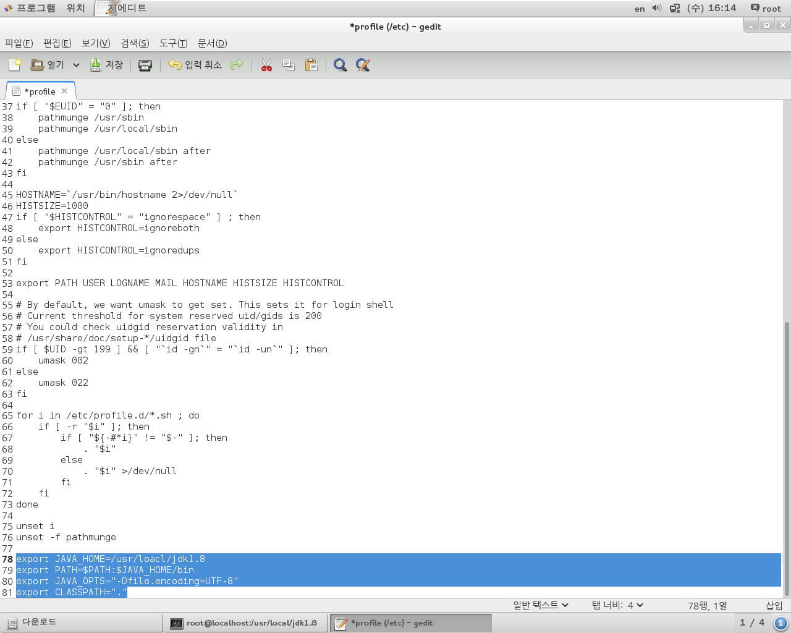

# Install JDK

> CentOS 7 에서
>
> JDK의 기본 버전은 1.7 이다.

1. 기존 JDK 삭제
2. JDK 1.8 설치
3. 환경변수 PATH 등록
   - java.exe
   - javac.exe
4. Hadoop 설정(추후)


## 1. 기존 JDK 삭제

```
[root@localhost ~]# java -version
java version "1.7.0_51"
OpenJDK Runtime Environment (rhel-2.4.5.5.el7-x86_64 u51-b31)
OpenJDK 64-Bit Server VM (build 24.51-b03, mixed mode)
```

```
[root@localhost ~]# yum remove java

.....

[root@localhost 다운로드]# java -version
bash: java: 명령을 찾을 수 없습니다...
[root@localhost 다운로드]#
```


```
[root@localhost 다운로드]# tar xfvz jdk-8u241-linux-x64.tar.gz jdk1.8

[root@localhost 다운로드]# ls -l
합계 636400
-rwxrw-rw- 1 root  root   11026056  2월 11 16:57 apache-tomcat-9.0.30.tar.gz
-rwxrw-rw- 1 root  root   66348863  2월 11 13:21 firefox-72.0.2.tar.bz2
-rwxrw-rw- 1 root  root   63851630  2월 14 09:30 hadoop-1.2.1.tar.gz
-rwxrw-rw- 1 root  root  194545143  2월 11 15:24 jdk-8u241-linux-x64.tar.gz
drwxr-xr-x 7 10143 10143      4096 12월 11 19:39 jdk1.8.0_241
-rwxrw-rw- 1 root  root  315891481  2월 16 11:00 oracle-xe-11.2.0-1.0.x86_64.rpm.zip
[root@localhost 다운로드]# 
[root@localhost 다운로드]# mv jdk1.8.0_241 /usr/local/jdk1.8

[root@localhost 다운로드]# cd /usr/local/jdk1.8/
[root@localhost jdk1.8]# ls -l
합계 25996
-r--r--r-- 1 10143 10143     3244 12월 11 19:35 COPYRIGHT
-r--r--r-- 1 10143 10143       44 12월 11 19:35 LICENSE
-r--r--r-- 1 10143 10143      159 12월 11 19:35 README.html
-rw-r--r-- 1 10143 10143   116400 12월 11 16:41 THIRDPARTYLICENSEREADME-JAVAFX.txt
-r--r--r-- 1 10143 10143   169788 12월 11 19:35 THIRDPARTYLICENSEREADME.txt
drwxr-xr-x 2 10143 10143     4096 12월 11 19:35 bin
drwxr-xr-x 3 10143 10143      125 12월 11 19:35 include
-rw-r--r-- 1 10143 10143  5217333 12월 11 16:41 javafx-src.zip
drwxr-xr-x 5 10143 10143     4096 12월 11 19:35 jre
drwxr-xr-x 5 10143 10143     4096 12월 11 19:35 lib
drwxr-xr-x 4 10143 10143       44 12월 11 19:35 man
-rw-r--r-- 1 10143 10143      424 12월 11 19:35 release
-rw-r--r-- 1 10143 10143 21078837 12월 11 19:35 src.zip
[root@localhost jdk1.8]# 


```


```
[root@localhost jdk1.8]# /usr/local/jdk1.8/bin/java -version
java version "1.8.0_241"
Java(TM) SE Runtime Environment (build 1.8.0_241-b07)
Java HotSpot(TM) 64-Bit Server VM (build 25.241-b07, mixed mode)
[root@localhost jdk1.8]# 
[root@localhost jdk1.8]# 
[root@localhost jdk1.8]# 
[root@localhost jdk1.8]# 
[root@localhost jdk1.8]# gedit /etc/profile

```


```
export JAVA_HOME=/usr/local/jdk1.8
export PATH=$PATH:$JAVA_HOME/bin
export JAVA_OPTS="-Dfile.encoding=UTF-8"
export CLASSPATH="."
```




```
[root@localhost jdk1.8]# gedit /etc/profile
[root@localhost jdk1.8]# 
[root@localhost jdk1.8]# echo $PATH
/usr/local/bin:/usr/local/sbin:/usr/bin:/usr/sbin:/bin:/sbin
[root@localhost jdk1.8]# 
[root@localhost jdk1.8]# echo $JAVA_HOME

[root@localhost jdk1.8]# source /etc/profile
[root@localhost jdk1.8]# 
[root@localhost jdk1.8]# java -version
java version "1.8.0_241"
Java(TM) SE Runtime Environment (build 1.8.0_241-b07)
Java HotSpot(TM) 64-Bit Server VM (build 25.241-b07, mixed mode)

```

