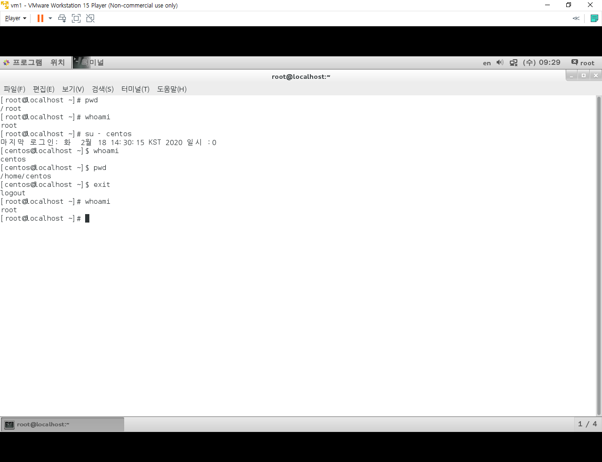
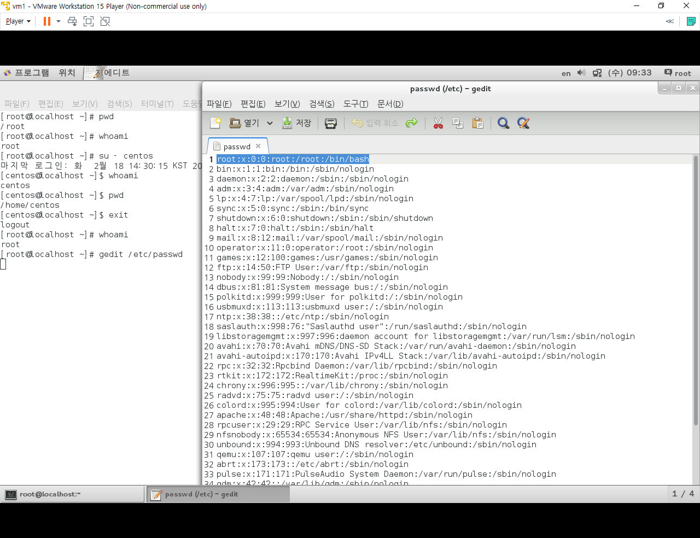
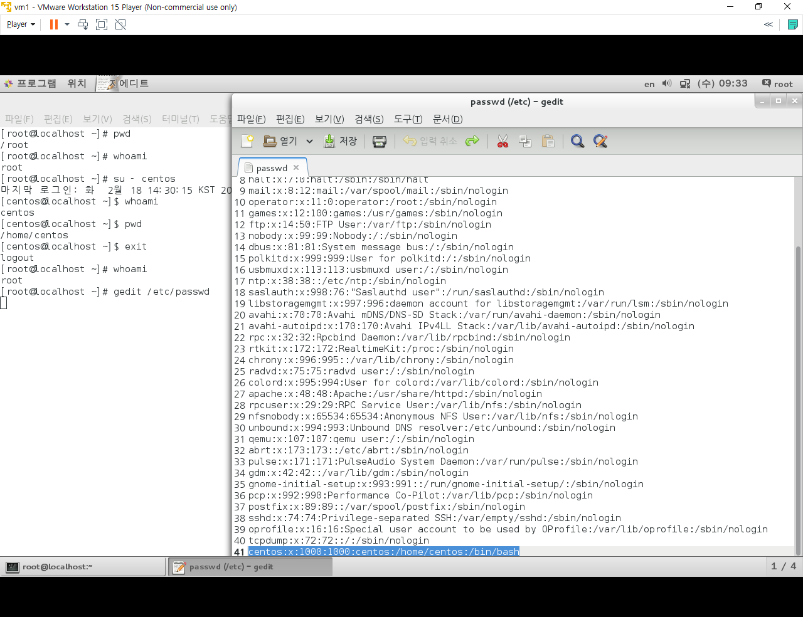
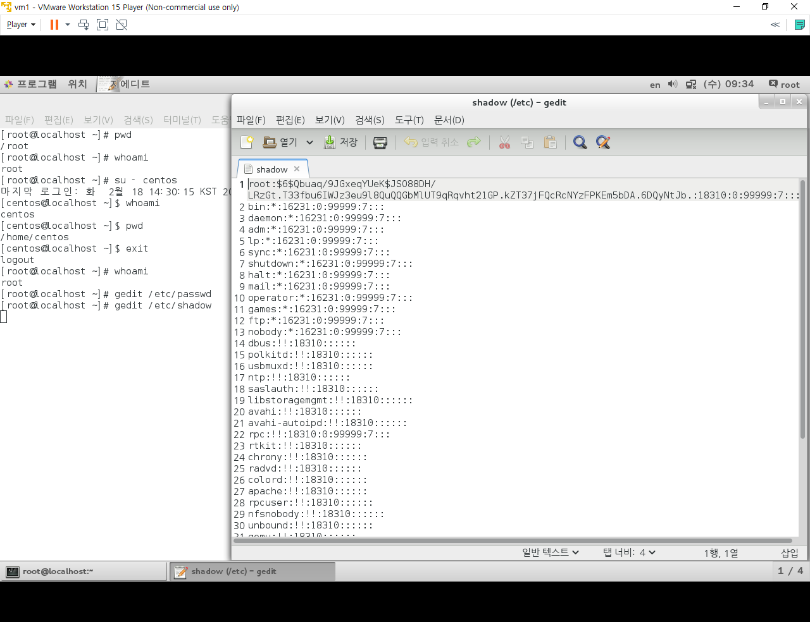
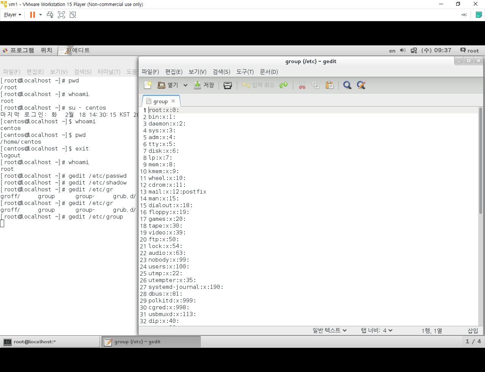
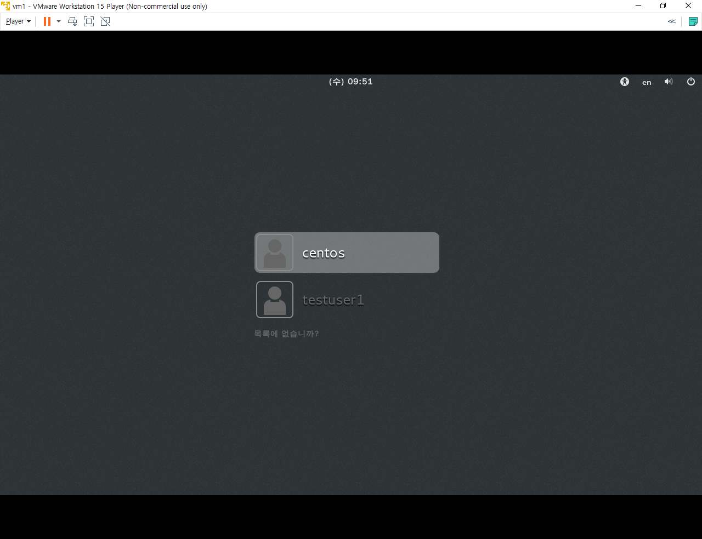
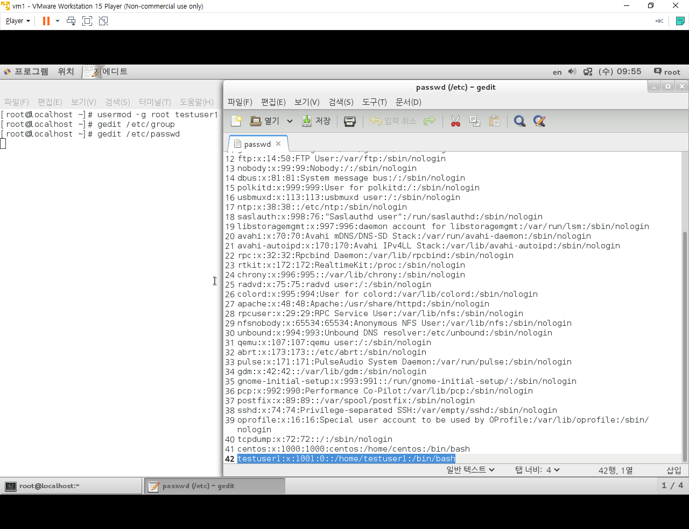

# Linux Account

---

## 사용자 계정 관리

```
[root@localhost ~]# whoami	
/root				-- 현재 로그인 계정 확인
```


```terminal
su - centos				-- 로그아웃 없이 사용자 계정 변경
exit					-- 유저 로그아웃, root 계정 복귀
```

```
[root@localhost ~]# pwd
/root
[root@localhost ~]# whoami
root
[root@localhost ~]# su - centos
마지막 로그인: 화  2월 18 14:30:15 KST 2020 일시 :0
[centos@localhost ~]$ whoami
centos
[centos@localhost ~]$ pwd
/home/centos
[centos@localhost ~]$ exit
logout
[root@localhost ~]# whoami
root
```



> `#`  >>  `$` 로 바뀌어있다.


---

#### 사용자 정보 확인

```
gedit /etc/passwd
```





> USER의 리스트를 확인하는 방법
>
> `1000번`부터 추가된 유저의 seq 값이 정해진다.


```
gedit /etc/shadow
```



>  USER의 비밀번호들을 확인하는 방법 (인코딩 암호)
>
> 느낌표 2개(!!) 계정은 암호화 되지 않은 비밀번호를 나타낸다.


```
gedit /etc/group
```



> USER의 그룹을 확인하는 방법
>
> 그룹도 seq로 지정되어있다.
>
> 사용자가 추가하는 User 계정의 그룹도 `1000번`부터 시작한다.


---

#### 사용자 정보 수정

> 사용자의 생성/그룹 등의 설정은 root 계정만 가능하다

```
useradd <user name>			-- 사용자 생성
passwd <user name>			-- 사용자 비밀번호 설정
usermod <option>			-- 사용자 설정 변경
userdel <user name>			-- 사용자 삭제
```


```
useradd testuser1
su - testuser1
```

```
[testuser1@localhost ~]$ gedit /etc/passwd
No protocol specified

** (gedit:3961): WARNING **: Could not open X display

(gedit:3961): Gtk-WARNING **: cannot open display: 
```

```
[testuser1@localhost ~]$ passwd testuser1
passwd: root로만 사용자 이름을 지정할 수 있습니다.
```


```
[testuser1@localhost ~]$ exit
logout
[root@localhost ~]# passwd testuser1
testuser1 사용자의 비밀 번호 변경 중
새  암호:
잘못된 암호: 암호는 8 개의 문자 보다 짧습니다
새  암호 재입력:
passwd: 모든 인증 토큰이 성공적으로 업데이트 되었습니다.
```




> 사용자가 추가되어있다.


```
usermod -g root testuser1
-- 사용자 그룹 root에 testuser1 추가
```




```
userdel testuser1
groupdel testuser1			-- 그룹 변경 이력으로 따로 삭제 필요
```


### 파일 / 디렉토리 권한

```
chmod

chown centos test
```


```
chgroup user test

chown user.centos test 
```


```
[root@localhost ~]# ls -l
합계 8
-rw-------. 1 root root 1420  2월 18 20:07 anaconda-ks.cfg
-rw-r--r--. 1 root root 1471  2월 18 11:08 initial-setup-ks.cfg
-rw-r--r--  1 root root    0  2월 19 11:15 sample.txt

.....

[root@localhost ~]# 
[root@localhost ~]# gedit sample.txt
[root@localhost ~]# 
[root@localhost ~]# cat sample.txt
root가 생성한 파일입니다.
ls -l
[root@localhost ~]# ls -l
합계 12
-rw-------. 1 root root 1420  2월 18 20:07 anaconda-ks.cfg
-rw-r--r--. 1 root root 1471  2월 18 11:08 initial-setup-ks.cfg
-rw-r--r--  1 root root   41  2월 19 11:16 sample.txt
-rw-r--r--  1 root root    0  2월 19 11:15 sample.txt~

.....

[root@localhost ~]# 
[root@localhost ~]# echo "test">>sample.txt
[root@localhost ~]# 
[root@localhost ~]# cat sample.txt
root가 생성한 파일입니다.
ls -l
test
[root@localhost ~]# 
[root@localhost ~]# /root/sample.txt
bash: /root/sample.txt: 허가 거부
[root@localhost ~]# 
[root@localhost ~]# chmod 744 sample.txt
[root@localhost ~]# 
[root@localhost ~]# ls -l
합계 12
-rw-------. 1 root root 1420  2월 18 20:07 anaconda-ks.cfg
-rw-r--r--. 1 root root 1471  2월 18 11:08 initial-setup-ks.cfg
-rwxr--r--  1 root root   46  2월 19 11:20 sample.txt
-rw-r--r--  1 root root    0  2월 19 11:15 sample.txt~

.....

[root@localhost ~]# 
[root@localhost ~]# cat sample.txt
root가 생성한 파일입니다.
ls -l
test
[root@localhost ~]# 
[root@localhost ~]# echo "test2">>sample.txt
[root@localhost ~]# 
[root@localhost ~]# cat sample.txt
root가 생성한 파일입니다.
ls -l
test
test2
[root@localhost ~]# 
[root@localhost ~]# /root/sample.txt
/root/sample.txt: line 1: $'root\352\260\200': command not found
합계 12
-rw-------. 1 root root 1420  2월 18 20:07 anaconda-ks.cfg
-rw-r--r--. 1 root root 1471  2월 18 11:08 initial-setup-ks.cfg
-rwxr--r--  1 root root   52  2월 19 11:23 sample.txt
-rw-r--r--  1 root root    0  2월 19 11:15 sample.txt~
drwxr-xr-x. 2 root root    6  2월 18 11:10 공개
drwxr-xr-x. 2 root root    6  2월 18 11:10 다운로드
drwxr-xr-x. 2 root root    6  2월 18 11:10 문서
drwxr-xr-x. 2 root root    6  2월 18 11:10 바탕화면
drwxr-xr-x. 2 root root    6  2월 18 11:10 비디오
drwxr-xr-x. 2 root root    6  2월 18 11:10 사진
drwxr-xr-x. 2 root root    6  2월 18 11:10 서식
drwxr-xr-x. 2 root root    6  2월 18 11:10 음악
/root/sample.txt: line 4: test2: command not found
[root@localhost ~]# 
[root@localhost ~]# chown centos sample.txt
[root@localhost ~]# 
[root@localhost ~]# ls -l
합계 12
-rw-------. 1 root   root 1420  2월 18 20:07 anaconda-ks.cfg
-rw-r--r--. 1 root   root 1471  2월 18 11:08 initial-setup-ks.cfg
-rwxr--r--  1 centos root   52  2월 19 11:23 sample.txt
-rw-r--r--  1 root   root    0  2월 19 11:15 sample.txt~
drwxr-xr-x. 2 root   root    6  2월 18 11:10 공개
drwxr-xr-x. 2 root   root    6  2월 18 11:10 다운로드
drwxr-xr-x. 2 root   root    6  2월 18 11:10 문서
drwxr-xr-x. 2 root   root    6  2월 18 11:10 바탕화면
drwxr-xr-x. 2 root   root    6  2월 18 11:10 비디오
drwxr-xr-x. 2 root   root    6  2월 18 11:10 사진
drwxr-xr-x. 2 root   root    6  2월 18 11:10 서식
drwxr-xr-x. 2 root   root    6  2월 18 11:10 음악
[root@localhost ~]# 
[root@localhost ~]# chgrp centos sample.txt
[root@localhost ~]# 
[root@localhost ~]# ls -l
합계 12
-rw-------. 1 root   root   1420  2월 18 20:07 anaconda-ks.cfg
-rw-r--r--. 1 root   root   1471  2월 18 11:08 initial-setup-ks.cfg
-rwxr--r--  1 centos centos   52  2월 19 11:23 sample.txt
-rw-r--r--  1 root   root      0  2월 19 11:15 sample.txt~
drwxr-xr-x. 2 root   root      6  2월 18 11:10 공개
drwxr-xr-x. 2 root   root      6  2월 18 11:10 다운로드
drwxr-xr-x. 2 root   root      6  2월 18 11:10 문서
drwxr-xr-x. 2 root   root      6  2월 18 11:10 바탕화면
drwxr-xr-x. 2 root   root      6  2월 18 11:10 비디오
drwxr-xr-x. 2 root   root      6  2월 18 11:10 사진
drwxr-xr-x. 2 root   root      6  2월 18 11:10 서식
drwxr-xr-x. 2 root   root      6  2월 18 11:10 음악
[root@localhost ~]# 

[root@localhost ~]# mv sample.txt /home/centos/
[root@localhost ~]# 
[root@localhost ~]# cat /home/centos/sample.txt 
root가 생성한 파일입니다.
ls -l
test
test2
[root@localhost ~]# su - centos
마지막 로그인: 수  2월 19 11:27:36 KST 2020 일시 pts/0
[centos@localhost ~]$ pwd
/home/centos
[centos@localhost ~]$ ls -l
합계 4
-rwxr--r-- 1 centos centos 52  2월 19 11:23 sample.txt
drwxr-xr-x 2 centos centos  6  2월 18 14:30 공개
drwxr-xr-x 2 centos centos  6  2월 18 14:30 다운로드
drwxr-xr-x 2 centos centos  6  2월 18 14:30 문서
drwxr-xr-x 2 centos centos  6  2월 18 14:30 바탕화면
drwxr-xr-x 2 centos centos  6  2월 18 14:30 비디오
drwxr-xr-x 2 centos centos  6  2월 18 14:30 사진
drwxr-xr-x 2 centos centos  6  2월 18 14:30 서식
drwxr-xr-x 2 centos centos  6  2월 18 14:30 음악
[centos@localhost ~]$ 

```


---

### link

> 원본 파일이나 디렉토리를 가리키는 참조아이콘

> Linux에서...
>
> Link : inode 블럭을 가리키는 참조아이콘
>
> inode 블럭 : 원본 데이터의 정보를 저장공간 (디스크 주소 등)

- 하드링크
  - 복사본 하나를 만든다고 생각하면 된다
- 소프트링크
  - inode 블럭의 주소만 참조하는 아이콘
- alias
  - 터미널 실행동안만 유지되는 link 방식


```
ln <target> <link name>			-- hard link
ln -s <target> <link name>		-- symbolic link
```


```
[root@localhost ~]# gedit link.txt
[root@localhost ~]# ls -l
합계 12
-rw-------. 1 root root 1420  2월 18 20:07 anaconda-ks.cfg
-rw-r--r--. 1 root root 1471  2월 18 11:08 initial-setup-ks.cfg
-rw-r--r--  1 root root   28  2월 19 13:13 link.txt
-rw-r--r--  1 root root    0  2월 19 11:15 sample.txt~
drwxr-xr-x. 2 root root    6  2월 18 11:10 공개
drwxr-xr-x. 2 root root    6  2월 18 11:10 다운로드
drwxr-xr-x. 2 root root    6  2월 18 11:10 문서
drwxr-xr-x. 2 root root    6  2월 18 11:10 바탕화면
drwxr-xr-x. 2 root root    6  2월 18 11:10 비디오
drwxr-xr-x. 2 root root    6  2월 18 11:10 사진
drwxr-xr-x. 2 root root    6  2월 18 11:10 서식
drwxr-xr-x. 2 root root    6  2월 18 11:10 음악
[root@localhost ~]# ln link.txt hardlink
[root@localhost ~]# 
[root@localhost ~]# ln -s link.txt softlink
[root@localhost ~]# ls -il
합계 16
137969148 -rw-------. 1 root root 1420  2월 18 20:07 anaconda-ks.cfg
137992016 -rw-r--r--  2 root root   28  2월 19 13:13 hardlink
137939847 -rw-r--r--. 1 root root 1471  2월 18 11:08 initial-setup-ks.cfg
137992016 -rw-r--r--  2 root root   28  2월 19 13:13 link.txt
137992017 -rw-r--r--  1 root root    0  2월 19 11:15 sample.txt~
137992021 lrwxrwxrwx  1 root root    8  2월 19 13:16 softlink -> link.txt
404585810 drwxr-xr-x. 2 root root    6  2월 18 11:10 공개
137939867 drwxr-xr-x. 2 root root    6  2월 18 11:10 다운로드
    15572 drwxr-xr-x. 2 root root    6  2월 18 11:10 문서
    15571 drwxr-xr-x. 2 root root    6  2월 18 11:10 바탕화면
404585811 drwxr-xr-x. 2 root root    6  2월 18 11:10 비디오
271144280 drwxr-xr-x. 2 root root    6  2월 18 11:10 사진
271144279 drwxr-xr-x. 2 root root    6  2월 18 11:10 서식
137939868 drwxr-xr-x. 2 root root    6  2월 18 11:10 음악
[root@localhost ~]# 
[root@localhost ~]# cat hardlink 
f doing link test...
ls -il
[root@localhost ~]# 
[root@localhost ~]# echo 'test'>>link.txt
[root@localhost ~]# 
[root@localhost ~]# cat link.txt 
f doing link test...
ls -il
test
[root@localhost ~]# 
[root@localhost ~]# cat hardlink 
f doing link test...
ls -il
test
[root@localhost ~]# cat softlink 
f doing link test...
ls -il
test
[root@localhost ~]# 
[root@localhost ~]# mv link.txt other.txt
[root@localhost ~]# 
[root@localhost ~]# ls -il
합계 16
137969148 -rw-------. 1 root root 1420  2월 18 20:07 anaconda-ks.cfg
137992016 -rw-r--r--  2 root root   33  2월 19 13:22 hardlink
137939847 -rw-r--r--. 1 root root 1471  2월 18 11:08 initial-setup-ks.cfg
137992016 -rw-r--r--  2 root root   33  2월 19 13:22 other.txt
137992017 -rw-r--r--  1 root root    0  2월 19 11:15 sample.txt~
137992021 lrwxrwxrwx  1 root root    8  2월 19 13:16 softlink -> link.txt
404585810 drwxr-xr-x. 2 root root    6  2월 18 11:10 공개
137939867 drwxr-xr-x. 2 root root    6  2월 18 11:10 다운로드
    15572 drwxr-xr-x. 2 root root    6  2월 18 11:10 문서
    15571 drwxr-xr-x. 2 root root    6  2월 18 11:10 바탕화면
404585811 drwxr-xr-x. 2 root root    6  2월 18 11:10 비디오
271144280 drwxr-xr-x. 2 root root    6  2월 18 11:10 사진
271144279 drwxr-xr-x. 2 root root    6  2월 18 11:10 서식
137939868 drwxr-xr-x. 2 root root    6  2월 18 11:10 음악
[root@localhost ~]# cat hardlink 
f doing link test...
ls -il
test
[root@localhost ~]# 
[root@localhost ~]# cat softlink 
cat: softlink: 그런 파일이나 디렉터리가 없습니다
[root@localhost ~]# 

```


## 설치

---

**`Linus...`**

1. zip, tar, tar.bz, tar.gz		-- unzip, tar
2. rpm or yum                         -- install...


### RPM

> .rpm 파일 설치, 삭제, 설치정보 확인

```
rpm -Uvh <package name.rpm>	-- 설치
	-U : 신규 / 업데이트
	-v : 설치과정 출력
	-h : 진행상황 출력 (###         ?%)
rpm -e <name>				-- 삭제
rpm -qa jdk*				-- 설치 확인 (q : 질문)
rpm -qip <name>.rpm			-- 미설치 프로그램 정보 조회
```


### YUM

> rpm에 기능 추가
>
> 1. 의존성 파일 자동 설치
> 2. rpm의 경우 설치파일이 컴퓨터에 존재해야 가능

```
yum (-y) install <package name>
yum info <package name>
yum remove <package name>

yum clean all			-- 패키지 목록 등 초기화
```


```
-- yum 설정파일
gedit /etc/yum.repos.d/CentOS-Base.repo

yum info mysql-connector-odbc
```

```
`/etc/yum.repos.d/CentOS-Base.repo`

[base]
name=CentOS-$releasever - Base
baseurl=http://vault.centos.org/7.0.1406/os/$basearch/
gpgcheck=0

[extras]
name=CentOS-$releasever - Extras
baseurl=http://vault.centos.org/7.0.1406/extras/$basearch/
gpgcheck=0
```


### Zip & unzip

1. 파일 개별 압축
   - .bz
   - .gz
2. 압축 파일 묶음


```
tar cfvz /target aaa.tar.gz			-- 압축(zip)

tar xfvz aaa.tar.gz	/target		-- 압축해제(unzip)
```


## 파일 위치 찾기

---

```
which				-- path only
whereis				-- all
find				-- all	(powerfull)
rpm -qa				-- rpm file only
```

```
find /root -name jdk*
fine /root -perm 777
find /root -user centos
```


## 파일 탐색

```
cat /etc/passwd
>>
more /etc/passwd

tail -5 /etc/passwd
head 5 /etc/passwd

fine /root -user centos | more
```


