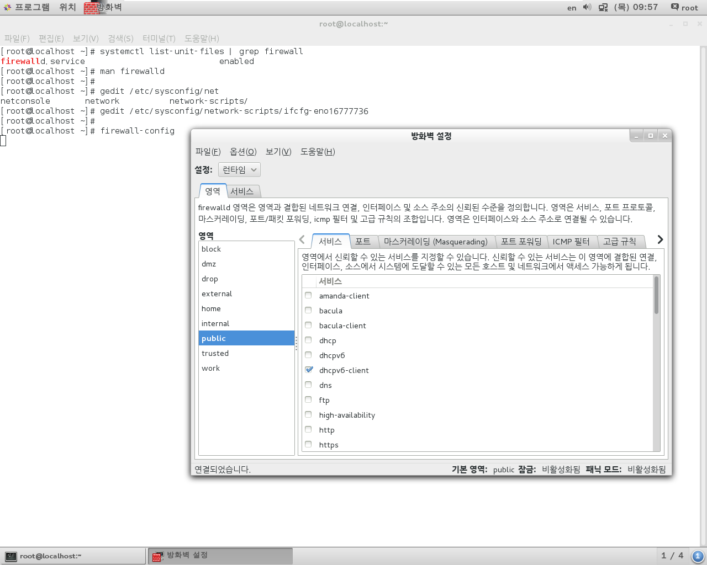
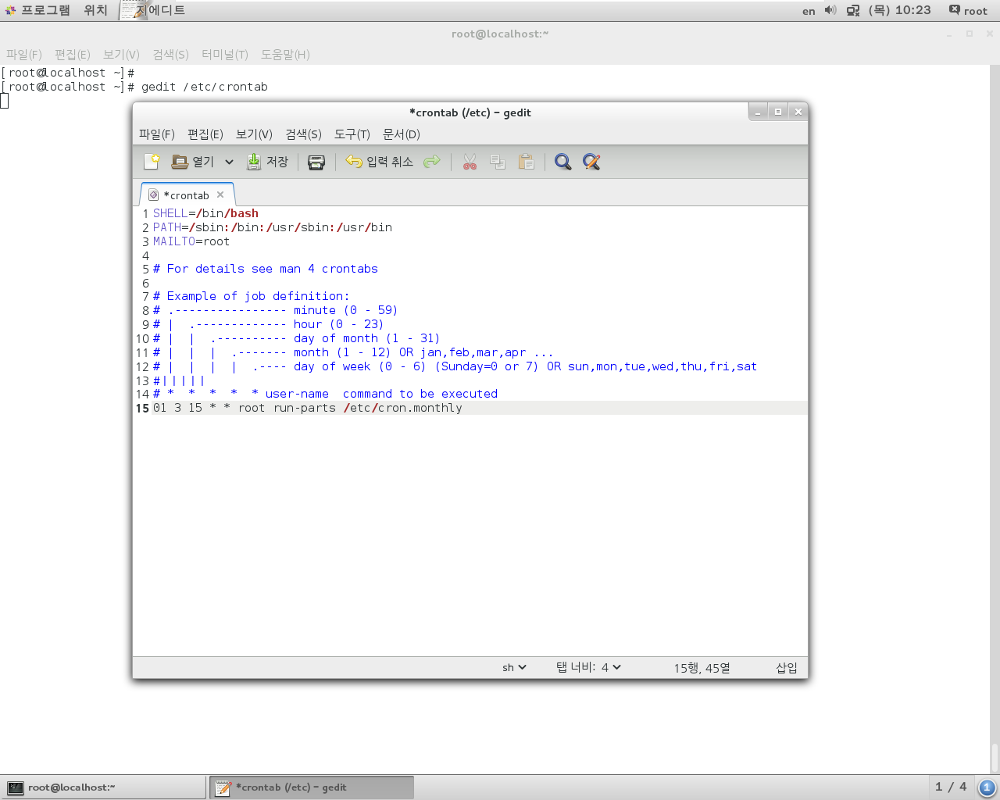
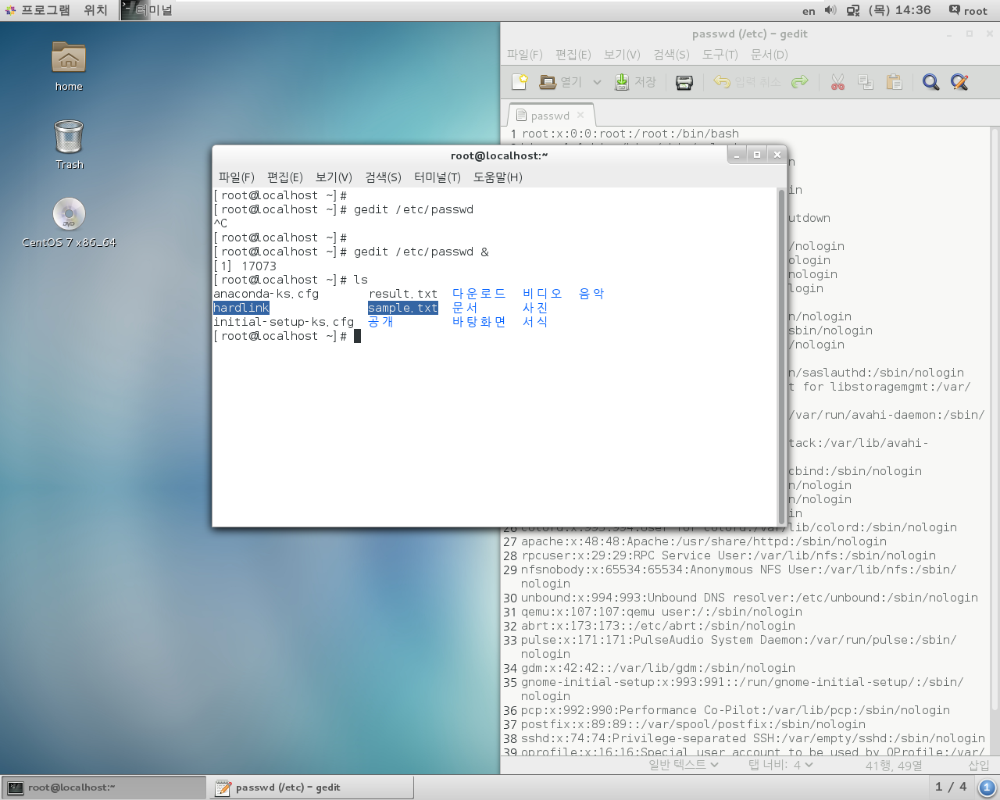

기본명령
관리자 명령
 - 사용자
 - 파일 설정


/usr/local/jdk1.8/bin/javac.exe
/usr/local/jdk1.8/bin/java.exe

excute
/usr/local/jdk1.8/bin/java -version

so, add PATH
/etc/profile


System Configuration.....

- 서비스 프로그램 :	자동실행 프로그램
		백그라운드 프로세스

```
systemctl list-unit-files			-- list Service names
systemctl list-unit-files | grep firewall
systemctl start <service_name>
		  stop, restart, disabled, enabled, status
```


- 수동 실행 프로그램


---

# 시스템 설정

## 네트워크 설정




작업예약

- cron
  - `주기적`으로 특정 작업 자동 수행
  - crond.service
- at
  - 예약 시간에 `1번` 특정 작업 수행
  - atd.service


```
[root@localhost ~]# 
[root@localhost ~]# gedit /etc/crontab 
[root@localhost ~]# 
[root@localhost ~]# ls /etc/cron.monthly/
[root@localhost ~]# 
[root@localhost ~]# gedit /etc/cron.monthly/mybackup.sh
[root@localhost ~]# 
```




- `/etc/cron.monthly/mybackup.sh`

```
set ${date}
fname ="backup-$2$3.tar.xz"

tar cfj /backup/$fname /home
```


```
[root@localhost cron.monthly]# ls -l
합계 4
-rw-r--r-- 1 root root 70  2월 20  2020 mybackup.sh
[root@localhost cron.monthly]# 
[root@localhost cron.monthly]# chmod 744 mybackup.sh 
[root@localhost cron.monthly]# 
[root@localhost cron.monthly]# ls -l
합계 4
-rwxr--r-- 1 root root 70  2월 20  2020 mybackup.sh
[root@localhost cron.monthly]# 
```


---


네트워크 통신

host  ---(프로토콜)--- host

web : http  + (의존성) 고급수준

 -> tcp / ip : 저급수준 네트워크 연결


telnet : 원격 접속 프로토콜

ssh : telnet? + 보안


ip address : 네트워크상 기기 식별 번호

- IPv4 --> IPv6

subnet mask

- 255.255.255.0

gateway

- 192.168.111.2		// 실습 설정

dns (domain name server)

- 문자 주소를 숫자형 주소로 변경해주는 서버


```
ifconfig

nmtui				-- GUI 네트워크 조회/설정

ifup				-- 네트워크 작동 시작
ifdown				-- 네트워크 작동 일시적 중단

nslookup <address>	-- 주소에 접근하는 내역 확인

```


```
[root@localhost ~]# ifdown eno16777736
[root@localhost ~]# 
[root@localhost ~]# ifconfig
eno16777736: flags=4163<UP,BROADCAST,RUNNING,MULTICAST>  mtu 1500
        ether 00:0c:29:7f:94:8f  txqueuelen 1000  (Ethernet)
        RX packets 174  bytes 27760 (27.1 KiB)
        RX errors 0  dropped 0  overruns 0  frame 0
        TX packets 269  bytes 24437 (23.8 KiB)
        TX errors 0  dropped 0 overruns 0  carrier 0  collisions 0

...

[root@localhost ~]# 
[root@localhost ~]# ifup eno16777736
Connection successfully activated (D-Bus active path: /org/freedesktop/NetworkManager/ActiveConnection/2)
[root@localhost ~]# 
[root@localhost ~]# ifconfig
eno16777736: flags=4163<UP,BROADCAST,RUNNING,MULTICAST>  mtu 1500
        inet 192.168.111.100  netmask 255.255.255.0  broadcast 192.168.111.255
        inet6 fe80::20c:29ff:fe7f:948f  prefixlen 64  scopeid 0x20<link>
        ether 00:0c:29:7f:94:8f  txqueuelen 1000  (Ethernet)
        RX packets 175  bytes 27820 (27.1 KiB)
        RX errors 0  dropped 0  overruns 0  frame 0
        TX packets 297  bytes 28387 (27.7 KiB)
        TX errors 0  dropped 0 overruns 0  carrier 0  collisions 0

...

[root@localhost ~]# 
```

- ifdown으로 종료 시와 정상 작동 시 아래의 차이가 있다.

```
        inet 192.168.111.100  netmask 255.255.255.0  broadcast 192.168.111.255
        inet6 fe80::20c:29ff:fe7f:948f  prefixlen 64  scopeid 0x20<link>
```


네트워크 어뎁터 설정 파일

`/etc/sysconfig/network-scripts/ifcfg-enoXXXXXXX`

-> `systemctl restart network` 수행해야 변경내용 적용


도메인 수정

`/etc/hostname`

-> `systemctl restart network` 수행해야 변경내용 적용


dns 설정 파일

`/etc/resolv.conf`

-> 재시작 필요 없음


```
[root@localhost ~]# 
[root@localhost ~]# gedit /etc/passwd &
[1] 17073
[root@localhost ~]# ls
anaconda-ks.cfg       result.txt  다운로드  비디오  음악
hardlink              sample.txt  문서      사진
initial-setup-ks.cfg  공개        바탕화면  서식
[root@localhost ~]# 
```

> 명령어 뒤에 `&` 를 넣어 독립적인 작업으로 열 수 있다.



```
[root@localhost ~]# jobs
[1]+  Running                 gedit /etc/passwd &
[root@localhost ~]# 
[root@localhost ~]# kill 17073
[root@localhost ~]# 
[1]+  종료됨               gedit /etc/passwd
[root@localhost ~]# 
[root@localhost ~]#
```

> 현재 분기된? 작업 목록을 알 수 있다.

