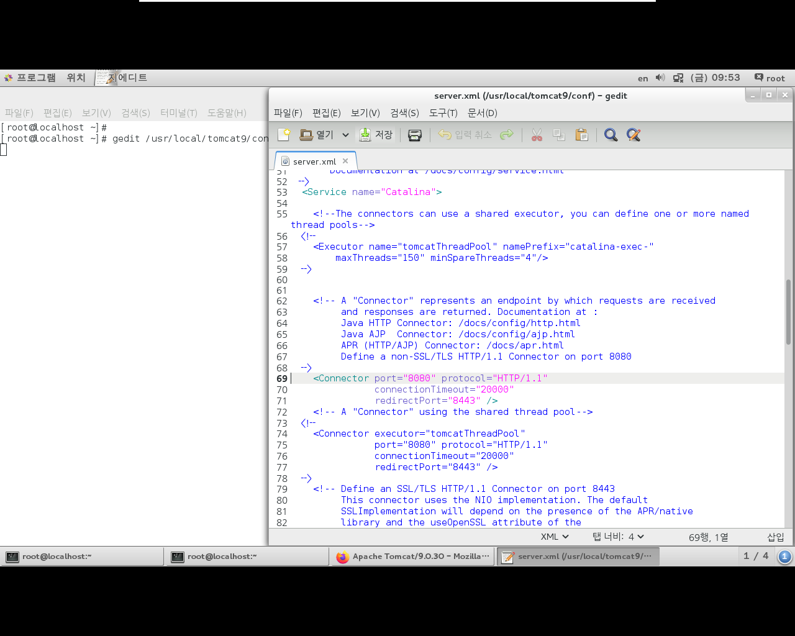
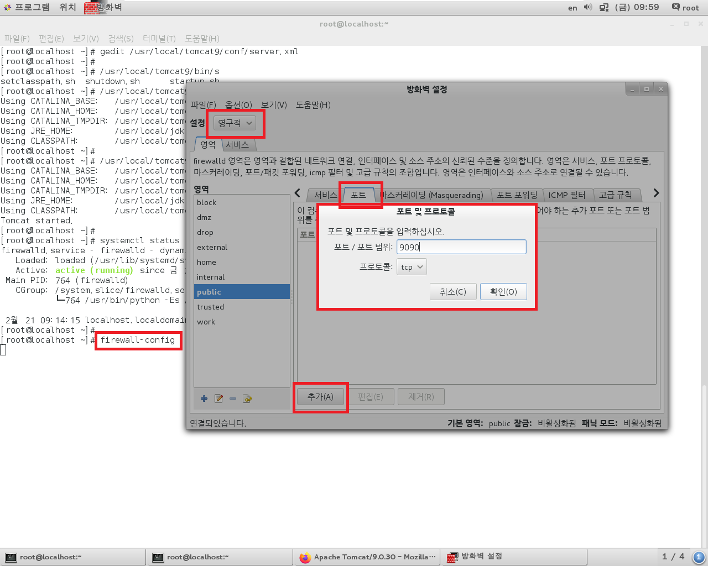
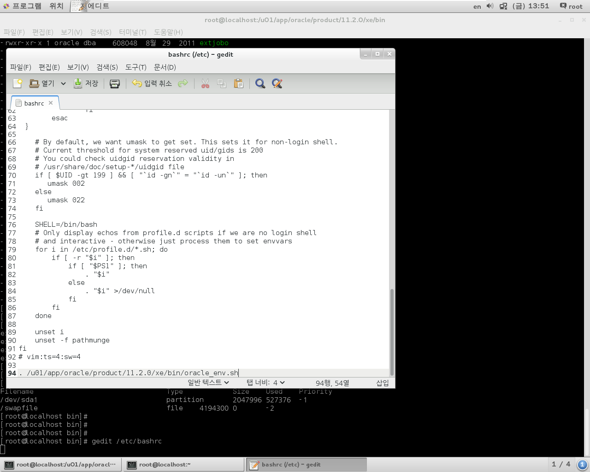

Linux Tomcat

```
/usr/local/tomcat9/bin/	시작, 종료 명령어들

/usr/local/tomcat9/conf/	설정파일.xml

/usr/local/tomcat9/lib		*.jar.... 사용 드라이버

/usr/local/tomcat9/webapps

	ㄴ	Web Project folder
```


1. Tomcat Start
2. localhost - access
3. host os - access
4. /usr/local/tomcat9/conf/server.xml
   - change tomcat port
5. Tomcat Stop


```
1. Tomcat Start
[root@localhost ~]# /usr/local/tomcat9/bin/startup.sh
```


```
2. local access
	localhost:8080
	192.168.111.100:8080
```


```
3. host os - access
	192.168.111.100:8080	-- Error
```

```
edit tomcat port

[root@localhost ~]# gedit /usr/local/tomcat9/conf/server.xml 

[ geidt ]
    <Connector port="9090" protocol="HTTP/1.1"
               connectionTimeout="20000"
               redirectPort="8443" />
               
[root@localhost ~]# /usr/local/tomcat9/bin/shutdown.sh 
Using CATALINA_BASE:   /usr/local/tomcat9
Using CATALINA_HOME:   /usr/local/tomcat9
Using CATALINA_TMPDIR: /usr/local/tomcat9/temp
Using JRE_HOME:        /usr/local/jdk1.8
Using CLASSPATH:       /usr/local/tomcat9/bin/bootstrap.jar:/usr/local/tomcat9/bin/tomcat-juli.jar
[root@localhost ~]# 
[root@localhost ~]# /usr/local/tomcat9/bin/startup.sh 
Using CATALINA_BASE:   /usr/local/tomcat9
Using CATALINA_HOME:   /usr/local/tomcat9
Using CATALINA_TMPDIR: /usr/local/tomcat9/temp
Using JRE_HOME:        /usr/local/jdk1.8
Using CLASSPATH:       /usr/local/tomcat9/bin/bootstrap.jar:/usr/local/tomcat9/bin/tomcat-juli.jar
Tomcat started.
[root@localhost ~]# 
```



```
Edit Firewall

[root@localhost ~]# systemctl status firewalld
firewalld.service - firewalld - dynamic firewall daemon
   Loaded: loaded (/usr/lib/systemd/system/firewalld.service; enabled)
   Active: active (running) since 금 2020-02-21 09:14:15 KST; 42min ago
 Main PID: 764 (firewalld)
   CGroup: /system.slice/firewalld.service
           └─764 /usr/bin/python -Es /usr/sbin/firewalld --nofork --nopid

 2월 21 09:14:15 localhost.localdomain systemd[1]: Started firewalld - dynamic firewall daemon.
[root@localhost ~]# 

-- 9090 only pass
( firewall-config / firewall-cmd )

image

```



> 옵션 - Firewall 다시 불러오기
>
> = `systemctl restart firewalld`


> [ Web Project ]
>
> 개발 : windows
>
> 서버 운영 : Linux
>
> 프로젝트를 Linux로 옮기는 과정 : Deploy


---

/			: Storage for Files

swqp	: tmp Memory area


---

Install Oracle in Linux

install `oracle-xe-11.2.0-1.0.x86_64.rpm.zip`  at [ Oracle.com ](http://www.oracle.com)

```
[root@localhost 다운로드]# unzip oracle-xe-11.2.0-1.0.x86_64.rpm.zip
Archive:  oracle-xe-11.2.0-1.0.x86_64.rpm.zip
   creating: Disk1/
   creating: Disk1/upgrade/
  inflating: Disk1/upgrade/gen_inst.sql  
   creating: Disk1/response/
  inflating: Disk1/response/xe.rsp   
  inflating: Disk1/oracle-xe-11.2.0-1.0.x86_64.rpm  
[root@localhost 다운로드]# 
[root@localhost 다운로드]# ls -l
합계 636396
drwxrwxr-x 4 root root        73  8월 29  2011 Disk1
-rwxrw-rw- 1 root root  11026056  2월 11 16:57 apache-tomcat-9.0.30.tar.gz
-rwxrw-rw- 1 root root  66348863  2월 11 13:21 firefox-72.0.2.tar.bz2
-rwxrw-rw- 1 root root  63851630  2월 14 09:30 hadoop-1.2.1.tar.gz
-rwxrw-rw- 1 root root 194545143  2월 11 15:24 jdk-8u241-linux-x64.tar.gz
-rwxrw-rw- 1 root root 315891481  2월 16 11:00 oracle-xe-11.2.0-1.0.x86_64.rpm.zip
[root@localhost 다운로드]# cd Disk1/
[root@localhost Disk1]# ls -l
합계 309884
-rw-rw-r-- 1 root root 317320273  8월 29  2011 oracle-xe-11.2.0-1.0.x86_64.rpm
drwxr-xr-x 2 root root        19  8월 29  2011 response
drwxrwxr-x 2 root root        25  8월 29  2011 upgrade
[root@localhost Disk1]# 
[root@localhost Disk1]# rpm -qip oracle-xe-11.2.0-1.0.x86_64.rpm 
Name        : oracle-xe
Version     : 11.2.0
Release     : 1.0
Architecture: x86_64
Install Date: (not installed)
Group       : Applications/OracleXE
Size        : 591492962
License     : Oracle Corporation
Signature   : (none)
Source RPM  : oracle-xe-11.2.0-1.0.src.rpm
Build Date  : 
Build Host  : dadvfg0711.us.oracle.com
Relocations : (not relocatable)
Packager    : Oracle <www.oracle.com>
URL         : http://www.oracle.com
Summary     : Oracle Database 11g Release 2 Express Edition
Description :
Oracle Database 11g Release 2 Express Edition
[root@localhost Disk1]# 
```

before installizaion...

extend swap area

```
[root@localhost Disk1]# free -m
             total       used       free     shared    buffers     cached
Mem:          1987       1907         80          6          0        627
-/+ buffers/cache:       1280        707
Swap:         1999         18       1981
[root@localhost Disk1]# 
[root@localhost Disk1]# swapon -s
Filename	Type		Size		Used	Priority
/dev/sda1   partition	2047996		18884	-1
[root@localhost Disk1]# 

[root@localhost Disk1]# dd if=/dev/zero of=/swapfile bs=1024 count=4194304
4194304+0 records in
4194304+0 records out
4294967296 bytes (4.3 GB) copied, 5.79374 s, 741 MB/s
[root@localhost Disk1]# 
[root@localhost Disk1]# mkswap /swapfile
Setting up swapspace version 1, size = 4194300 KiB
no label, UUID=8a54cda2-74ec-4924-a893-e85586b28b94

[root@localhost Disk1]# swapon /swapfile
swapon: /swapfile: insecure permissions 0644, 0600 suggested.

[root@localhost Disk1]# swapon -s
Filename		Type		Size		Used	Priority
/dev/sda1       partition	2047996		466372	-1
/swapfile       file		4194300		0		-2

[root@localhost Disk1]# 
[root@localhost Disk1]# ls -l
합계 309884
-rw-rw-r-- 1 root root 317320273  8월 29  2011 oracle-xe-11.2.0-1.0.x86_64.rpm
drwxr-xr-x 2 root root        19  8월 29  2011 response
drwxrwxr-x 2 root root        25  8월 29  2011 upgrade
[root@localhost Disk1]# 
[root@localhost Disk1]# yum -y localinstall oracle-xe-11.2.0-1.0.x86_64.rpm

.......

You must run '/etc/init.d/oracle-xe configure' as the root user to configure the database.

  Verifying  : oracle-xe-11.2.0-1.0.x86_64                                                                                              1/1 

Installed:
  oracle-xe.x86_64 0:11.2.0-1.0                                         
Complete!
[root@localhost Disk1]# 
[root@localhost Disk1]# rpm -qa | grep oracle
oracle-xe-11.2.0-1.0.x86_64
[root@localhost Disk1]# 

```


configuration

```
[root@localhost Disk1]# service oracle-xe configure

Oracle Database 11g Express Edition Configuration
-------------------------------------------------
This will configure on-boot properties of Oracle Database 11g Express 
Edition.  The following questions will determine whether the database should 
be starting upon system boot, the ports it will use, and the passwords that 
will be used for database accounts.  Press <Enter> to accept the defaults. 
Ctrl-C will abort.

Specify the HTTP port that will be used for Oracle Application Express [8080]:

Specify a port that will be used for the database listener [1521]:

Specify a password to be used for database accounts.  Note that the same
password will be used for SYS and SYSTEM.  Oracle recommends the use of 
different passwords for each database account.  This can be done after 
initial configuration:
Confirm the password:

Do you want Oracle Database 11g Express Edition to be started on boot (y/n) [y]:y

Starting Oracle Net Listener...Done
Configuring database...Done
Starting Oracle Database 11g Express Edition instance...Done
Installation completed successfully.
[root@localhost Disk1]# 
[root@localhost Disk1]# /etc/init.d/oracle-xe start
Starting oracle-xe (via systemctl):                        [  OK  ]
[root@localhost Disk1]# 
```

```
[root@localhost Disk1]# cd /u01/app/oracle/product/11.2.0/xe/bin/
[root@localhost bin]# ls -l
합계 191312
-rwxr-xr-x 1 oracle dba     13091  8월 29  2011 adapters
-rwxr-xr-x 1 oracle dba      8614  8월 29  2011 createdb.sh
-rwxr-xr-x 1 oracle dba    523832  8월 29  2011 ctxkbtc
-rwxr-xr-x 1 oracle dba    453648  8월 29  2011 ctxlc
-rwxr-xr-x 1 oracle dba    193080  8월 29  2011 ctxload
-rwxr-xr-x 1 oracle dba      6840  8월 29  2011 cursize
-rwxr-xr-x 1 oracle dba    558768  8월 29  2011 dbfs_client
-rwxr-xr-x 1 oracle dba      6856  8월 29  2011 dbfsize
-rwxr-xr-x 1 oracle dba      2415  8월 29  2011 dbhome
-rwxr-xr-x 1 oracle dba    321904  8월 29  2011 dbv
-rwxr-xr-x 1 oracle dba    340072  8월 29  2011 dg4odbc
-rwxr-xr-x 1 oracle dba    349320  8월 29  2011 dgmgrl
-rwxr-xr-x 1 oracle dba      8296  8월 29  2011 dumpsga
-rwxr-xr-x 1 oracle dba    614568  8월 29  2011 exp
-rwxr-xr-x 1 oracle dba    126440  8월 29  2011 expdp
-rwxr-xr-x 1 oracle dba    608048  8월 29  2011 extjob
-rwxr-xr-x 1 oracle dba    608048  8월 29  2011 extjobo
-rwxr-xr-x 1 oracle dba      5944  8월 29  2011 extproc
-rwxr-xr-x 1 oracle dba    300968  8월 29  2011 imp
-rwxr-xr-x 1 oracle dba    136904  8월 29  2011 impdp
-rwxr-xr-x 1 oracle dba    368456  8월 29  2011 kgmgr
-rwxr-xr-x 1 oracle dba     12536  8월 29  2011 loadpsp
-rwxr-xr-x 1 oracle dba     91016  8월 29  2011 lsnrctl
-rwxr-xr-x 1 oracle dba    511824  8월 29  2011 lxchknlb
-rwxr-xr-x 1 oracle dba      7960  8월 29  2011 mapsga
-rwxr-xr-x 1 oracle dba      6872  8월 29  2011 maxmem
-rwxr-xr-x 1 oracle dba     58968  8월 29  2011 nid
-rwxr-xr-x 1 oracle dba     16759  8월 29  2011 nls_lang.sh
-rwsr-s--x 1 oracle dba 165700472  8월 29  2011 oracle
-rwxr-xr-x 1 oracle dba       156  8월 29  2011 oracle_env.csh
-rwxr-xr-x 1 oracle dba       156  8월 29  2011 oracle_env.sh
-rwxr-xr-x 1 oracle dba     52800  8월 29  2011 oradism
-rwxr-xr-x 1 oracle dba      6183  8월 29  2011 oraenv
-rwxr-xr-x 1 oracle dba     15232  8월 29  2011 orapwd
-rwxr-xr-x 1 oracle dba     19936  8월 29  2011 osdbagrp
-rwxr-xr-x 1 oracle dba     20040  8월 29  2011 osh
-rwxr-xr-x 1 oracle dba       946  8월 29  2011 ott
-rwxr-xr-x 1 oracle dba  14087984  8월 29  2011 rman
-rwxr-xr-x 1 oracle dba   1313712  8월 29  2011 sqlldr
-rwxr-x--x 1 oracle dba      4968  8월 29  2011 sqlplus
-rwxr-xr-x 1 oracle dba     13352  8월 29  2011 sysresv
-rwxr-xr-x 1 oracle dba     85096  8월 29  2011 tkprof
-rwxr-xr-x 1 oracle dba    738440  8월 29  2011 tnslsnr
-rwxr-xr-x 1 oracle dba     11040  8월 29  2011 tnsping
-rwxr-xr-x 1 oracle dba     16496  8월 29  2011 trcroute
-rwxr-xr-x 1 oracle dba    144784  8월 29  2011 unzip
-rwxr-xr-x 1 oracle dba   7097808  8월 29  2011 wrap
-rwxr-xr-x 1 oracle dba    208384  8월 29  2011 zip
[root@localhost bin]# 
[root@localhost bin]# . /u01/app/oracle/product/11.2.0/xe/bin/oracle_env.sh

[root@localhost bin]# 
[root@localhost bin]# cat oracle_env.sh 
export ORACLE_HOME=/u01/app/oracle/product/11.2.0/xe
export ORACLE_SID=XE
export NLS_LANG=`$ORACLE_HOME/bin/nls_lang.sh`
export PATH=$ORACLE_HOME/bin:$PATH
```


```
[root@localhost bin]# gedit /etc/bashrc 
[root@localhost bin]#
```

add

```
94 | . /u01/app/oracle/product/11.2.0/xe/bin/oracle_env.sh
```




+ 포트 방화벽 제외(8080, 1521)

```
[root@localhost bin]# firewall-config &
[1] 16612
[root@localhost bin]# 
[1]+  Done                    firewall-config
[root@localhost bin]# 
```


```
[root@localhost bin]# sqlplus

SQL*Plus: Release 11.2.0.2.0 Production on 금 2월 21 13:55:41 2020

Copyright (c) 1982, 2011, Oracle.  All rights reserved.

Enter user-name: system
Enter password: 

Connected to:
Oracle Database 11g Express Edition Release 11.2.0.2.0 - 64bit Production

SQL> 
```


```
[root@localhost admin]# pwd
/u01/app/oracle/product/11.2.0/xe/network/admin
[root@localhost admin]# 
[root@localhost admin]# gedit tnsnames.ora 
[root@localhost admin]# 
[root@localhost admin]# /etc/init.d/oracle-xe stop
Stopping oracle-xe (via systemctl):  
                                                           [  OK  ]
[root@localhost admin]# 
[root@localhost admin]# /etc/init.d/oracle-xe start
Starting oracle-xe (via systemctl):  
                                                           [  OK  ]
[root@localhost admin]# 
[root@localhost admin]# 
```

```
[root@localhost admin]# sqlplus

SQL*Plus: Release 11.2.0.2.0 Production on 금 2월 21 14:42:29 2020

Copyright (c) 1982, 2011, Oracle.  All rights reserved.

Enter user-name: hr
Enter password: 

Connected to:
Oracle Database 11g Express Edition Release 11.2.0.2.0 - 64bit Production

SQL> 
SQL> conn scott/TIGER@win
Connected.
SQL> 				{Windows's Oracle Server}
```


---

> day03 단축

프로세스 / 데몬


root 암호 복구


---

​							   firefox, etc...

소프트웨어       OS  -  Linux

Kernel				 controll

하드웨어			cpu processor

​							   hard disk

---

Network

```
ifdown / ifup
systemctl start network			-- auto start on boot
nslookup <url>

/etc/sysconfig/network-script/ifcfg-<network adapter>
	+ systemctl restart network

/etc/sysconfig/hostname
	localhost

/etc/resolv.conf
	dns setting
```

---