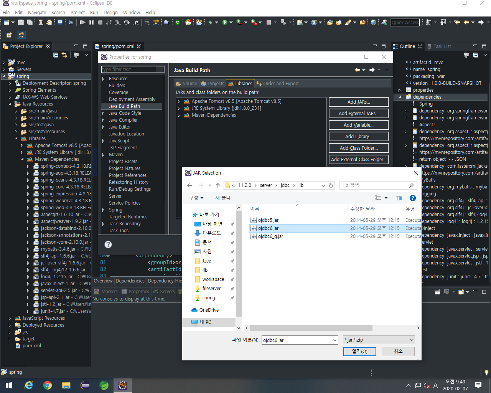

# MyBatis

> DB 사용에 있어서 코드에서 sql문을 따로 빼내어 xml로 관리한다.


## JDBC

> Java에서 DB 사용을 위해서
>
> JDBC Driver, JDBC url, Account ID, PW  4가지가 필요하다.

```java
try {
	// 1. jdbc driver load
	Class.forName("oracle.jdbc.driver.OracleDriver");
    			// JDBC Drivers*
	// 2. db info & conn
	Connection con = DriverManager.getConnection
			("jdbc:oracle:thin:@localhost:1521:xe", "scott", "TIGER");
    		// jdbc url*, account id*, pw*
	// 3. sql define
	PreparedStatement pt = 
			con.prepareStatement("select * from board order by time desc");
	// 4. request
    //		select : executeQuery()		: return ResultSet*
	//		other  : executeUpdate()	: return int
	ResultSet rs = pt.executeQuery();
	
    rs.next()	
	BoardVO vo = new BoardVO();
	vo.setSeq(rs.getInt("seq"));
    // 생략...
    
	// 5. disconn
	pt.close();
	rs.close();
	con.close();
	} catch (Exception e) {
		e.printStackTrace();
}
```


### JDBC 특징

1. 코드의 반복이 많다
2. 자바 내부에 sql문이 포함되어있다.
3. DB 연결 정보를 매번 작성한다.


## MyBatis

- db-config.xml 	: DB의 연결정보 저장

- ???-mapping.xml   :  SQL문을 모아서 관리


### MyBatis 특징

1. 코드의 간결함
   - try-catch 등의 코드가 줄어들게 된다.
2. SQL 문을 따로 사용한다.
   - SQL문의 재사용성이 늘어나며, SQL문이 수정되어도 코드에 영향이 없다.
3. Spring과 연계하여 사용할다.
   - DAO가 MyBatis를 호출하여 사용하는 방식으로 Spring에서 사용이 가능하다.
   - 이때, Spring에서 SQL문의 호출문은 사라진다.


---

## 0. 환경설정

1. porm.xml - mybatis api 추가

   ```xml
   <dependencies>
       <!-- ... -->
       
   	<!-- https://mvnrepository.com/artifact/org.mybatis/mybatis -->
       <dependency>
           <groupId>org.mybatis</groupId>
           <artifactId>mybatis</artifactId>
           <version>3.4.6</version>
       </dependency>
       
       <!-- ... -->
   </dependencies>
   ```

   > [[ mvnrepository.com ]](https://mvnrepository.com/) 에서 `mybatis` 검색
   >
   > 유저수가 많은 3.4.6 버전으로 선택했다.


2. ojdbc.jar 추가 (Oracle Database 11g Express Edition를 사용하기 위한 JDBC API)



> C:\oraclexe\app\oracle\product\11.2.0\server\jdbc\lib\ojdbc6.jar


3. `mybatis-config.xml` 생성

   > 별도 패키지 `mybatis`에 만들었다

   

   ```xml
   <?xml version="1.0" encoding="UTF-8" ?>
   <!DOCTYPE configuration
     PUBLIC "-//mybatis.org//DTD Config 3.0//EN"
     "http://mybatis.org/dtd/mybatis-3-config.dtd">
     
   <configuration>
   	
       <!-- 자주 사용되는 클래스의 위치를 지정한다. -->
   	<typeAliases>
   		<typeAlias type="mybatis.EmpVO" alias="emp"/>
   	</typeAliases>
   	 
       <!-- DB의 연결 정보들을 관리한다. -->
   	<environments default="mydb">	<!-- 기본 연결 정보 -->
   		<!-- 1개의 db 연결 정보 -->
   		<environment id="mydb">
   			<transactionManager type="JDBC" />
   			<dataSource type="POOLED">
   				<property name="driver" value="oracle.jdbc.driver.OracleDriver"/>
   				<property name="url" value="jdbc:oracle:thin:@localhost:1521:xe"/>
   				<property name="username" value="hr"/>
   				<property name="password" value="hr"/>
   			</dataSource>
   		</environment>
   	</environments>
   	
       <!-- SQL문을 따로 모아둔 xml을 등록한다. -->
   	<mappers>
   		<mapper resource="mybatis/emp-mapping.xml"/>
   	</mappers>
   	
   </configuration>
   
   ```


4. `emp-mapping.xml` 생성

   > HR 계정의 Employees 테이블과 관련된 query문을 모아둔다.

   

   ```xml
   <?xml version="1.0" encoding="UTF-8" ?>
   <!DOCTYPE mapper PUBLIC "-//mybatis.org//DTD Mapper 3.0//EN"
     "http://mybatis.org/dtd/mybatis-3-mapper.dtd">
   
   <mapper namespace="emp">
       <select id="">query</select>
       <insert id="">query</insert>
       <delete id="">query</delete>
       <updtat id="">query</updtat>
   </mapper>
   ```

   Select, Insert, Delete, Update 문이 개별적인 Tag에 관리한다.

   

5. `EmpMain.java` 에서 테스트

   ```java
   package mybatis;
   
   import org.apache.ibatis.io.Resources;
   import org.apache.ibatis.session.SqlSession;
   import org.apache.ibatis.session.SqlSessionFactory;
   import org.apache.ibatis.session.SqlSessionFactoryBuilder;
   
   public class EmpMain {
   
   	public static void main(String[] args) {
   		
   		try {
   			String resource = "mybatis/mybatis-config.xml";
   			
   			// 1.
   			SqlSessionFactoryBuilder builder = new SqlSessionFactoryBuilder();
   			
   			// 2. SqlSessionFactory - 연결 설정 읽어오기
   			SqlSessionFactory factory = 
   					builder.build(Resources.getResourceAsReader(resource));
   			
   			// 3. SqlSession - 연결 생성	: JDBC Connection과 유사
   			SqlSession session = factory.openSession();
               					// openSession(true) : Outo Commit (default : false)
   			
   			System.out.println(session);	// null : conn error
   			
   		} catch (Exception e) {
   			e.printStackTrace();
   		}
   	}
   
   }
   ```

   ```java
   org.apache.ibatis.session.defaults.DefaultSqlSession@2a2d45ba
   ```

   > `SqlSession` 은 JDBC의 `connection`과 유사하며, DB의 연결을 생성한다.


## 1. MyBatis 실습

#### Select 문

0. DAO 생성

   ```java
   public class EmpDAO {
   	
   //	@Autowired
   	SqlSession session;
   	
   	public void setSession(SqlSession session) {
   		this.session = session;
   	}
   }
   ```

   > Spring 에서는 `SqlSession` 객체를 Controller가 DAO에 넘겨줄 것이다.

    

1. `emp-mapping.xml` query문 등록

   모든 employees를 출력한다.

   ```xml
   <select id="all_emp" resultType="emp">
   	select * from employees
   </select>
   ```

   - `emp-mapping.xml`에 `all_emp`라는 id를 갖는 select문 작성

   - `resultType`은 `mybatis-config.xml`에서 설정한 `mybatis.EmpVO`를 지칭한다.

     ```xml
     ...
     	<typeAliases>
     		<typeAlias type="mybatis.EmpVO" alias="emp"/>
     	</typeAliases>
     ...
     ```

   - `parameterType`을 이용해 쿼리문에 사용할 parameter를 받을 수 있다.

     ```xml
     <select id="one_emp" resultType="emp" parameterType="int">
     	select * from employees where employee_id=#{a}
     </select>
     ```

     

2. query문을 호출하는 DAO

   ```java
   public List<EmpVO> getAllEmp() {
   	return session.selectList("all_emp");
   }
   ```

   - query문을 실행하면 다수의 `EmpVO` 가 반환될 것이다.

     따라서, DAO에서 `session.selectList(''query_id")`를 실행하여 리스트의 형태로 데이터를 반환받으며,

     반환되는 데이터는 리스트에 EmpVo 형태의 제네릭이 적용되어있다.

     

3. DAO를 호출하는 Main(Controller)

   ```java
   EmpDAO dao = new EmpDAO();	// MVC에서 @Autowired 를 사용하면 필요 없다.
   dao.setSession(session);	// DAO에서 사용할 SqlSession 객체 지정
   
   List<EmpVO> list;
   list = dao.getAllEmp();		// query 실행 요청
   for(EmpVO vo : list) {
   	System.out.println(vo);
   }
   ```


##### Parameter

`emp-mapping.xml`에 저장되는 query들은 parameter을 받아 다양한 결과를 도출할 수 있다.

Parameter의 자료형은 int, String, Object 등이 가능하다.


1. `parameterType="int"`
2. `parameterType="String"`
3. 


0. Parameter

   

1. ㅁ

2. ㅁ

3. ㅁ

4. ㅁ