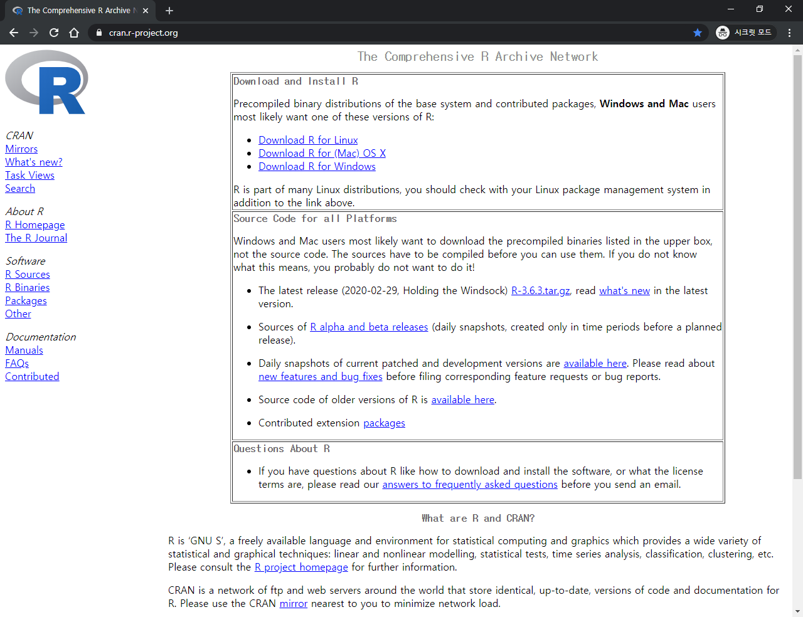
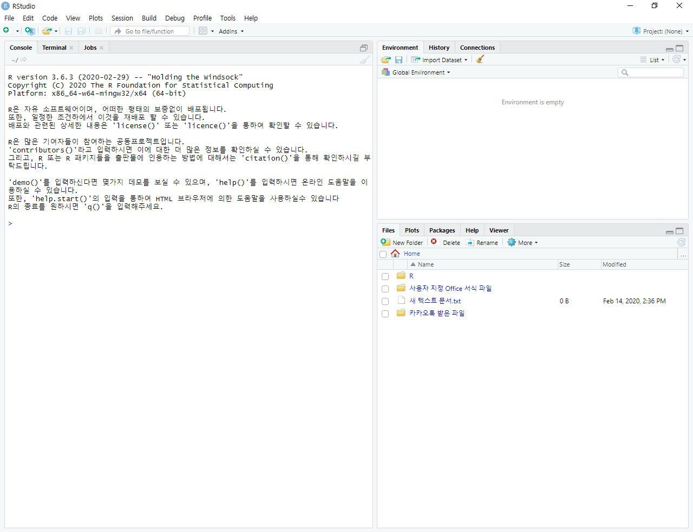
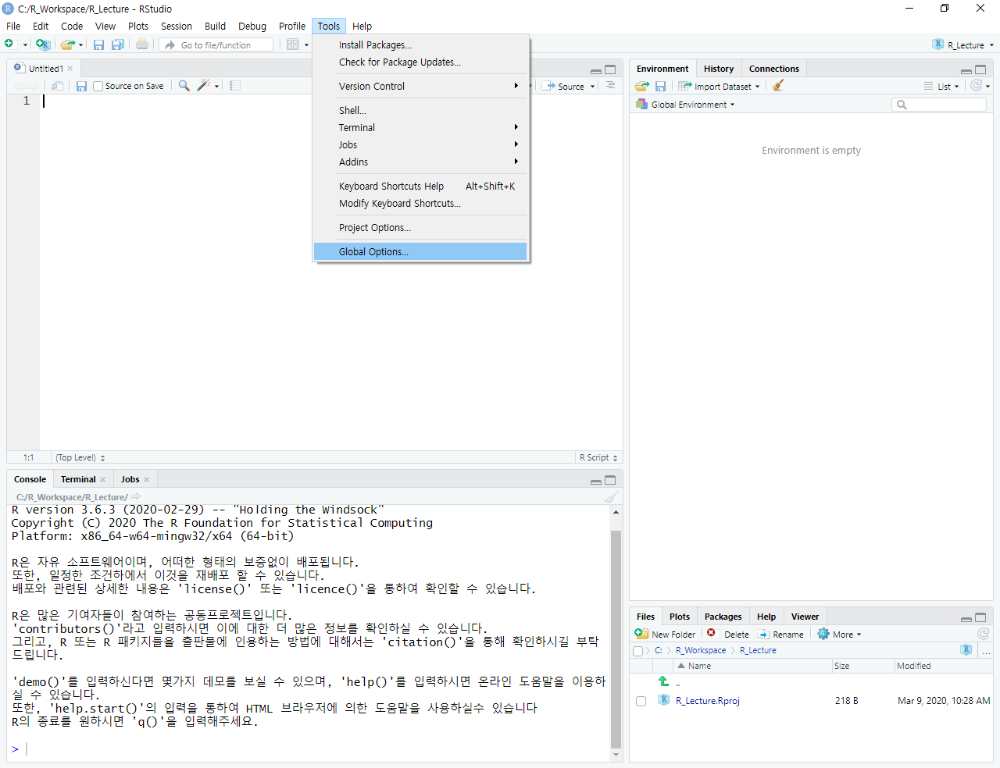
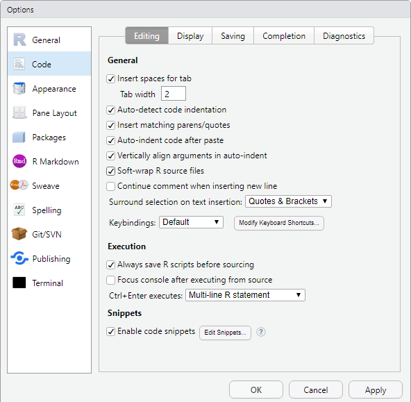
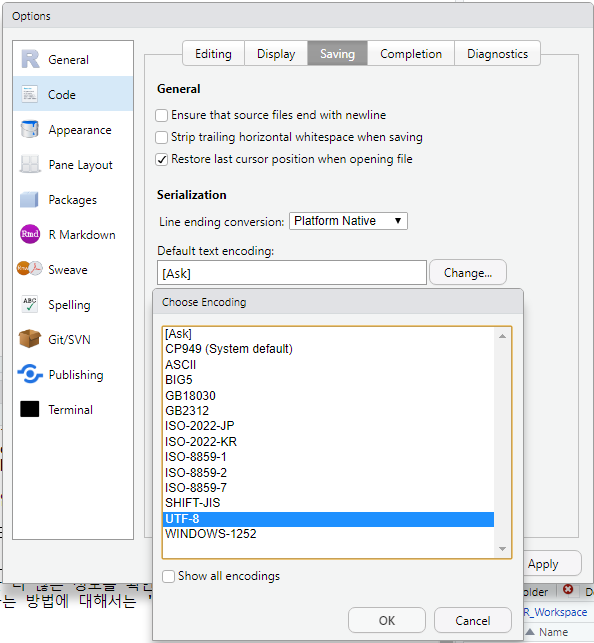
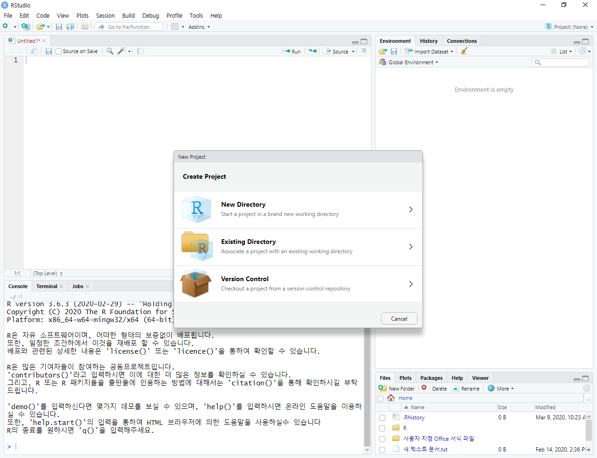

# R

---

> 2020 03 09 ~

> R은 통계계산을 위해서 만들어진 프로그래밍 언어이면서 소프트웨어
>
> AT&T의 `BELL 연구소`에서 만들어진 S라는 언어를 참조
>
> 1993년 로스이하카, 로버트젠틀맨에 의해서 개발 (통계학자)
>
> 현재는 R 코어팀에 의해서 유지보수, 개발중


## R로 무었을 할 수 있나요?

- 통계분석 : 기초 통계, 가설검정
- 머신러닝
- 텍스트 마이닝


## 데이터 분석을 하기 위해서 R이 최선인가?

- SAS, SPSS (통계 전문 소프트웨어, 유료툴)
- Excel (기본적인 통계기능 포함)
-  R
  - 무료, 유료툴에 버금가는 기능
  - 코드 베이스(재연성**)


## Python  vs  R

- R - 순수한 데이터 분석
  - 데이터의 분석, 추출, 그래프화, 리포트
- Python - 연결되는 게 많음
  - 데이터의 결과를 기존의 다른 시스템에 적용하기 좋음


## R 설치하기!

### 1. R install

- [CRAN (The Comprehensive R Archive Network)](https://cran.r-project.org/) 
- R Package 공유 site
- 
- Download R for Windows
- install  (all next, yes)


### 2. IDE 설치하기!

- RStudio (IDE)
- RStudio 설치 시 R의 경로를 확인하여 인터프리터를 자동으로 연결한다.
- 즉, R을 먼저 설치해야한다.
- 


### 3. RStudio 설정

- 자동 줄바꿈
- 언어설정(UTF-8)

#### 1. 자동 줄바꿈

- 
- Tool - Global Options...
- 
- Code - Editing - `Soft-wrap R source files`


#### 2. 언어설정(UTF-8)

- 
- Code - Saving - Default text encoding : - Change... - UTF-8


### 4. RSudio 프로젝트 생성

- File - New Project... 
- 
- new Directory - new project - name


---

## R 사용하기

### R의 기본 특성

```R
# R의 주석은 #을 이용한다.
# 여러줄 주석은 ctrl + shift + c

# ";"는 한 라인에 하나의 statement만 존재할 경우 생략 가능
a = 100
b = 200; c = 300
```

 

```R
# 작성된 코드 실행은 ctrl + enter
# 인터프리터 방식이라 원하는 라인만 실행 가능하다

# 대소문자 구분한다.(case-sensitive)
# camel-case notation 추천
# weak type 언어 - 변수 선언시 type를 명시하지 않는다.

# "=", "->"를 이용해서 assignment를 수행
a = 100     # 사용 가능, 매우 드문 경우로 Error 발생
a <- 100    # 주로 사용(공식적)
200 -> a
```

 

```R
# Data Type(자료형), Data Structure(자료구조)
# Data Frame(자료형, table)(tomorrow)
# Vector  1차원, 같은 데이터 타입만 사용할 수 있다.
# Vector 중에 원소가 1개만 있는 Vector는 Scalar이다.
# R은 Index가 0이 아니라 1부터 시작한다.
```

 

```R
# 변수의 값을 출력하려면
# - 해당 변수를 그대로 실행
# - print()를 이용해서 출력
# - 만약 여러개의 값을 출력하려면 cat()을 이용
# - file에 출력하려면 cat을 이용해 file option 사용
# - 만약 file 출력에서 파일안에 내용을 추가하려면
#   append=TRUE를 이용

myVar <- 100
result = myVar + 200

result
print(result)

cat("결과값은 : ", result, myVar, 
    file="C:/R_Workspace/R_Lecture/test.txt",
    append=TRUE)
```


#### 자료형

```R
# R의 데이터 타입!
#
# 1. nemeric(수치형) : 정수, 실수를 구분하지 않는다. (default : 실수)
#     100, 100.3 - 실수
#     10L        - 정수
# 
# 2. chracter(문자열) : 모든 글자는 문자열로 간주되고, 
#                       '', "" 혼용해서 사용이 가능하다.
# 
# 3. logical(논리형) : TRUE(T), FALSE(F)
#
# 4. complex(복소수형) : 4-3i

# 특수데이터 타입
#
# 1. NULL (java의 null과 유사) - 존재하지 않는 객체를 지칭할때 사용
# 2. NA (Not Available) 
#		- 유효하지 않은 값
#       - 일반적으로 결측치를 표현할때 사용(missing value)
# 3. NAN (Not A Number) 
#		- 수치값이지만 숫자로 표현이 안되는 값
#         ex) sqrt(-9)
# 4. Inf(Infinite) 
#		- 양의 무한대
#         ex) 3 / 0
```

 

```R
# 데이터타입의 우선순위
# character > complex > mumeric > logical
```

 

```R
# 기본적인 연산자는 다른 언어와 상당히 유사

var1 <- 100   # 정수 같지만 실수로 적용
var2 <- 3

result <- var1 / var2

result    # [1] 33.33333 (총 7개의 digit로 표현 - default)

options(digits = 5)   # digit 바꾸기
result    # [1] 33.333

# C와 Java처럼 format을 이용한 출력도 가능
sprintf("%.8f", result)   # [1] "33.33333333"

# 몫과 나머지
result = var1 %/% var2    # 몫
result    # [1] 33

result = var1 %% var2    # 나머지
result    # [1] 1
```


#### 비교연산

```R
# 비교연산
# 다른 언어와 동일

var1 <- 100
var2 <= 200

var1 == var2    # [1] FALSE
var1 != var2    # [1] TRUE
```


#### 논리연산

```R
# 논리연산
# 살짝 달라

# &, && >> 의미는 동일! (AND)
# |, || >> 의미는 동일! (OR)
# 1개와 2개 사용 시
# vector인지 scalar인지에 따라서 동작이 달라진다!
# R은 기본이 vector다
# scalar : vector의 길이가 1개인 것

TRUE & TRUE    # [1] TRUE
TRUE && TRUE    # [1] TRUE

# combine 함수를 이용해서 vector를 생성 >> c()
# vector의 인덱스는 0이 아닌 1부터 시작한다.
c(TRUE, FALSE)

# &
# 결과도 vector
c(TRUE, FALSE) & c(TRUE, TRUE)    # [1] TRUE FALSE
c(TRUE, FALSE) & c(TRUE, TRUE, FALSE)    # Error

## && >> 맨 처음에 있는 요소만 가지고 연산
# 결과가 scalar
c(TRUE, FALSE) && c(TRUE, TRUE)    # [1] TRUE
c(TRUE, FALSE) && c(TRUE, TRUE, FALSE)    # [1] TRUE
```


#### 기본 함수

```R
# 기본 함수들

abs(-3)         # 절대값      # 3
sqrt(4)         # 제곱근      # 2
factorial(4)    # factorial   # 24

mean()
help(mean)

# help()를 이용해도 좋으나 RDocumentation.org 사이트를 이용하는게 더 좋다.
```

 

```R
# R에서 제공하는 기본적인 함수 2가지
# 1. mode()          : data type
var1 <- 100
mode(var1)        # [1] "numeric"

# 2. is 계열의 함수
var2 = 300
is.numeric(var2)  # [1] TRUE
is.integer(var2)  # [1] FALSE   # 실수
```


```R
# 기본적으로 사용되는 자료구조 : vector
myVar = c(10, 20, 30, 40)
myVar   # [1] 10 20 30 40

myVar = c(10, 20, 30, FALSE)
myVar   # [1] 10 20 30 0

myVar = c(10, "홍길동", 30, TRUE)
myVar   # [1] "10"     "홍길동" "30"     "TRUE"

# as 계열의 함수를 이용한 casting(형변환)
myVar = "100"
as.numeric(myVar)
```


### 패키지

```R
# R의 package는 처리할 Data + 기능(함수, 알고리즘)

# R의 package 시스템은
# 1. base System (R 설치 시 같이 설치되는 기본 package)
#    - base package (loading 과정이 필요없는 package)
#    - recommended package (설치는 되어있으나 loading은 필요한)
# 2. other package
# 
```


```R
# 간단하게 package를 설치해보기
install.packages("ggplot2")

# package 삭제는
# remove.packages("ggplot2")

# 어디에 설치되는가?
.libPaths()
# [1] "C:/Users/student/Documents/R/win-library/3.6"  << 여기에!!
# [2] "C:/Program Files/R/R-3.6.3/library" 

# 설치위치 변경은?
# .libPaths("C:/myLib")

# package 설치 후 사용을 위해서는 메모리에 loading 해야 한다.
library(ggplot2)
# or
require(ggplot2)

myVar = c("남자", "여자", "여자", "여자", "여자", "남자")

qplot(myVar)
```


```R
## 주의!
# 라이브러리 Error가 발생할 수 있다.(생각보다 잘!)
# R 설치 후에 .libPaths()를 이용해 2개의 경로가 나오는지 확인한다.
# 경로가 하나일 경우, .libPaths(__path__)를 사용해 별도의 경로를 추가해준다.
```


### 자료구조

```r
# 자료형은 저장된 데이터의 타입을 지칭
# 자료구조는 데이터가 메모리에 어떤 방식으로 저장되어있는가

## homogeneous - 자료구조 내부의 데이터 타입이 같은
# 
#  - 1. Vector  : 1차원 선형구조, 순서개념이 존재
#                같은종류의 데이터타입을 이용
#  - 2. Matrix  : 2차원 구조. 인덱스를 사용할 수 있다. (2차원 배열과 같다)
#                같은종류의 데이터타입을 이용
#  - 3. array   : 3차원 이상의 구조. 인덱스 사용 가능
#                같은종류의 데이터타입을 이용
# 
# 
## heterogeneous - 자료구조 내부의 데이터 타입이 다른
# 
#  - 1. list    : 1차원 선형구조. 순서개념 존재
#                실제 저장되는 구조는 map구조 (중첩자료구조)
#  - 2. data frame  : 2차원 테이블 구조
# 
```


#### Vector

```r
# Vector  : 1차원 선형자료구조. 순서개념
#           index를 이용하며, 시작이 1이다.
#           []를 이용해서 각 요소를 access할 수 있다.
#           요소가 1개인 vector >> scalar
#
myVar = c(100)    # myVar = 100
```


```r
# vector를 만드는 방법
# 
# 1. combine() 함수를 사용 >> c()
#     - vector를 만드는 가장 대표적인 방법
#     - 2개 이상의 vector를 하나의 vector로 만들 때 사용할 수 있다.
#
myVar1 = c(10,20,30)
myVar2 = c(3.14,10,100)
myVar1    # [1] 10 20 30
myVar2    # [1]   3.14  10.00 100.00

result <- c(myVar1, myVar2)
result    # [1]  10.00  20.00  30.00   3.14  10.00 100.00
```

```r
#
# 2. ":"을 이용해서 만들기
#     - 수치형 데이터에만 사용할 수 있고 단조증가, 단조감소
#       형태의 vector를 생성
#
myVar <- 1:10   # (start:end)
myVar     # [1]  1  2  3  4  5  6  7  8  9 10

myVar <- 8.7:2
myVar     # [1] 8.7 7.7 6.7 5.7 4.7 3.7 2.7
```

```r
#
# 3. 2번의 일반형
#
myVar = seq(1,10,2)
myVar     # [1] 1 3 5 7 9

myVar = seq(from=10,to=3,by=-3)
myVar     # [1] 10  7  4
```

```r
#
# 4. 반복적인 값을 이용해서 vector 생성
#   rep()
#
myVar = rep(1:3, time=3)
myVar     # [1] 1 2 3 1 2 3 1 2 3

myVar = rep(1:3, each=3)
myVar     # [1] 1 1 1 2 2 2 3 3 3
```


```r
# 많이 사용하는 함수 중 하나 : vector 안의 요소 갯수를 구하는 함수
myVar = c(10,20,30,40)
length(myVar)   # [1] 4
```


```r
# vector 요소의 사용 (indexing 방식)
myVar = c(3.14,100,"Hello",TRUE,300)
myVar     # [1] "3.14"  "100"   "Hello" "TRUE"  "300"

myVar[1]      # [1] "3.14"
myVar[6]      # [1] NA
myVar[length(myVar)]    # [1] "300"

# slicing indexing
result <- myVar[2:4]
result        # [1] "100"   "Hello" "TRUE"

# fancy indexing
result <- myVar[c(2,3,5)]
result        # [1] "100"   "Hello" "300" 

myVar[-1]     # [1] "100"   "Hello" "TRUE"  "300"
              # index 1 빼고 나머지

myVar[-(3:4)] # [1] "3.14" "100"  "300"
              # index 3, 4 빼고 나머지

myVar[-c(1, 4, 5)]  # [1] "100"   "Hello"
              # index 1, 4, 5 제외
```


```r
# vector 데이터에 이름 붙이기!
myVar = c(10,20,30,40,50)
myVar

names(myVar)    # NULL      # 이름 출력
names(myVar) = c("A","B","C","D","E")
names(myVar)    # [1] "A" "B" "C" "D" "E"

myVar
# A  B  C  D  E 
# 10 20 30 40 50

myVar[1]      #   # A
myVar["A"]        # 10
```


```r
# vector 연산
myVar1 = 1:3    # [1] 1 2 3
myVar2 = 4:6    # [1] 4 5 6

result <- myVar1 + myVar2
result          # [1] 5 7 9

# recycle rule
myVar3 = 1:6    # [1] 1 2 3 4 5 6

result <- myVar1 + myVar3
result          # [1] 2 4 6 5 7 9     
                # (1 2 3 1 2 3) + (1 2 3 4 5 6)

# vector에 대한 집합연산(합집합, 교집합, 차집합)
var1 = 1:5            # [1] 1 2 3 4 5
var2 = 3:7            # [1]     3 4 5 6 7

union(var1,var2)      # [1] 1 2 3 4 5 6 7
intersect(var1, var2) # [1] 3 4 5
setdiff(var1,var2)    # [1] 1 2
```


#### Matrix

```r
## Matrix : 2차원 구조(행과 열로 구성)
##          같은 데이터 타입만 저장이 가능
```

```r
## * 생성 방법
##    - matrix() 함수
##    - cbind(), rbind() 함수
```

```r
## 1. matrix() 함수를 이용해서 만들기

var1 <- matrix(c(1:5))
var1
#      [,1]   # 5행 1열
# [1,]    1
# [2,]    2
# [3,]    3
# [4,]    4
# [5,]    5

# nrow : 행
var1 <- matrix(c(1:10), nrow=2)
var1
#      [,1] [,2] [,3] [,4] [,5]   # 2행 5열
# [1,]    1    3    5    7    9
# [2,]    2    4    6    8   10

var1 <- matrix(c(1:11), nrow=2)
# Warning
# 경고메시지(들): 
#   In matrix(c(1:11), nrow = 2) :
#   데이터의 길이[11]가 행의 개수[2]의 배수가 되지 않습니다
var1
#      [,1] [,2] [,3] [,4] [,5] [,6]    # recycle rule
# [1,]    1    3    5    7    9   11
# [2,]    2    4    6    8   10    1

# byrow=TRUE  : 행 방향으로 데이터 채움(기본 열방향 데이터 채움)
var1 <- matrix(c(1:10), nrow=2, byrow = TRUE)
var1
#      [,1] [,2] [,3] [,4] [,5] 
# [1,]    1    2    3    4    5
# [2,]    6    7    8    9   10
```

```r
## 2. cbind(), rbind()를 이용해서 만들기
#

var1 <- 1:4
var2 <- 5:8
mat1 <- rbind(var1, var2)
mat1
#      [,1] [,2] [,3] [,4]
# var1    1    2    3    4
# var2    5    6    7    8

var1 <- 1:4
var2 <- 5:8
mat1 <- cbind(var1, var2)
mat1
#      var1 var2
# [1,]    1    5
# [2,]    2    6
# [3,]    3    7
# [4,]    4    8
```


``` r
var1 <- matrix(c(1:10), nrow=2, byrow = TRUE)
#      [,1] [,2] [,3] [,4] [,5] 
# [1,]    1    2    3    4    5
# [2,]    6    7    8    9   10

# 일반적인 2차원 indexing 방법과 동일
var1[1,4]     # [1] 4

# 모든행에 대해서 4열을 가져오기
# 결과는 vector로 return
var1[,4]        # [1] 4 9

var1[1,]        # [1] 1 2 3 4 5

var1[length(var1)]    # [1] 10

##

length(var1)    # [1] 10    # 전체 요소(원소)의 갯수
nrow(var1)      # [1] 2     # 행의 갯수
ncol(var1)      # [1] 5     # 열의 갯수
```


#### Array

```r
# 3차원 Array 생성
# 

var1 <- array(c(1:24))
var1    #  [1]  1  2  3  4  5  .....

var1 <- array(c(1:24),
              dim = c(3,2,4))
#                    (행,열,면)
var1
# , , 1     		# 면
# 
#      [,1] [,2]
# [1,]    1    4
# [2,]    2    5
# [3,]    3    6
# 
# , , 2
# 
#      [,1] [,2]
# [1,]    7   10
# [2,]    8   11
# [3,]    9   12
# 
# , , 3
# 
#      [,1] [,2]
# [1,]   13   16
# [2,]   14   17
# [3,]   15   18
# 
# , , 4
# 
#      [,1] [,2]
# [1,]   19   22
# [2,]   20   23
# [3,]   21   24
```


#### Factor

```r
## R Factor 
## > factor는 범주형
##    방의 크기(대, 중, 소) -> level
## 
## 명목형과 순서형이 있다.
## level에 순서개념이 없으면 명목형(좌,우)
##                    있으면 순서형(대,중.소)
```


```r
# factor 생성 
# > vector를 이용해서 만든다 
# 

var1 <- c("A","B","AB","O","A","AB")
var1    # [1] "A"  "B"  "AB" "O"  "A"  "AB"

var1_factor <- factor(var1)
var1_factor
# [1] A  B  AB O  A  AB
# Levels: A AB B O            # 순서 개념 x : 명목형

# factor의 level만 출력
levels(var1_factor)           # [1] "A"  "AB" "B"  "O"
```


```r
# 일반적으로 factor를 생성하는 방법
#

var1 <- c("A","B","AB","O","A","AB")
var1_factor <- factor(var1,
                      levels = c("A","B","O","AB"),
                      ordered=TRUE)
var1_factor
# [1] A  B  AB O  A  AB
# Levels: A < B < O < AB

# !
var1_factor <- factor(var1,
                      levels = c("A","B","O"))
var1_factor
# [1] A    B    <NA> O    A    <NA>
# Levels: A B O
```


#### List

```r
## List
## > 1차원 선형구조
## > 여러 형태의 자료형이 같이 저장될 수 있다.
## > 각 index 위치에 값이 저장될 때 map 형태로 저장된다. (key, value)
## 

var1_scalar <- 100
var2_vector <- c(10,20,30)
var3_matrix <- matrix(c(1:6), nrow=3)

myList <- list(var1_scalar,var2_vector,var3_matrix)
myList
# [[1]]             # key
# [1] 100           # value
# 
# [[2]]
# [1] 10 20 30
# 
# [[3]]
#      [,1] [,2]
# [1,]    1    4
# [2,]    2    5
# [3,]    3    6

myList[[1]]         # [1] 100
myList[[2]][3]      # [1] 30
```


```r
## 전형적인 list 생성 방법
#

#              key    value
myList <- list(names =c("홍길동","김길동"),
               age   =c(20,30),
               gender=c("남자","여자"))
myList
# $names                    # key
# [1] "홍길동" "김길동"     # value
# 
# $age
# [1] 20 30
# 
# $gender
# [1] "남자" "여자"

#
## access
#

myList$age        # key
# [1] 20 30

myList[[2]]       # index
# [1] 20 30

myList[["age"]]   # key
# [1] 20 30
```


#### Data Frame

``` r
## Data Frame
##
## > R에서 가장 많이 쓰이고 가장 중요한 자료구조
## > 행과 열로 구성된 2차원 형태의 테이블
## > matrix와 달리 coloum 명이 존재!
## > Database의 Table과 같은 구조
## > 컬럼 단위로 서로 다른 타입의 데이터 저장이 가능
```

```r
#                coloum  value
df <- data.frame(NO    = c(1,2,3),
                 Name  = c("홍길동","이순신","강감찬"),
                 Age   = c(20,30,40))
df
#   NO   Name Age
# 1  1 홍길동  20
# 2  2 이순신  30
# 3  3 강감찬  40

View(df)    # View 창을 이용해서 data frame 확인 가능

#
df$Name     # coloum name     # return factor
# [1] 홍길동 이순신 강감찬
# Levels: 강감찬 이순신 홍길동
#
# > 문자열은 기본적으로
# > factor 형태로 자동 저장
# >
# > vector 형태로 저장하고싶다면

df <- data.frame(NO    = c(1,2,3),
                 Name  = c("홍길동","이순신","강감찬"),
                 Age   = c(20,30,40),
                 stringsAsFactors=FALSE)  # *옵션 추가*
df$Name
# [1] "홍길동" "이순신" "강감찬"
```


```r
# data frame중 일부를 추출해서
# 다른 data frame을 생성할 수 있다.
# 

df <- data.frame(x=c(1:5),
                 y=seq(2,10,2),
                 z=c("a","b","c","d","e"),
                 stringsAsFactors=FALSE)
df
#   x  y z
# 1 1  2 a
# 2 2  4 b
# 3 3  6 c
# 4 4  8 d
# 5 5 10 e

# 
# x의 값이 3 이상인 행만 추출
# 

subset1 <- subset(df, x>=3)
subset1
#   x  y z
# 3 3  6 c
# 4 4  8 d
# 5 5 10 e

# 
# x의 값이 3 이상, y값이 8 이하인 행만 추출
# 

subset1 <- subset(df, x>=3 & y<=8)
subset1
#   x y z
# 3 3 6 c
# 4 4 8 d
```


### 연습문제

```r
## 1. 4,5,7,8,10,3 의 숫자를 이용해서 숫자벡터 x를 생성하세요!!
# 
x <- c(4,5,7,8,10,3)
x   # [1]  4  6  7  8 10  3
```


```r
## 2. 다음 연산을 수행한 결과는?
##    x1 <- c(3,5,7,9)
##    x2 <- c(3,3,3)
##    x1 + x2 = ? 
# 
# [1] 6 8 10 12           # recycle rule 적용
```


``` r
## 3. data frame과 subset을 이용해서 다음의 결과를 만들어보아라. 
# 
Age <- c(22,25,18,20)
Name <- c("홍길동","최길동","박길동","김길동")
Gender <- c("M","F","M","F")

# 3-1. 위 3개의 vector를 이용하여 Data Frame을 생성하고
# 3-2. subset을 이용하여 다음의 결과를 출력한다.
#      Age  Name    Gender
#      22   홍길동  M
#      18   박길동  M

# 3-1
myDf <- data.frame(Age = c(22,25,18,20),
                   Name = c("홍길동","최길동","박길동","김길동"),
                   Gender = c("M","F","M","F"))
myDf <- data.frame(Age = Age,
                   Name = Name,
                   Gender = Gender,
                   stringsAsFactors=FALSE)
myDf

# 3-2
subset(myDf, Gender=="M")
```


```r
## 4. 다음의 R 코드를 실행시킨 결과는 무었일까요? 
# 
x <- c(2,4,6,8)
y <- c(T,F,T,F)     # locical vector

x[1]  # [1] 2
x[y]  # [1] 2 6

# > Boolean indexing
# > - TRUE 위치의 값은 남기고 나머지는 지우는 방식.
# > - 두 vector의 사이즈가 같아야 한다.

x[c(1,2,4)]   # [1] 2 4 8

# > fancy indexing 
# > - 지정한 위치의 값만 남기고 나머지는 지우는 방식.

x[1]          # indexing
x[1:3]        # slicing
x[y]          # boolean indexing
x[c(1,2,4)]   # fancy indexing

##

sum(x[y])     # [1] 8
              # sum(), mean(), max(), min().... 기본 수학 함수
```


```r
## 5. 아래의 계산결과는?
# 
x <- c(1,2,3,4)
(x+2)[(!is.na(x)) & x>2] -> k
k       # [1] 5 6

# > x+2
# [1] 3 4 5 6
#
# > is.na(x)
# [1] FALSE FALSE FALSE FALSE
#
# > (!is.na(x)) & x>2
# [1] FALSE FALSE  TRUE  TRUE
```


```r
## 6. 결측치(missing value) -> NA
##     > 데이터 분석을 위해서는 반드시!
##     > NA 값을 없애거나 다른 값으로 바꿔주어야 한다.
# 
x <- c(10,20,30,NA,40,50,60,NA,NA,100)
#
##     이 vector 안에 결측치는 몇개가 있는가?
#
is.na(x)          # [1] FALSE FALSE FALSE  TRUE FALSE FALSE FALSE  TRUE  TRUE FALSE
sum(is.na(x))     # [1] 3       # FALSE : 0  // TRUE : 1
```


