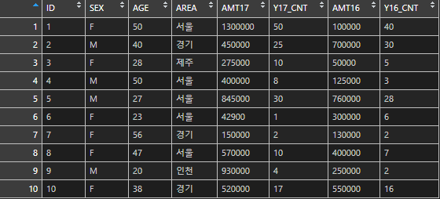

# Data Manipulation

> 데이터 조작 (**data manipulation**)
>
> ​	SQL처럼 빅데이터 내에서 필요한 정보를 추출하는 방법

> 실습에는 `ggplot2` package 내부의 `mpg` dataset을 사용한다.
>
> ```R
> install.packages("ggplot2")
> library(ggplot2)
> 
> mpg     # table 형식
>         # Fuel Economy Data From 1999 To 2008 For 38 Popular Models Of Cars
> 
> df <- as.data.frame(mpg)
> ```


## 기본함수

> 데이터 조작에서 쓸 수 있는
>
> R에서 제공되는 기본적인 함수들에 대해서 알아본다.


### 1. class()

```R
# > 1. class()  : 자료구조를 알고싶을때 - 자료구조가 문자열로 출력
# 
class(df)     # [1] "data.frame"
```


### 2. ls()

```R
# > 2. ls()     : data frame에 적용하면 컬럼을 출력(retrun vector)
# 
ls(df)
# [1] "class"        "cty"          "cyl"          "displ"        "drv"          "fl"          
# [7] "hwy"          "manufacturer" "model"        "trans"        "year" 
```


### 3. head()

```R
# > 3. head()   : 데이터의 앞쪽 6개만 출력
#				 head(df, row) - row 개만 출력
# 
head(df)
#   manufacturer model displ year cyl      trans drv cty hwy fl   class
# 1         audi    a4   1.8 1999   4   auto(l5)   f  18  29  p compact
# 2         audi    a4   1.8 1999   4 manual(m5)   f  21  29  p compact
# 3         audi    a4   2.0 2008   4 manual(m6)   f  20  31  p compact
# 4         audi    a4   2.0 2008   4   auto(av)   f  21  30  p compact
# 5         audi    a4   2.8 1999   6   auto(l5)   f  16  26  p compact
# 6         audi    a4   2.8 1999   6 manual(m5)   f  18  26  p compact
```


### 4. tail()

```R
# > 4. tail()   : 데이터의 뒤쪽 6개 출력
# 
tail(df)
#     manufacturer  model displ year cyl      trans drv cty hwy fl   class
# 229   volkswagen passat   1.8 1999   4   auto(l5)   f  18  29  p midsize
# 230   volkswagen passat   2.0 2008   4   auto(s6)   f  19  28  p midsize
# 231   volkswagen passat   2.0 2008   4 manual(m6)   f  21  29  p midsize
# 232   volkswagen passat   2.8 1999   6   auto(l5)   f  16  26  p midsize
# 233   volkswagen passat   2.8 1999   6 manual(m5)   f  18  26  p midsize
# 234   volkswagen passat   3.6 2008   6   auto(s6)   f  17  26  p midsize
```


### 5. View()

```r
# > 5. View()   : View 창을 이용해서 데이터 출력
# 
View(df)
```


### 6. dim()

```R
# > 6. dim()    : 행과 열의 갯수를 출력
# 
dim(df)     # [1] 234  11
```


### 7. nrow()

```R
# > 7. nrow()   : 행의 갯수
# 
nrow(df)    # [1] 234
```


### 8. ncol()

```R
# > 8. ncol()   : 열의 갯수
# 
ncol(df)    # [1] 11
```


### 9. str()

```R
# > 9. str()    : data frame의 전반적인 정보를 출력
# 
str(df)
# 'data.frame':	234 obs. of  11 variables:
# $ manufacturer: chr  "audi" "audi" "audi" "audi" ...
# $ model       : chr  "a4" "a4" "a4" "a4" ...
# $ displ       : num  1.8 1.8 2 2 2.8 2.8 3.1 1.8 1.8 2 ...
# $ year        : int  1999 1999 2008 2008 1999 1999 2008 1999 1999 2008 ...
# $ cyl         : int  4 4 4 4 6 6 6 4 4 4 ...
# $ trans       : chr  "auto(l5)" "manual(m5)" "manual(m6)" "auto(av)" ...
# $ drv         : chr  "f" "f" "f" "f" ...
# $ cty         : int  18 21 20 21 16 18 18 18 16 20 ...
# $ hwy         : int  29 29 31 30 26 26 27 26 25 28 ...
# $ fl          : chr  "p" "p" "p" "p" ...
# $ class       : chr  "compact" "compact" "compact" "compact" ...
```


### 10. length()

```R
# > 10. length()  : 갯수를 구하는 함수
#               ! data frame에 적용시키면 column의 갯수 반환
# 
length(df)    # [1] 11
```


### 11. summary()

```R
# > 11. summary() : 간단한 통계치를 보여준다.(숫자에 대해서)
# 
summary(df)
# manufacturer          model               displ            year           cyl       
# Length:234         Length:234         Min.   :1.600   Min.   :1999   Min.   :4.000  
# Class :character   Class :character   1st Qu.:2.400   1st Qu.:1999   1st Qu.:4.000  
# Mode  :character   Mode  :character   Median :3.300   Median :2004   Median :6.000  
#                                       Mean   :3.472   Mean   :2004   Mean   :5.889  
#                                       3rd Qu.:4.600   3rd Qu.:2008   3rd Qu.:8.000  
#                                       Max.   :7.000   Max.   :2008   Max.   :8.000  
# trans               drv                 cty             hwy             fl           
# Length:234         Length:234         Min.   : 9.00   Min.   :12.00   Length:234        
# Class :character   Class :character   1st Qu.:14.00   1st Qu.:18.00   Class :character  
# Mode  :character   Mode  :character   Median :17.00   Median :24.00   Mode  :character  
#                                       Mean   :16.86   Mean   :23.44                   
#                                       3rd Qu.:19.00   3rd Qu.:27.00                     
#                                       Max.   :35.00   Max.   :44.00                     
# class          
# Length:234        
# Class :character  
# Mode  :character
```


## dplyr 패키지

> data frame을 제어해서 원하는 정보를 추출하려면
>
> 별도의 package를 사용하는게 좋다
>
> `dplyr`은 가장 많이 사용되는 data frame 제어 package으로
>
> data frame을 제어하는데 특화된 함수를 제공한다.
>
> chaining(%>%)을 지원하기 때문에 편하게 data frame을 제어할 수 있다.


### 0. install

```R
install.packages("dplyr")
library(dplyr)
```


- 예제 데이터

  


### 1. rename()

```R
# > 1. rename(data frame, newVar = var)
#     컬럼명을 변경할 수 있다.

df <- rename(excel_data, Y17_AMT = AMT17)
names(df)
# [1] "ID"      "SEX"     "AGE"     "AREA"    "Y17_AMT" "Y17_CNT" "AMT16"   "Y16_CNT"
```

```R
df <- rename(excel_data, 
             Y17_AMT = AMT17,
             Y16_AMT = AMT16)
# 복수개의 컬럼명을 변경할 수 있다.
```


### 2. filter()

```R
# > 2. filter(data frame, 조건1, 조건2, ...)
# 	  조건에 맞는 row를 추출한다.
# 
df <- filter(excel_data, SEX=="M")
df
#   ID SEX AGE AREA  AMT17 Y17_CNT  AMT16 Y16_CNT
# 1  2   M  40 경기 450000      25 700000      30   
# 2  4   M  50 서울 400000       8 125000       3   
# 3  5   M  27 서울 845000      30 760000      28   
# 4  9   M  20 인천 930000       4 250000       2   

df <- filter(excel_data, SEX=="M", AREA=="서울")
df
#   ID SEX AGE AREA  AMT17 Y17_CNT  AMT16 Y16_CNT
# 1  4   M  50 서울 400000       8 125000       3   
# 2  5   M  27 서울 845000      30 760000      28   

df <- filter(excel_data, SEX=="M", AREA %in% c("서울", "경기"))
df
#   ID SEX AGE AREA  AMT17 Y17_CNT  AMT16 Y16_CNT
# 1  2   M  40 경기 450000      25 700000      30
# 2  4   M  50 서울 400000       8 125000       3
# 3  5   M  27 서울 845000      30 760000      28
```


### 3. arrange()

```R
# > 3. arrange(data frame, column이름1, desc(column이름2), ...)
#     기본적으로 정렬은 오름차순 정렬
#     내림차순 정령시에는 desc() 사용
# 
df <- arrange(excel_data, SEX)
df
#    ID SEX AGE AREA   AMT17 Y17_CNT  AMT16 Y16_CNT
# 1   1   F  50 서울 1300000      50 100000      40
# 2   3   F  28 제주  275000      10  50000       5
# 3   6   F  23 서울   42900       1 300000       6
# 4   7   F  56 경기  150000       2 130000       2
# 5   8   F  47 서울  570000      10 400000       7
# 6  10   F  38 경기  520000      17 550000      16
# 7   2   M  40 경기  450000      25 700000      30
# 8   4   M  50 서울  400000       8 125000       3
# 9   5   M  27 서울  845000      30 760000      28
# 10  9   M  20 인천  930000       4 250000       2

df <- arrange(excel_data, SEX, desc(AGE))
df
#    ID SEX AGE AREA   AMT17 Y17_CNT  AMT16 Y16_CNT
# 1   7   F  56 경기  150000       2 130000       2
# 2   1   F  50 서울 1300000      50 100000      40
# 3   8   F  47 서울  570000      10 400000       7
# 4  10   F  38 경기  520000      17 550000      16
# 5   3   F  28 제주  275000      10  50000       5
# 6   6   F  23 서울   42900       1 300000       6
# 7   4   M  50 서울  400000       8 125000       3
# 8   2   M  40 경기  450000      25 700000      30
# 9   5   M  27 서울  845000      30 760000      28
# 10  9   M  20 인천  930000       4 250000       2
```


### + chaining

```R
# 함수의 연산 결과를 다음 함수가 넘겨받아 연산할 수 있다.

# !! 성별이 남성인 사람들만 찾아서 나이순으로 내림차순하여 정렬하기.
# 
df <- filter(excel_data, SEX=="M") %>% arrange(desc(AGE))
df
#     함수1                            함수2
#     함수1의 결과를 함수2의 결과에 넘겨 연산
```


### 4. selector()

```R
# > 4. select(data frame, 컬럼명1, 컬럼명2, .....)
# 	  - 출력할 column 목록을 지정한다.
# 
df <- filter(excel_data, SEX=="M") %>% 
      arrange(desc(AGE)) %>% 
      select(ID, SEX, AREA)
df
#   ID SEX AREA
# 1  4   M 서울
# 2  2   M 경기
# 3  5   M 서울
# 4  9   M 인천

df <- filter(excel_data, SEX=="M") %>% 
      arrange(desc(AGE)) %>% 
      select(-SEX)            # -컬럼 : 해당 컬럼 제외
df
#   ID AGE AREA  AMT17 Y17_CNT  AMT16 Y16_CNT
# 1  4  50 서울 400000       8 125000       3
# 2  2  40 경기 450000      25 700000      30
# 3  5  27 서울 845000      30 760000      28
# 4  9  20 인천 930000       4 250000       2
```


### 5. mutate()

```R
# > 5. mutate(data frame, column명=수식, column명=수식, .....)
# 	  - 특정 조건으로 값을 갖는 column을 추가한다.
#     - 원본 data frame에서 남자중에서 
#		AMT17의 값이 500,000 이상인 사람을 찾아 VIP 설정
# 
df <- filter(excel_data, SEX=="M") %>%
      mutate(VIP=AMT17>500000)
df
#   ID SEX AGE AREA  AMT17 Y17_CNT  AMT16 Y16_CNT   VIP
# 1  2   M  40 경기 450000      25 700000      30 FALSE
# 2  4   M  50 서울 400000       8 125000       3 FALSE
# 3  5   M  27 서울 845000      30 760000      28  TRUE
# 4  9   M  20 인천 930000       4 250000       2  TRUE
```


### 6. summarise()

```r
# > 6. summarise(data frame, 추가할 column명=함수, column명=함수,.....)
# 	  - mean(), sd(), var(), median() 등의 함수를 지정하여 
#		기초 통계량을 구할 수 있다
#
df <- summarise(excel_data,
                SUM17AMT=sum(AMT17), cnt=n())
df
#   SUM17AMT cnt
# 1  5482900  10
```


### 7. group_by()

```R
# > 7. group_by(data frame, 범주형 column)
# 	  - column의 값을 기준으로 그룹화 한다.
#
df <- group_by(excel_data,SEX) %>%
      summarise(SUM17AMT=sum(AMT17), cnt=n())
df
# # A tibble: 2 x 3
# SEX     SUM17AMT   cnt
# <fct>      <dbl> <int>
# 1 F      2857900     6
# 2 M      2625000     4
```


### 8. bind_rows()

```r
# > 8. bind_rows(df1, df2)
#     - 2개의 df를 붙인다
#     - 대신, column 명이 같아야한다.
# 
df1 <- data.frame(x=c(1,2,3))
df1
#   x
# 1 1
# 2 2
# 3 3

df2 <- data.frame(y=c(4,5,6))
df2
#   y
# 1 4
# 2 5
# 3 6

bind_rows(df1, df2)
#    x  y
# 1  1 NA
# 2  2 NA
# 3  3 NA
# 4 NA  4
# 5 NA  5
# 6 NA  6
```


## 연습문제

> ```R
> # ggplot2 package의 mpg data 활용
> 
> install.packages("ggplot2")
> library(ggplot2)
> 
> mpg = as.data.frame(mpg)   # mpg data frame
> 
> # 주요컬럼
> # manufacturer : 제조회사
> # displ : 배기량
> # cyl : 실린더 개수
> # drv : 구동 방식
> # hwy : 고속도로 연비
> # class : 자동차 종류
> # model : 자동차 모델명
> # year : 생산연도
> # trans : 변속기 종류
> # cty : 도시 연비
> # fl : 연료 종류
> ```

```R
# 1. 자동차 배기량에 따라 고속도로 연비가 다른지 알아보려 한다. 
# displ(배기량)이 4 이하인 자동차와 4 초과인 자동차 중 
# 어떤 자동차의 hwy(고속도로 연비)가 평균적으로 더 높은지 확인하세요.

df <- mutate(mpg,
             DISPL_DIFF = ifelse(displ <= 4, "4 LOW", "4 HIGH")) %>%
      group_by(DISPL_DIFF) %>%
      summarise(AVG_HWY = mean(hwy))
df
# # A tibble: 2 x 2
# DISPL_DIFF AVG_HWY
# <chr>        <dbl>
# 1 4 HIGH      17.6
# 2 4 LOW       26.0    < 배기량 4 이하의 차량의 hwy가 더 높다.

```


```R
# 2. 자동차 제조 회사에 따라 도시 연비가 다른지 알아보려고 한다. 
# "audi"와 "toyota" 중 어느 manufacturer(제조회사)의 cty(도시 연비)가 
# 평균적으로 더 높은지 확인하세요.
df <- filter(mpg, manufacturer %in% c("audi", "toyota")) %>%
      group_by(manufacturer) %>%
      summarise(AVG_CTY = mean(cty))
df
# # A tibble: 2 x 2
# manufacturer AVG_CTY
# <chr>          <dbl>
# 1 audi          17.6
# 2 toyota        18.5  < toyota 의 cty 연비 평균이 더 높다.

```


```R
# 3. "chevrolet", "ford", "honda" 자동차의 고속도로 연비 평균을 알아보려고 한다. 
# 이 회사들의 데이터를 추출한 후 hwy(고속도로 연비) 전체 평균을 구하세요.
df <- filter(mpg, manufacturer %in% c("chevrolet", "ford", "honda")) %>%
    summarise(AVG_HWY = mean(hwy))
df
#     AVG_HWY
# 1  22.50943

```


```R
# 4. "audi"에서 생산한 자동차 중에 어떤 자동차 모델의 hwy(고속도로 연비)가 
# 높은지 알아보려고 한다. "audi"에서 생산한 자동차 중 hwy가 1~5위에 해당하는 
# 자동차의 데이터를 출력하세요.
df <- filter(mpg, manufacturer=="audi") %>%
    arrange(desc(hwy)) %>% head()
df
#   manufacturer      model displ year cyl      trans drv cty hwy fl   class
# 1         audi         a4   2.0 2008   4 manual(m6)   f  20  31  p compact
# 2         audi         a4   2.0 2008   4   auto(av)   f  21  30  p compact
# 3         audi         a4   1.8 1999   4   auto(l5)   f  18  29  p compact
# 4         audi         a4   1.8 1999   4 manual(m5)   f  21  29  p compact
# 5         audi a4 quattro   2.0 2008   4 manual(m6)   4  20  28  p compact
# 6         audi         a4   3.1 2008   6   auto(av)   f  18  27  p compact

```


```R
# 5. mpg 데이터는 연비를 나타내는 변수가 2개입니다. 
# 두 변수를 각각 활용하는 대신 하나의 통합 연비 변수를 만들어 사용하려 합니다. 
# 평균 연비 변수는 두 연비(고속도로와 도시)의 평균을 이용합니다. 
# 회사별로 "suv" 자동차의 평균 연비를 구한후 내림차순으로 정렬한 후 1~5위까지 데이터를 출력하세요.
df <- filter(mpg, class=="suv") %>%
      mutate(MPG=((cty + hwy)/2)) %>%
      arrange(desc(MPG)) %>% head()
df
#                                                                              v
#   manufacturer        model displ year cyl      trans drv cty hwy fl class  MPG
# 1       subaru forester awd   2.5 2008   4 manual(m5)   4  20  27  r   suv 23.5
# 2       subaru forester awd   2.5 2008   4   auto(l4)   4  20  26  r   suv 23.0
# 3       subaru forester awd   2.5 2008   4 manual(m5)   4  19  25  p   suv 22.0
# 4       subaru forester awd   2.5 1999   4 manual(m5)   4  18  25  r   suv 21.5
# 5       subaru forester awd   2.5 1999   4   auto(l4)   4  18  24  r   suv 21.0
# 6       subaru forester awd   2.5 2008   4   auto(l4)   4  18  23  p   suv 20.5


# + 회사별
df <- filter(mpg, class=="suv") %>%
      mutate(MPG=((cty+hwy)/2)) %>%
      group_by(manufacturer) %>% 
      summarise(AVG_MPG = mean(MPG)) %>%
      arrange(desc(AVG_MPG)) %>% head(5)
df
# A tibble: 5 x 2
# manufacturer   AVG_MPG
# <chr>            <dbl>
# 1 subaru          21.9
# 2 toyota          16.3
# 3 nissan          15.9
# 4 mercury         15.6
# 5 jeep            15.6

```


```R
# 6. mpg 데이터의 class는 "suv", "compact" 등 자동차의 특징에 따라 
# 일곱 종류로 분류한 변수입니다. 어떤 차종의 도시 연비가 높은지 비교하려 합니다. 
# class별 cty 평균을 구하고 cty 평균이 높은 순으로 정렬해 출력하세요.
df <- group_by(mpg, class) %>% 
      summarise(AVG_CTY = mean(cty)) %>%
      arrange(desc(AVG_CTY))
df
# # A tibble: 7 x 2
# class        AVG_CTY
# <chr>          <dbl>
# 1 subcompact    20.4
# 2 compact       20.1
# 3 midsize       18.8
# 4 minivan       15.8
# 5 2seater       15.4
# 6 suv           13.5
# 7 pickup        13 

```


```R
# 7. 어떤 회사 자동차의 hwy(고속도로 연비)가 가장 높은지 알아보려 합니다. 
# hwy(고속도로 연비) 평균이 가장 높은 회사 세 곳을 출력하세요.
df <- group_by(mpg, manufacturer) %>%
      summarise(AVG_HWY = mean(hwy)) %>%
      arrange(desc(AVG_HWY)) %>% head(3)
df
# # A tibble: 3 x 2
# manufacturer   AVG_HWY
# <chr>            <dbl>
# 1 honda           32.6
# 2 volkswagen      29.2
# 3 hyundai         26.9

```


```R
# 8. 어떤 회사에서 "compact" 차종을 가장 많이 생산하는지 알아보려고 합니다. 
# 각 회사별 "compact" 차종 수를 내림차순으로 정렬해 출력하세요.
df <- filter(mpg, class=="compact") %>%
      group_by(manufacturer) %>%
      summarise(compact = n()) %>%
      arrange(desc(compact))
df
# # A tibble: 5 x 2
# manufacturer   compact
# <chr>            <int>
# 1 audi              15
# 2 volkswagen        14
# 3 toyota            12
# 4 subaru             4
# 5 nissan             2  

```

