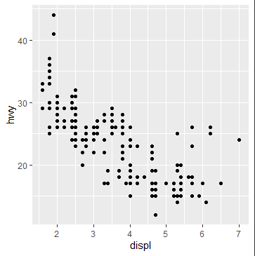
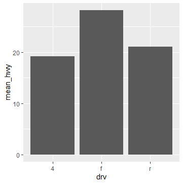
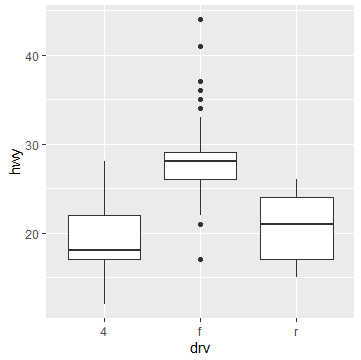
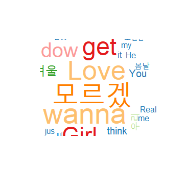
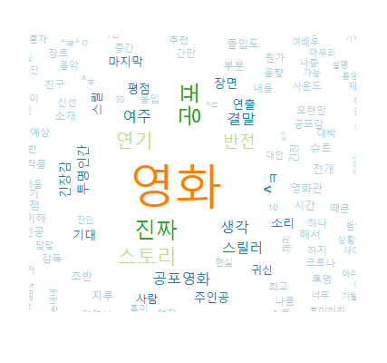

# Graph & Word Cloud


## Graph

> ggplot2 package를 사용한다

```R
library(ggplot2)
```


### 그리는 방법

1. 배경설정(x, y축 설정)
2. 실제 그래프를 추가(선, 막대, 점)
3. 축 범위, 색과 같은 설정 추가


### 그래프 종류

#### 1. 산점도(scatter plot)

- 2차원 평면(x, y축)에 점으로 표현한 그래프

- 예 ) 배기량과 고속도로 연비의 관계

  

- ```R
  ggplot(data = df,
    	   aes(x=displ,y=hwy)) +
    	   geom_point()
  ```

- ```R
  ggplot(data = df,
         aes(x=displ,y=hwy)) +
    	   geom_point() +
   	   xlim(3,6) + ylim(20,40)   # 그래프의 일부 범위
  ```


#### 2. 막대그래프

- 일반적으로 두 집단간의 차이를 볼 때 사용한다.

- 예 ) 구동방식별 고속도로 연비차이를 비교

  

- ```R
  library(dplyr)
  result <- df %>% 
            group_by(drv) %>%
            summarise(mean_hwy=mean(hwy))
  
  ggplot(data = result,
         aes(x=drv,y=mean_hwy)) +
    	   geom_col()
  ```


#### 3. boxplot

- 데이터를 4분위로 구분하여 박스로 나타낸다.

- 세로선 : 0~1사분위, 3~4사분위

- 가로선 : (아래부터) 1사분위, 2사분위(두꺼운실선), 3사분위

- 점  :  이상치

- 예 ) 구동방식별 고독도로 연비차이 비교

  

- ```R
  ggplot(data = df,
         aes(x=drv,y=hwy)) +
    	   geom_boxplot()
  ```


## Word Cloud

> 단어나 키워드를 빈도에 따라 크기나 색을 다르게 하여 
>
> `직관적으로 보여주는 시각화 도구`


### 그리는 방법

> 1. 문자열 처리
> 2. 한글 형태소 분석(형태소 : 뜻을 가진 가장 작은 단위)
> 3. Wordcloud 작성

> 예 )  특정 영화에 대한 comment들을 모아서 Wordcloud 작성

#### 1. Package 설치

> 한글 형태소를 분석하기 위해서는 특수한 package가 필요하다.
>
> `KoNLP(Korean Natural Language Process)`

```R
install.packages("KoNLP")
library(KoNLP)
```


##### 1-1. 설치 에러

>  `!`  `Error`
>
> ```R
> Warning in install.packages :
>   package ‘KONLP’ is not available (for R version 3.6.3)
> ```
>
> 현재 CRAN에서 설치가 불가능한 상황 (2020/03/16 기준)
>
> (라이브러리 목록에서 제외된 상태로 생각됨)

> `Sol`
>
> 1. KoNLP 패키지를 `.libPaths()` 에 등록된 경로에 압축해제한다.
>
> 2. 패키지에 필요한 의존성 패키지를 수동 설치한다.
>
>    ```R
>    # install.packages("Sejong")
>    # install.packages("hash")
>    # install.packages("tau")
>    # install.packages("RSQLite")
>    # install.packages("devtools")
>    ```


#### 2. 사전 선택

> 사용 가능한 한글 사전으로는
>
> `시스템, 세종, NIADIC` 으로 3종이 있다.

```R
useNIADic()

> useNIADic()
Backup was just finished!
983012 words dictionary was built.
```


#### 3. 텍스트 분석

> 분석 대상인 `hiphop.txt` 는 BTS의 노래 가사가 들어있다.

```R
library(stringr)
txt <- readLines("data/hiphop.txt", encoding = "UTF-8")

words <- extractNoun(txt)     # return list
result <- unlist(words)       # list to vector

wordcount <- table(result)
wordcount_df <- as.data.frame(wordcount, stringsAsFactors = F)

word_df <- wordcount_df %>%
    filter(nchar(result) >= 2) %>%
    arrange(desc(Freq))
```


#### 4. Word Cloud 그리기

```R
install.packages("wordcloud")
library(wordcloud)

# WordCloud에서 키워드들의 색상 그룹 지정
pal <- brewer.pal(8,"Paired")

# wordcloud는 기본적으로 생성할 때마다 다르게 생성한다
# 만약 같은 형태의 wordcloud를 생성하고 싶다면
# random 대신 seed값을 설정
set.seed(1)

# 그리기
wordcloud(words = word_df$result,     # 사용할 단어*
          freq = word_df$Freq,        # 빈도수*
          min.freq = 2,               # 최소 빈도수
          max.words = 200,            # 사용할 단어들의 최대 갯수
          random.order = F,           # 고빈도 단어는 중앙
          rot.per = 0.1,              # 글자 회전
          colors = pal)
```





## 종합 예제

> 네이버 영화에서 특정 영화의 댓글들을 수집하여 Word Cloud를 그리자
>
> 댓글은 1페이지당 10개씩 100페이지(1000개)
>
> 대상 : 인비저블맨

```R
library(rvest)
library(stringr)

url <- "https://movie.naver.com/movie/point/af/list.nhn?st=mcode&sword=189001&target=&page="

movie_contents <- vector(mode = "character", length = 1000)

for (i in 1:100) {
  request_url <- str_c(url,i)
  page_html <- read_html(request_url, encoding = "CP949")
  
  nodes <- html_nodes(page_html, "td.title")
  page_content <- html_text(nodes)
  
  for (j in 1:length(page_content)) {
    page_content[j] <- str_remove_all(page_content[j], "신고")
    page_content[j] <- str_remove_all(page_content[j], "\t")
    page_content[j] <- str_split(page_content[j], "\n")
    movie_contents[(i-1)*10+j] <- page_content[j][[1]][11]
  }
}
```

```R
library(KoNLP)
library(dplyr)
library(wordcloud)

useNIADic()
words <- extractNoun(movie_contents)
result <- unlist(words)

wordcount <- table(result)
wordcount_df <- as.data.frame(wordcount, stringsAsFactors = F)

word_df <- wordcount_df %>%
  filter(nchar(result) >= 2) %>%
  arrange(desc(Freq))
word_df


pal <- brewer.pal(8,"Paired")
set.seed(1)

wordcloud(words = word_df$result,
          freq = word_df$Freq,
          min.freq = 2,
          max.words = 200,
          random.order = F,
          rot.per = 0.1,
          colors = pal)
```


