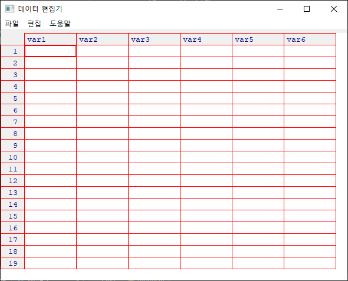

# String Handling

> 빅데이터 처리에서 문자열 처리는 꽤나 빈번하게 발생하는 작업니다.


## Package - stringr

> R에서 문자열을 처리하는 대표적인 package

### stringr 설치

```r
# 1. package install
install.packages("stringr")

# 2. package loading
library(stringr)        # or  require(stringr)

# 3. using!
```


### stringr 사용하기

> stringr 패키지의 함수들은 모두 `str_`로 시작한다.

```r
myStr <- "Hongkd1051Leess4504YOU25홍길동1004"
```

```r
# 1. 문자열의 길이
str_length(myStr)       # [1] 31

# 2. 찾고자 하는 문자열의 시작위치와 끝위치
str_locate(myStr, "Lee")
#      start end
# [1,]    11  13

str_locate(myStr, "0")
#      start end
# [1,]     8   8

str_locate_all(myStr, "0")
# [[1]]             # list
#      start end    # matrix
# [1,]     8   8
# [2,]    18  18
# [3,]    29  29
# [4,]    30  30

# 3. 부분 문자열
str_sub(myStr, 2, 5)    # [1] "ongk"

# 4. 모두 대문자/소문자로
str_to_upper(myStr)     # [1] "HONGKD1051LEESS4504YOU25홍길동1004"
str_to_lower(myStr)     # [1] "hongkd1051leess4504you25홍길동1004"

# 5. 문자열 교체
str_replace(myStr, "홍길동", "신사임당")    # [1] "Hongkd1051Leess4504YOU25신사임당1004"

# 6. 문자열 결합
str_c(myStr, "이순신2020")      # [1] "Hongkd1051Leess4504YOU25홍길동1004이순신2020"

# 7. 문자열 분리
myStr <- "Hongkd1051,Leess4504,YOU25,홍길동1004"
str_split(myStr, ",")           # vector로 return?
# [[1]]
# [1] "Hongkd1051" "Leess4504"  "YOU25"      "홍길동1004"
```


## R 정규식

### 정규식(regular expression)이란?

> 약속된(정해져있는) 기호를 이용해서 의미를 표현

```r
myStr <- "Hongkd1051,Leess4504,YOU25,홍길동1004"
```

```R
# stringr에 정규식을 이용하여 내가 원하는 형태의 문자열을 추출하는 함수가 있다.
str_extract_all(myStr, "[a-z]{3}")
#               target  en   cnt  반복 3개인것
# [[1]]
# [1] "ong" "ees"

str_extract_all(myStr, "[a-z]{3,}")   # 소문자 3번 이상
# [[1]]
# [1] "ongkd" "eess"

str_extract_all(myStr, "[a-z]{3,4}")   # 소문자 3번 이상 5 미만
# [[1]]
# [1] "ongk" "eess"

str_extract_all(myStr, "[가-힣]{3}")    # 한글
# [[1]]
# [1] "홍길동"

str_extract_all(myStr, "[0-9]{4}")		# 숫자
# [[1]]
# [1] "1051" "4504" "1004"

str_extract_all(myStr, "[^a-z]{3}")     # 소문자가 아닌것
# [[1]]
# [1] "105"   "1,L"   "450"   "4,Y"   "OU2"   "5,홍"  "길동1" "004"
```


## 데이터 입출력

> 데이터 분석을 하기 위해서는 가장 먼저 데이터를 준비해야한다.
>
> 1. 키보드를 이용해 데이터를 입력받기
>
>    ```R
>    scan(), edit()
>    ```
>
> 2. 외부 file에서 데이터를 입력받기
>
>    ```R
>    read.table()
>    ```


### 1. 키보드로 입력받기

```R
myNum = scan()					# default : 숫자만 입력가능
myNum
# > myNum = scan()
# 1: 100
# 2: 200
# 3: 300
# 4: 
#   Read 3 items
# > myNum
# [1] 100 200 300


myData = scan(what=character())		# 문자 입력
myData
# > myData = scan(what=character())
# 1: 홍길동
# 2: 
#   Read 1 item
# > myData
# [1] "홍길동"

# 
# > 만약 data frame에 데이터를 직접 임력하고 싶다면?
# 
df = data.frame()
my_df = edit(df)
my_df
```

- `edit(df)` 실행시
- 


### 2. file로 입력받기.

```R
df <- read.table("data/student_midterm.txt", sep = ",")
df
#   V1 V2  V3  V4
# 1  1  1  39 100
# 2  2  1 100  30
# 3  3  4  50  50
# 4  4  4 100  90
# 5  5  3  90  80

#
## > file에 header가 포함되어 있는 경우
#
df <- read.table("data/student_midterm.txt", 
                 sep = ",", 
                 header = TRUE, 
                 fileEncoding = "UTF-8")
df
#   학번 학년 국어 영어
# 1    1    1   39  100
# 2    2    1  100   30ㄴ
# 3    3    4   50   50
# 4    4    4  100   90
# 5    5    3   90   80

#
## > file 탐색기에서 file을 선택할 수 있다.
#
df <- read.table(file.choose(), sep = ",")

# 
## > 만약 file에 이상데이터가 있는 경우
#
# 	na.strings
# 	- 데이터의 공백이 있을 때, NA값으로 대체한다.
df <- read.table("data/student_midterm_na.txt", 
                 sep = ",", 
                 header = TRUE, 
                 fileEncoding = "UTF-8",
                 na.strings = "-")
df
#   학번 학년 국어 영어
# 1    1    1   39  100
# 2    2    1  100   30
# 3    3    4   50   NA
# 4    4    4   NA   90
# 5    5    3   90   NA
```


### 3. file에 data frame 저장

``` r
# > write.table()
# 
write.table(df,
            file = "data/result.csv",
            row.names = FALSE,
            quote = FALSE)
# row.names : index 출력 x
# quote     : "" x
```


## 데이터 표준형식

> 데이터를 교환, 전달할 때 사용하는 데이터 표준형식.

1. CSV(Comma Seperated Value) 방식

   - .csv 파일을 사용한다.

     `1,1,39,100,......`

   - 장점  :  용량이 작다	- 대용량 데이터 전달에 유리

   - 단점  :  데이터의 구조화가 힘들다.

     - 데이터 제공자의 양식에 따라 해석해야한다.
     - 파서(Parser)가 데이터에 따라 수정이 필요하다.

     

2. XML(Extended Markup Language) 방식

   - .xml 파일을 사용한다.

     `<name>홍길동</name><age>20</age>.....`

   - 장점  :  데이터 구조화가 간편하다. (파싱이 편하다.)

   - 단점  :  데이터의 용량이 너무 크게 증가한다.

     - 실제 데이터보다 구조를 위한 데이터가 더 많다.

     

3. JSON(JavaScript Object Notation)

   - `{ name:"홍길동", age:20, addr:"a".... }`

   - 장점  :  데이터 구조화가 간편하다.

     ​              용량이 적다. (  csv  <  JSON  <  XML  )


### 관련 함수

```r
## read.csv()
##  - read.table()과 유사
##  - header=TRUE : default
##  - sep=","     : default
# 
df <- read.csv("data/student_midterm.csv", fileEncoding = "UTF-8")
df

# 
## excel 파일로 데이터 파일이 되어있는 경우
## 기본기능으로는 불가능하고, 외부 package를 이용해야한다.
# 
install.packages("xlsx")
require("xlsx")

#
df <-read.xlsx(file.choose(),
               sheetIndex = 1,
               encoding = "UTF-8")
df

class(df)     # [1] "data.frame"    # data structure
```

