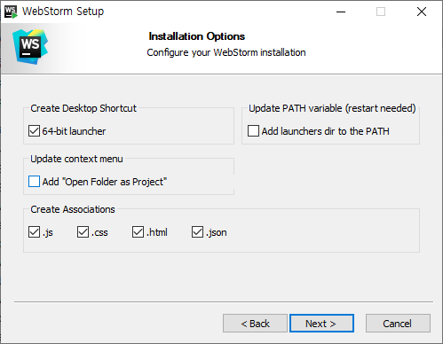
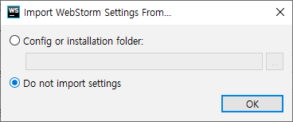
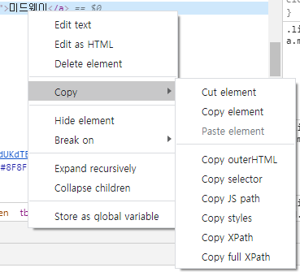

# 데이터 수집

> Web 상의 데이터를 수집하는 방법으로는
>
> 1. Web Scraping
>
>    웹사이트 상에서 내가 원하는 위치에 대한 정보를
>
>    자동으로 추출하여 수집하는 기능
>
> 2. Web Crawling
>
>    자동화 봇인 Web Crawler가 정해진 규칙에 따라
>
>    복수개의 웹페이지를 browsing하며 수집하는 행위


---

## Web Scraping

> Web Scraping 방식에는 2가지가 있다.
>
> 1. CSS, jQuery의 selector를 사용하는 방법
> 2. XPATH를 사용하는 방법

### 1. Selector를 이용하는 방법

> 잡담으로
>
> Eclipse는 Back-End 프로그래밍에 최적화 되어있고,
>
> Front-End에서는 가끔 약한 모습을 보인다.
>
> Selector에 대해서 `WebStorm`을 사용하겠다.


#### 1-0. WebStorm 설치

> 설치는 [WebStorm](https://www.jetbrains.com/ko-kr/webstorm/) 에서 설치하면 된다.
>
> 30일 무료사용이며, 학교 메일주소로 1년간 무료로 이용 가능하다.

- 설치는 간단하다. (동일)
- 설치 중간에 아래 항목에만 체크한다.




- 설치 후 최소 사용시, 기존의 WebStorm의 설정내용이 있는지 묻는다.

  다른 PC나 재설치 전에 설정이 있다면 백업한 설정을 적용한다.




- ```r
  WebStorm의 장점들 중 하나로
  
  Web Server가 있어야 한다.
  	>> WebStorm 안에 내장되어있다.
  	>> web server에 프로젝트의 존재를 알려야(configure)
  	>> web server가 프로젝트를 Web에 Deploy(전개)
  	>> Client Browser를 이용해서 프로젝트에 url로 접근.
  >> 여기까지 버튼 하나로 ok
  ```


#### 1-1. Selector란?

```html
<!DOCTYPE html>
<html lang="en">
<head>
    <meta charset="UTF-8">
    <title>title</title>
</head>
<body>										<!-- line 7 -->
    <h1>selector 배우기.</h1>
    <div>
        >> div area
        <ul>								<!-- line 11 -->
            <li class="myClass">서울</li>
            <li id="kaka">인천</li>
            <li class="myClass">부산</li>
        </ul><br>
        <ol>								<!-- line 16 -->
            <li>홍길동</li>
            <li class="myClass">신사임당</li>
            <li>강감찬</li>
        </ol>
    </div>
</body>
</html>
```

```html
    <style>
        /*  selector : 선택자
            1. tag selector
                tag 명으로 원하는 부분을 지정할 수 있다.
        */
        h1 {
            color: red;		/* line 8 */
        }
        li {
            background-color: yellow;	/* line 12-14, 17-19 */
        }
        /*  2. Universal selector (전체 선택자)
                `*`를 통해 모든 영역을 선택할 수 있다.
        */
        * {
            /*color: red;*/				/* all texts */
        }
        /*  3. ID selector
                `#`을 이용해서 원하는 영역을 선택할 수 있다.
        */
        #kaka {
            color: black;				/* line 13 */
        }
        /*  4. class selector
                `.`를 이용해서 원하는 영역을 선택할 수 있다.
        */
        .myClass {
            background-color: mediumpurple;
            					/* line 12, 14, 18 */
        }
        /*  5. 구조 selector
                자식 : `>`
                후손 : ` `(공백)
                형제 중 바로 다음 형제 : `+`
        */
        ol > .myClass {
            color: lightgreen;			/* line 18 */
        }
        div li {
            border: cadetblue 1px solid;
            					/* line 12-14, 17-19 */
        }
        #kaka + li.myClass{
            color: red;					/* line 14 */
        }

    </style>
```


#### 1-2. 실습 (Naver 영화 평점)

> Naver 영화 평점 Scraping 하기

```R
# 필요 패키지 설치 및 로딩
install.packages("rvest")
library(rvest)
library(stringr)

# 네이버 영화의 유저 평점 페이지
url <- "https://movie.naver.com/movie/point/af/list.nhn?&page="
request_url <- str_c(url,"1")
request_url

# html 페이지 읽기
page_html <- read_html(request_url, encoding = "CP949")
page_html                         # target 페이지의 현재 인코딩에 맞춰주어야한다.

#
# # 1. 영화 제목 가져오기
#
# html 중 selecter에 맞는 element를 가져온다.
nodes <- html_nodes(page_html, "td.title > a.movie")

# element가 가지고 있는 text(tag 사이의 내용)를 가져온다.
movie_title <- html_text(nodes)

movie_title		# 1페이지 영화 제목들(10개)

#
# # 2. 영화 평점 가져오기
#
nodes <- html_nodes(page_html, "div.list_netizen_score > em")
movie_point <- html_text(nodes)
movie_point     # 1페이지 영화 평점들

#
# # 3. 영화 한줄평 가져오기
#
nodes <- html_nodes(page_html, "td.title")
content <- html_text(nodes)

# \t로 이루어진 공백을 제거하고
# 한줄평이 있는 라인만 빼냈다.
for (i in 1:length(content)) {
  temp <- str_remove_all(content[i], "\t")
  temp <- str_split(temp, "\n")
  content[i] <- temp[[1]][11]
}
content         # 1페이지 리뷰들

#
```


### 2. XPATH

#### 2-1. XPath란?

> **XPath**(XML Path Language)는 [W3C](https://ko.wikipedia.org/wiki/W3C)의 표준으로 [확장 생성 언어](https://ko.wikipedia.org/wiki/XML) 문서의 구조를 통해 경로 위에 지정한 구문을 사용하여 항목을 배치하고 처리하는 방법을 기술하는 언어

> 우리는 `Chrome 개발자 도구`에서 지원하는 XPath를 가져다 쓴다.
>
> 다만, Chrome의 제공기능은 Chrome의 개발자도구가 자동 추가한 코드로 인해 작동하지 않을 수 있다.




#### 2-2 실습 (Naver 영화 평점)

```R
# 필요 패키지 설치 및 로딩
# 네이버 영화의 유저 평점 페이지
# html 페이지 읽기
# ---------------------------------------------- #
# # 여기까지 1-2와 동일
# ---------------------------------------------- #
```

[Go to 1-2](#1-2.-실습-(Naver-영화-평점))

```R
#
# # 1. 영화 제목 가져오기
#
# html 중 selecter에 맞는 element를 가져온다.
nodes <- html_nodes(page_html, "td.title > a.movie")

# element가 가지고 있는 text(tag 사이의 내용)를 가져온다.
movie_title <- html_text(nodes)

movie_title		# 1페이지 영화 제목들(10개)

#
# # 2. 영화 평점 가져오기
#
nodes <- html_nodes(page_html, "div.list_netizen_score > em")
movie_point <- html_text(nodes)
movie_point     # 1페이지 영화 평점들

#
# # 3. 영화 한줄평 가져오기
#
nodes <- html_nodes(page_html, "td.title")
content <- html_text(nodes)

# \t로 이루어진 공백을 제거하고
# 한줄평이 있는 라인만 빼냈다.
for (i in 1:length(content)) {
  temp <- str_remove_all(content[i], "\t")
  temp <- str_split(temp, "\n")
  content[i] <- temp[[1]][11]
}
content         # 1페이지 리뷰들

#
```


## 잡담

```html
<!--
Front-End Web Application Project*
HTML, CSS, JavaScript를 이용해 프론트엔드 프로그래밍을 한다.
순수 JavaScript를 이용하기보단 jQuery 라이브러리를 사용하는데
	jQuery는 library 형태로 코드가 구현되기 때문에
	유지보수에 문제가 발생할 수 있다.
    >> Angular, React 같은 Web Framwork를 이용해서
	  프론트엔드 개발하는 방향으로 가는중.
-->
```

