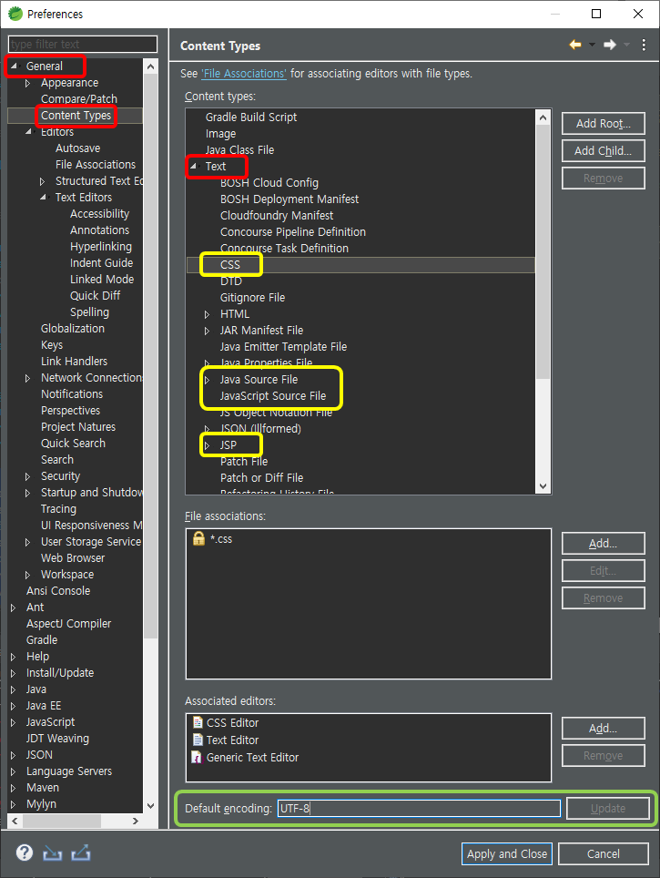
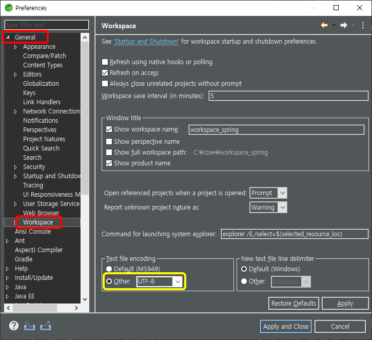
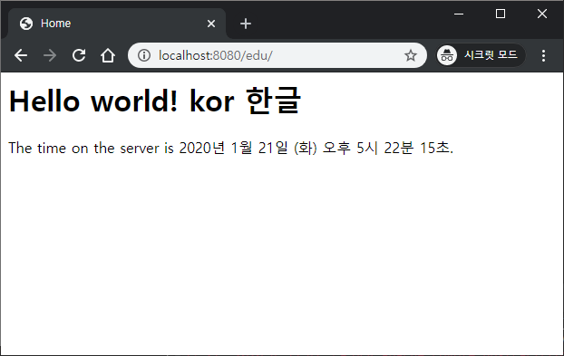

# Spring 한글 처리

> 1. `Window - Preferences` 에서 `encoding type` 설정
> 2. `src\main\webapp\WEB-INF\web.xml` 에 `encoding filter` 설정
> 3. `.jsp` 에서 `page encoding` 설정


## 1. Preferences 에서 encoding type 설정

- `General - Content Types` 내부의 `Text` 에서 (Red)

  `CSS, Java Source File, JavaScript Source File, JSP`의 (Yellow)

  `Default encoding`을 `UTF-8`로 변경(Green)




- `General - Workspace` 에서 (Red)

  `Text file encoding`을 `Other : UTF-8` 로 설정(Yellow)




## 2. web.xml` 에 `encoding filter 설정

- `src\main\webapp\WEB-INF\web.xml` 파일에 `encoding filter` 설정문구 추가

  ```xml
  <?xml version="1.0" encoding="UTF-8"?>
  <web-app version="2.5" xmlns="http://java.sun.com/xml/ns/javaee"
  	.....>
  
  
  	<context-param>
  		<!-- ....... -->
  	</context-param>
  
  	<listener>
  		<!-- ....... -->
  	</listener>
  
  	<servlet>
  		<!-- ....... -->
  	</servlet>
  		
  	<servlet-mapping>
  		<!-- ....... -->
  	</servlet-mapping>
  	
      <!-- Start -->
  	<filter>
  		<filter-name>encodingFilter</filter-name>
  		<filter-class>
  			org.springframework.web.filter.CharacterEncodingFilter
  		</filter-class>
  		<init-param>
  			<param-name>encoding</param-name>
  			<param-value>UTF-8</param-value>
  		</init-param>
  		<init-param>
  			<param-name>forceEncoding</param-name>
  			<param-value>true</param-value>
  		</init-param>
  	</filter>
  
  	<filter-mapping>
  		<filter-name>encodingFilter</filter-name>
  		<url-pattern>/*</url-pattern>
  	</filter-mapping>
      <!-- End -->
  
  </web-app>
  
  ```

  > <web-app> </web-app> 태그 사이에서
  >
  > `Start ~ End` 사이의 `<filter>`와 `<filter-mappint>` 부분을 추가한다.
  
  > `HomeController.java` 에서 `home.jsp`로 넘어가는 
  >
  > `String formattedDate` 데이터의 Encoding 문제 해결


## 3. jsp 에서 page encoding 설정

- `JSP` 파일 상단에 `Page Encoding`을 설정한다.

  ```jsp
  <%@ taglib uri="http://java.sun.com/jsp/jstl/core" prefix="c" %>
  <%@ page session="false" %>
  <!-- Start -->
  <%@ page language="java" contentType="text/html; charset=UTF-8"
      pageEncoding="UTF-8"%>
  <!-- End -->
  <html>
  <head>
  	<title>Home</title>
  </head>
  <body>
  <h1>
  	Hello world!  kor 한글 
  </h1>
  
  <P>  The time on the server is ${serverTime}. </P>
  </body>
  </html>
  
  ```

  > `home.jsp`파일 예시
  >
  > `Start ~ End` 사이에 `Page Encoding`과 관련된 JSP 페이지 디렉티브를 추가한다.
  
  > `home.jsp` 파일에서 추가되는 내용의 Encoding 문제 해결


## 4. 실행 결과



