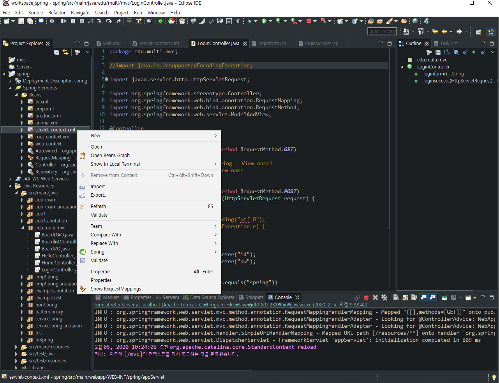

`관리`  -  조회 / 저장 / 수정 / 삭제  (4가지는 기본)

CRUD

- Create(저장)
- Read(조회)
- Update(수정)
- Delete(삭제)

Board Table

BoardVO	BoardDAO

BoardController - 4개 이상 RequestMapping 메서드

Member Table

Product Table

---

html 에서...

<form action="url"

​		url : /context_name/mapping_url	(ex : /mvc/list)

<a href="url"

<script src="url"

Servlet, JSP, Spring(웹서버)에서...

@RequestMapping("/list")

