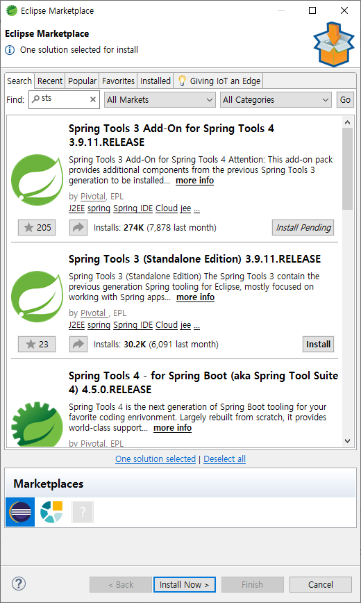

> `Eclipse Marketplace` 에서 `Spring Tools 3 Add-On for Spring Tools 4 3.9.11.RELEASE` 설치


---


일반 Java 프로젝트에 pom.xml 추가하기


일반 Java 프로젝트에 Spring Nature 추가하기


```xml
<project xmlns="http://maven.apache.org/POM/4.0.0" xmlns:xsi="http://www.w3.org/2001/XMLSchema-instance" xsi:schemaLocation="http://maven.apache.org/POM/4.0.0 https://maven.apache.org/xsd/maven-4.0.0.xsd">
  <!-- ....... -->
  <build>
	<!-- ....... -->
  </build>
  
  <!-- Start -->
  <dependencies>
  	<!-- https://mvnrepository.com/artifact/org.springframework/spring-context -->
	<dependency>
    	<groupId>org.springframework</groupId>
    	<artifactId>spring-context</artifactId>
    	<version>4.1.7.RELEASE</version>
	</dependency>
  </dependencies>
  <!-- End -->
</project>
```


Spring Context(Core)


//


//


//


