> 2020/01/31

# Spring

### 개발환경

> JDK 1.8
>
> Tomcat 8.5
>
> Eclipse 2019-03
>
> Spring 4


## Spring

### 개념 간단 정리

1. 여러가지 모듈 단위별

2. POJO, class A extends HttpServlet 등 형태 사용 가능

3. 스프링 이전 개발 자바 객체 그대로 재사용

4. Inversion of Control

   ```java
   class A{
       B b1;
       A(B b1) {
           this.b1=b1;
       }
       setB(B b1) {
           this.b1=b1;
       }
   }
   ```

   IoC(Inversion of Control) 기능 지원

   - **`new`** 가 사라지고 스프링 대신 생성 객체 전달받는다

   

   DI(의존성 주입 : Dependency Injection)

   >  스프링 내부 프로그래밍 방식(IoC)

   

   1. 생성자
   2. **Setter**  (**Spring 권장**)


### Eclipse 설정

help - Eclipse Marketplace로 이동

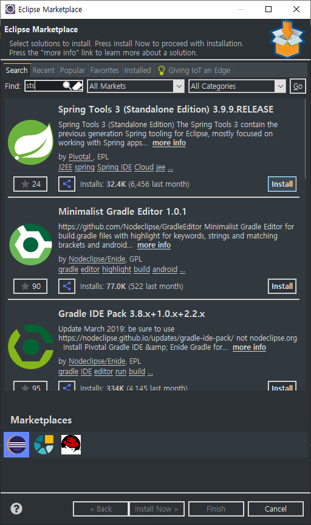

STS로 검색 후 맨 위의 `Spring Tools 3 (Standard Edition) 3.9.9.Release`를 `install` 한다.


---

### 프로젝트 생성

1. 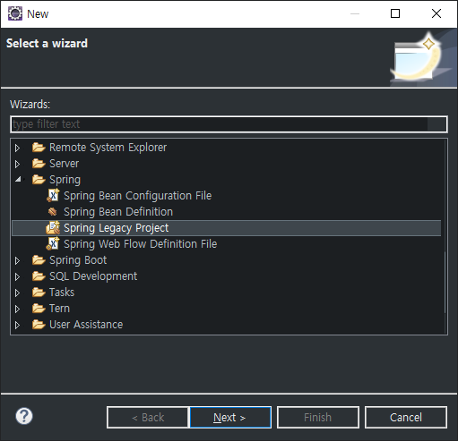


2. 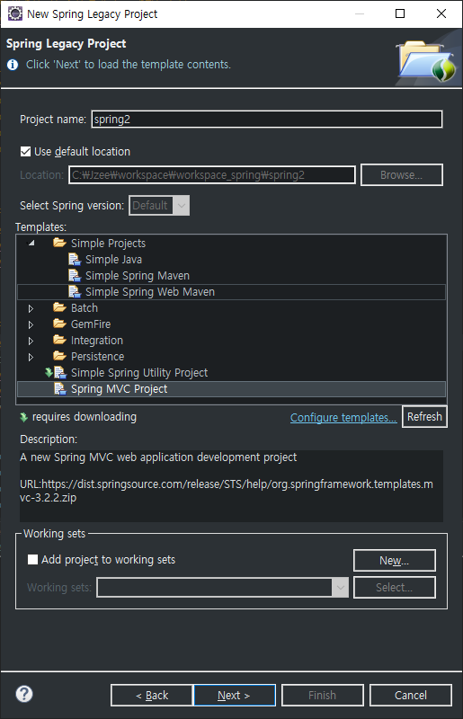

   * Spring MVC Project를 선택한다.

   

3. 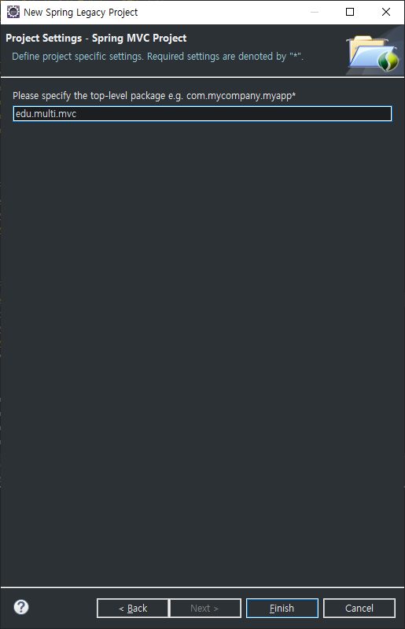

   * 패키지 경로를 설정한다.


#### 버전 설정

> Java JDK 버전과 Spring 버전을 설정한다.
>
> JDK : 1.8
>
> STS : 4.3.18

1. `porm.xml` 설정 변경

   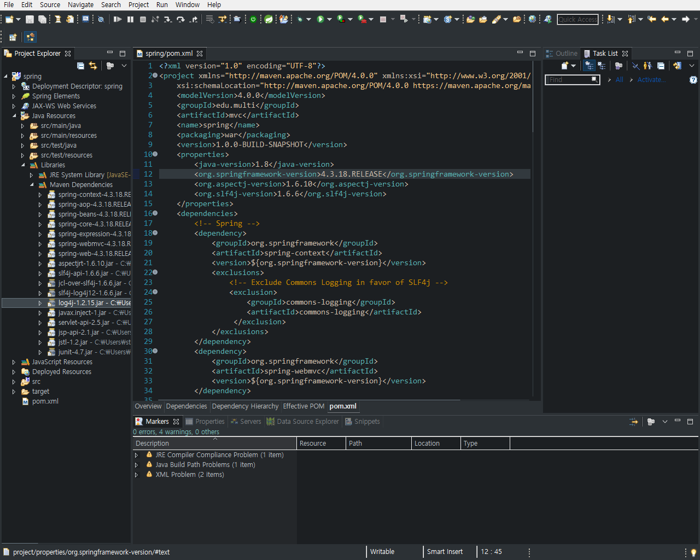

   ```xml
   line 11
   	1.6 -> 1.8
   
   line 12
   	3.1.1.RELEASE -> 4.3.18.RELEASE
   ```

   위 내용으로 변경을 하면

   Spring의 Maven으로 인해 라이브러리가 자동으로 설치된다.


2. 프로젝트 설정 변경

   1. 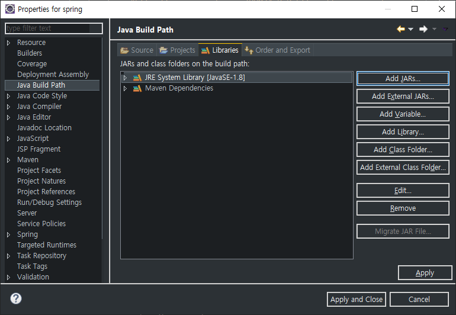

      Project - Properties - Java Build Path - Libraries 에서

      JRE 버전을 1.6 -> 1.8로 바꾼다.

      

   2. 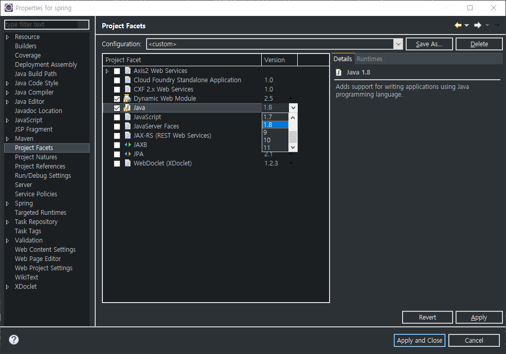

      Project - Properties - Projet Facets 에서

      Java 버전을 1.6 -> 1.8로 변경한다.

      

   3. 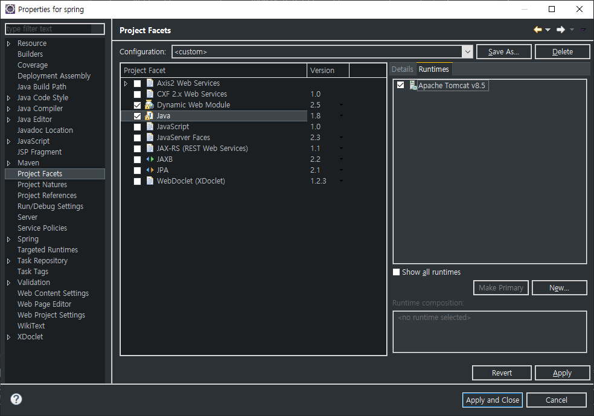

      우측의 `Runtimes`에서 Tomcat 서버를 추가한다.

      기존에 서버가 있으면 체크를 해주고 없으면하단의 New를 통해 추가한다.

      

   4. ㅁ


...

Java to Spring  Dependency

### IoC

xml file

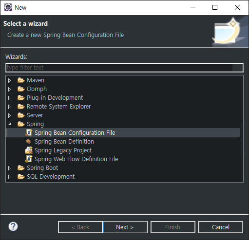

```xml
<?xml version="1.0" encoding="UTF-8"?>
<beans xmlns="http://www.springframework.org/schema/beans"
	xmlns:xsi="http://www.w3.org/2001/XMLSchema-instance"
	xsi:schemaLocation="http://www.springframework.org/schema/beans http://www.springframework.org/schema/beans/spring-beans.xsd">

<!-- MultiTV tv = new MultiTV(); -->
<bean id="tv" class="tvSpring.MultiTV" />
<bean id="tv2" class="tvSpring.OtherTV" />

</beans>
```


Error


> 위에서 에러 발생 시, 상단 import를 확인한다.
>
> Apache가 아닌 SpringFramework의 라이브러리를 import 해야한다.

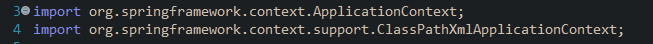


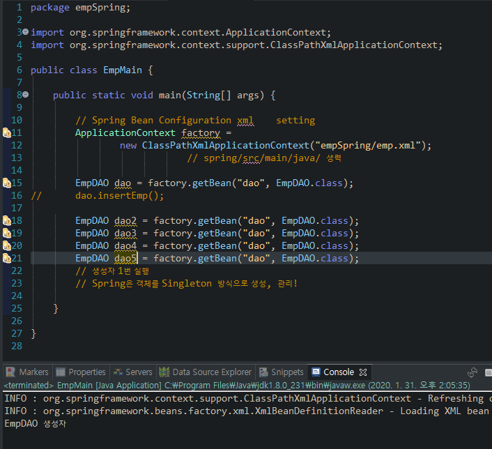

Spring에서는 객체를 요청하면 Singleton 방식으로 생성하고 이를 공유하도록 강제한다.


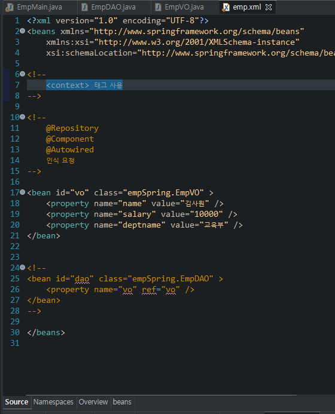

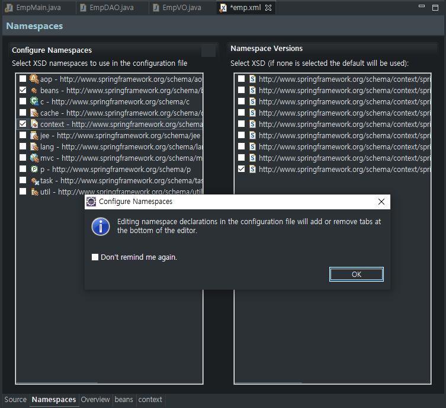

xml 파일 하단의 `Namespaces`에서 `context`를 선택한다.