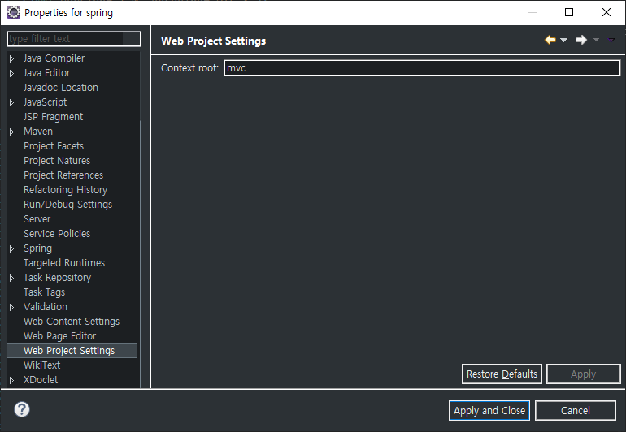

# Spring MVC

## Web Program

- html
- JavaScript + jQuery
- Servlet + JSP


### Client

요청 = url	>>	응답 = html	:	웹브라우저


### Server

- Servlet
  1. 클라이언트 요청을 받아서 분석
  2. 결과 생성, 객체 생성, 메서드 호출
  3. 브라우저 전달(html)
- JSP
  1. a
  2. b
- a


`Servlet - JSP` 에서는 MVC는 `"권장"`

`Spring` 에서 MVC는 `"강제"`


Singleton

Proxy


2 front controller

> mvc -> FrontControllerServlet & web.xml
>
> ```xml
> <servlet-mapping>
>     <servlet-name>FrontControllerServlet</servlet-name>
>     <url-pattern>/</url-pattern> <!-- front controller 방식 -->
> </servlet-mapping>
> ```
>
> 

1 MVC


왜 2.5라고????

Spring에서 Servlet 사용 시 Servlet의 버전을 2.5로 사용한다.

---



Spring Project 에서 Context 확인 방법

프로젝트 - 설정 - Web Project Settings


---

### 요청의 처리를 위한 데이터의 공유

> 1. 1개의 요청&응답
> 2. 브라우저가 구동
> 3. 서버의 구동

- Server (javax.servlet.http.*)

  1. HttpServletRequest
  2. HttpSession
  3. ServletContext

  

- Client (JSP 내장객체)

  1. request
  2. session
  3. applicationl