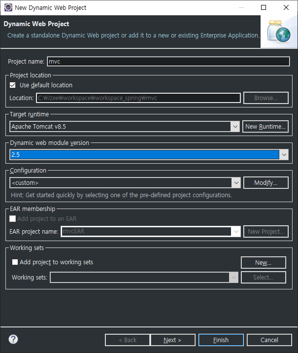

# Spring MVC

## Web Program

- html
- JavaScript + jQuery
- Servlet + JSP

### Client

요청 = url	>>	응답 = html	:	웹브라우저

### Server

- Servlet
  1. 클라이언트 요청을 받아서 분석
  2. 결과 생성, 객체 생성, 메서드 호출
  3. 브라우저 전달(html)
- JSP
  1. a
  2. b
- a

`Servlet - JSP` 에서는 MVC는 `"권장"`

`Spring` 에서 MVC는 `"강제"`

Singleton

Proxy

2 front controller

1 MVC

왜 2.5라고????

Spring에서 Servlet 사용 시 Servlet의 버전을 2.5로 사용한다.