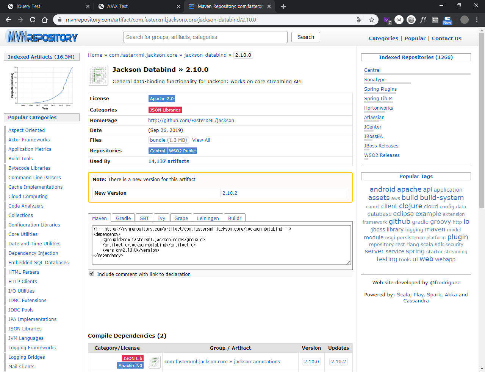

html : 구성요소

css : 구성요소 배치, 색상, 크기조정

javascript/jquery : 구성요소 동적 적용


jquery

1. library load

2. jquery 문장 사용

   $( selector ).method_name(param);

   $(  "h1"  ) .css ( "color", "blue" )

   $(  "#id"  ) .css ( "color", "blue" )

   $ ( ".class" ) .css ( "color", "blue" )


JSP		<% %>, <%= %>

jQyery	$( )

el			${ }

---

비동기화 통신 jquery 방식 신규	(>> 통신방식)

: asynchronous javascript (jQuery) and xml (ajax)

xml : 

```xml
<user>
    <name>홍길동</name>
    <age>21</age>
</user>
```

---

json	(>> Data)

: javascript object notation

```json
var obj = { name:"홍길동", age:21, test: function() {.....} };
```

-> Java

```java
String obj = "{ \"name\":\"홍길동\", \"age\":21 }";
```

---


요청1 / 요청2 / 요청3 / 서버처리... / 요청2 / 요청3 / 요청1

(요청을 보낸 후 응답을 기다리지 않고 요청을 재차 보낼 수 있다)

(서버에서 처리된 응답은 처리가 완료된 즉시 보내지며, 이는 보내는 순서와 관계가 없다)


---

---



-> porm.xml