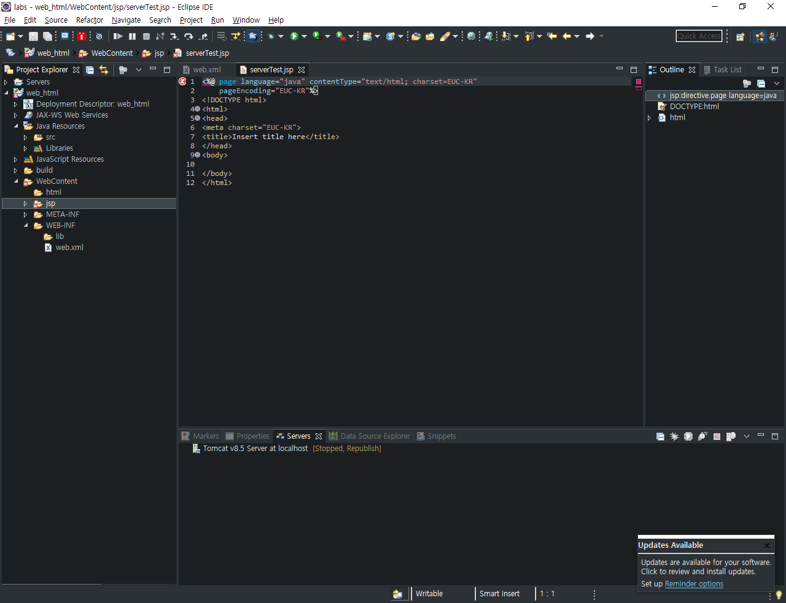
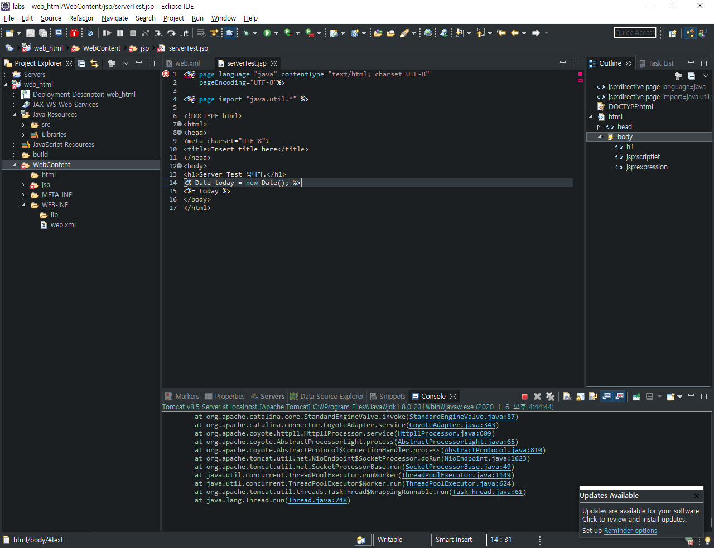

> tomcat path 설정


> Oracle, tomcat port 중복(8080)
>
> -> Oracle port 변경(9090)

```sql
sqlplus system/oracle
-- login system account
select dbms_xdb.gethttpport() from dual;
-- check oracle port
exec dbms_xdb.sethttpport(9090);
-- change oracle port 8080 to 9090
```


> Eclipse 프로젝트 생성
>
> New - Dynamic Web Project


> workspace content type 변경


> CSS
>
> Java Properties File
>
> Java Source File
>
> JavaScript Source File
>
> JSP
>
> > Default encodeing : `UTF-8`로 변경


> `WebContent` 경로 아래에 `html`, `jsp` 폴더 생성


> `WebContent/jsp` 경로에 `serverTest.jsp` 파일 생성


> `EUC-KR` 들을 `UTF-8`으로 변경 (3개)




> Error
>
> - `jsp.jar` not found


> Solution
>
> ~\lib    <-    jsp
>
> Tomcat's .jar -> java's lib


> 3개의 files
>
> C:\Program Files\Java\jdk1.8.0_231\jre\lib\ext 에 복사


> add line 10


`Ctrl + F11` 실행


> browser 추가 및 기본값 설정


> firefox 등 다른 브라우저 사용 시 우측 New로 추가
>
> 우리는 Chrome 사용


> 내용 추가



> line 4
>
> ```html
> <%@ page import="java.util.*" %>
> ```
>
> line 14, 15
>
> ```html
> <% Date today = new Date(); %>
> <%= today %>
> ```

