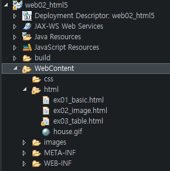
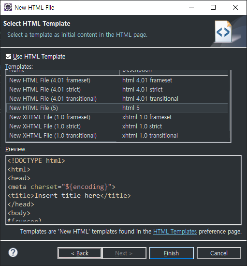
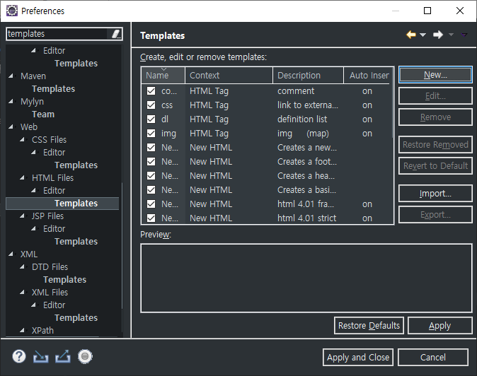

## HTML5

> HTML, CSS, JSP 등의 파일들은 `WebContent` 폴더 안에 위치시킨다.
>
> `WebContent` 폴더는 사이트의 이름에 따라 그 이름이 달라질 수 있다.




### Templates사용

> HTML 파일을 최초 생성할 때의 기본 형태를 미리 저장해두고 이를 가져다 사용할 수 있다.

1. 기존의 Template 사용

   > HTML 파일을 생성할 때 이름을 지정하고 다음 페이지로 넘어가면
   >
   > Template를 선택할 수 있다.
   >
   > 각 버전에 따른 기본적인 Template이 존재한다.



 

2. 새로운 Template 사용

> 기존의 Template 외에도 사용자가 직접 Template을 만들어 사용할 수 있다.
>
> 위의 템플릿 선택창에서 `Finish` 위의 `HTML Templates`을 통해 이동하여 만들거나
>
> 이클립스 설정에서 미리 만들고 1번의 과정을 거칠 수 있다.



> Preference - Web - Html Files - Editor - Templates
>
> 우측 상단의 `New`를 하여 나오는 창에서 Template를 생성할 수 있다.


> `Context`는 `New HTML`로 설정한다.
>
> `Pattern`에 원하는 HTML 기본 구성을 HTML 코드로 넣어준다.


### HTML 코드에 CSS 코드 삽입하기

```html
<head>
<--> ...... </-->    
    <style type="text/css">
        table {
            border: 2px solid purple;
            width: 500;
            height: 150;
        }
        th {border: 1px double;}
        tr {border: 2px dotted;}
    </style>
</head>
```

> `style` 태그를 이용하여 CSS 코드를 삽입했다.


