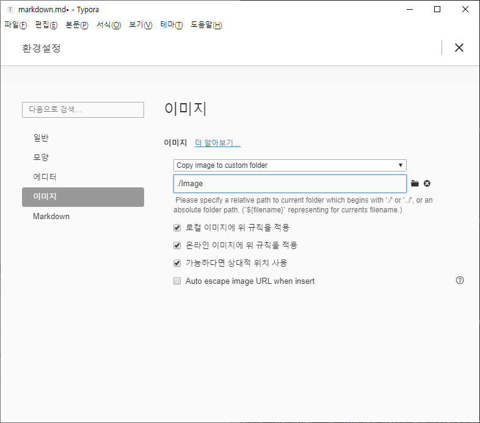

# 마크다운(markdown) 기초

## 제목(heading)

제목은 `#`

'#'의 갯수로 제목의 레벨을 표현이 가능하며, 1~6까지 사용할 수 있다

### H3

#### H4

##### H5

###### h6


## 목록

* 순서가 없는 목록은 '*'을 통해 표현합니다.
  * tab을 통해 목록의 레벨을 조정할 수 있습니다.
    * 한번 더!
      * 한번 더!
        * 또 한번 더!
      * 엔터 2번 또는
    * Shift + Tab으로 상위 레벨로 이동

1. 순서가 있는 목록
2. 순서가 있는 목록은 `1.` 으로
   1. 역시 tab을 통해 목록의 레벨을 조정할 수 있습니다.


## 링크

[구글신](https://google.com) `[name](address)`

으로 링크를 줄 수 있다!

[마크다운 활용법](https://guides.github.com/features/mastering-markdown/)


## 코드 블록

```java
// 자바 주석	[```java] 로 사용, Ctrl + Enter나 화살표로 바로 나갈 수 있음
int number = 3;
System.out.println("안녕!");
```

```python
# python 주석
// 이건 python에서 주석 아님
print('hi')
def foo() :
    return 'hi'
```


## 이미지


드래그&드롭

이 경우 웹에 올리면 이미지가 손상되는 등의 현상이 있을 수 있다

이걸 방지하기 위해서!

file - 환경설정-이미지



설정 후 이미지 추가 시 Til 경로에 

Image 폴더가 상대경로로서 생성된다


## 표

본분 - 표 - 표삽입(Ctril + T)

| 순번 | 이름   | 나이 |
| ---- | ------ | ---- |
| 1    | 최시영 | ?    |
| 2    | 김현호 | ?    |
| 3    | ?      | !    |


표 copy (by code mode)

| 순번 | 이름   | 나이 |
| ---- | ------ | ---- |
| 1    | 최시영 | ?    |
| 2    | 김현호 | ?    |
| 3    | ?      | !    |


## 기타

> 인용문은 `>` 기호를 통해 작성합니다.
>
> > 인용 문구를 쓰기도 하지만, 정의 등 따로 표현할 때 사용해도 좋다
> >
> > > 이것도 레벨이?!

---

`---`을 이용해서 만든 수직선

*이텔릭체 기울임체*  	`*이텔릭체 기울임체*`

**볼드체 굵게** 			`**볼드체 굵게**`

~~취소선~~					`~~취소선~~`


`+)`

[주니어 개발자 인터뷰](https://github.com/JaeYeopHan/Interview_Question_for_Beginner)

[카카오 기술 블로그](https://tech.kakao.com/)

[Notion, 생산성 note](https://www.google.com/search?q=notion&rlz=1C1OKWM_koKR877KR877&sxsrf=ACYBGNQdPSPQ-0Idp3oIZKfAsre-SxOdFw:1576471381945&source=lnms&tbm=isch&sa=X&ved=2ahUKEwj6quDFrbnmAhWLH3AKHW7yBCIQ_AUoAXoECAsQAw&biw=1280&bih=864)

블로그 등등 makedown으로 연결 가능

'+' Notion : 에버노트와 비슷함


> 신기한것 들 투성이다
>
> 모르는게 너무 많았다
>
> 하지만 이제 2시라고!


