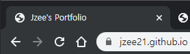

# 마크다운(markdown) 기초

## 0. 시작하기 전에...

markdown(.md) 파일은 `Typora`를 이용하여 작성한다.


## 1. 제목(heading)

제목은 `#`으로 표현 가능하다.

제목의 레벨은 `#`의 갯수로 표현이 가능하며, 1~6까지 표현 가능하다.

### 제목3_H3

#### 제목4_H4

##### 제목5_H5

###### 제목6_h6


## 2. 목록

목록은 순서가 있는 목록과 순서가 없는 목록으로 구분된다.

* 순서가 없는 목록은 `*` 또는 `-`을 통해 표현할 수 있다.
  
  * tab을 통해 목록의 레벨을 조정할 수 있습니다.
    * 한번 더!
      * 한번 더!
    * 엔터 2번 또는
  * Shift + Tab으로 상위 레벨로 이동
  
  

1. 순서가 있는 목록
2.  `1.` 으로 순서를 나타내며
   1. tab을 통해 레벨을 조정할 수 있습니다.


## 3. 링크

`[name](address)` 으로 링크를 줄 수 있다!

[구글갓](https://google.com) 

[마크다운 활용법](https://guides.github.com/features/mastering-markdown/)


## 4. 코드 블록


```java
// 자바 주석	[```java] 로 사용, Ctrl + Enter나 화살표로 바로 나갈 수 있음
int number = 3;
System.out.println("안녕!");
```

```python
# python 주석
// 이건 python에서 주석 아님
print('hi')
def foo() :
    return 'hi'
```


## 5. 인용문

> 인용문은 `>` 기호를 통해 작성한다.
>
> > 인용 문구를 쓰기도 하지만, 다양하게 사용해도 상관없다
> >
> > > 이것도 레벨이 있다


## 6. 이미지


위 이미지는 절대경로로 작성되어 외부에서 볼 때 이미지가 깨지게된다.


따라서, 다음과 같이 `Typora`를 설정한다.

- 파일 > 환경 설정에서 `이미지` 탭을 클릭하고 아래의 내용들을 체크한다.

  - 로컬 이미지에 위 규칙 적용
  - 온라인 이미지에 위 규칙 적용
  - 가능하다면 상대적 위치 사용

- copy image to custom folder 선택 후

  - ./Image로 설정

- 설정 후 이미지부터는 마크다운 파일의 위치를 기준으로 Image 폴더를 생성하여 이미지가 저장된다.

  


(설정 후 이미지 추가 시 Til 경로에 Image 폴더가 상대경로로서 생성된다)


> Typora를 사용하면 Image의 경로에 `\`를 사용한다.
>
> 이미지 경로는 `\` 대신 `/` 로 바꾸도록 한다.
>
> 상위 폴더는 ..으로 표시한다.
>
> 예시) ../Image/github_io_title.png
>
> 


## 7. 표

표는 `Typora` 기능을 이용해 추가하는 것을 추천한다.

본분 > 표 > 표삽입 (Ctril + T)

| 순번 | 이름   | 나이 |
| ---- | ------ | ---- |
| 1    | 최시영 | ?    |
| 2    | 김현호 | ?    |
| 3    | ?      | !    |


표 Copy (by code mode)(code mode : ctrl + /)

| 순번 | 이름   | 나이 |
| ---- | ------ | ---- |
| 1    | 최시영 | ?    |
| 2    | 김현호 | ?    |
| 3    | ?      | !    |


## 8. 기타

수직선 (`---`을 이용해서 만든다.)

---


*이텔릭체 기울임체*  	`*이텔릭체 기울임체*`

**볼드체 굵게** 			`**볼드체 굵게**`

~~취소선~~					`~~취소선~~`


`+)`

블로그 등등이 makedown으로 연결 가능하다.

markdown으로 작성된 예

- [주니어 개발자 인터뷰](https://github.com/JaeYeopHan/Interview_Question_for_Beginner)

- [카카오 기술 블로그](https://tech.kakao.com/)


`+)`

[Notion, 생산성 note](https://www.google.com/search?q=notion&rlz=1C1OKWM_koKR877KR877&sxsrf=ACYBGNQdPSPQ-0Idp3oIZKfAsre-SxOdFw:1576471381945&source=lnms&tbm=isch&sa=X&ved=2ahUKEwj6quDFrbnmAhWLH3AKHW7yBCIQ_AUoAXoECAsQAw&biw=1280&bih=864) (에버노트와 비슷함)


